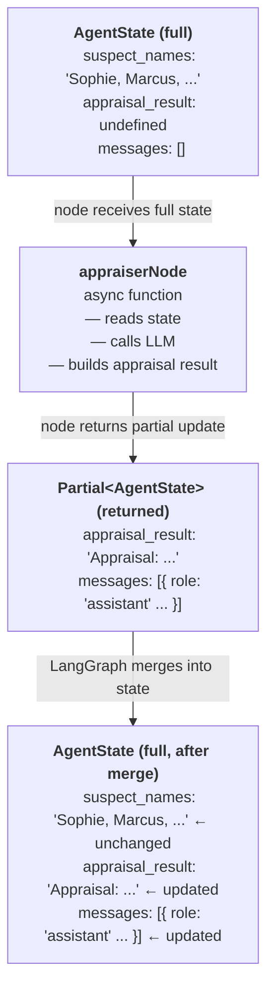
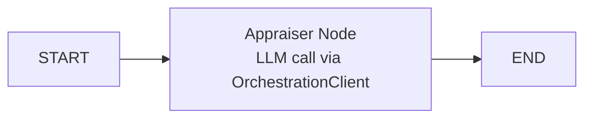

# Build Your First AI Agent

For this CodeJam, you will build three agents. Each of these agents will take an active part in solving a burglary and executing a loss appraisal for an insurance claim.

After any good burglary you need a loss appraiser who determines the insurance claims. That will be the first agent you are going to build.

---

## Overview

In this exercise, you will build an agent with TypeScript, LangGraph and the SAP Cloud SDK for AI.

[**LangGraph**](https://langchain-ai.github.io/langgraphjs/) is an open-source library for building stateful, multi-step workflows with LLMs. It models your agent logic as a **graph**; a set of nodes (steps) connected by edges (transitions). Unlike simpler agent frameworks, LangGraph gives you explicit control over how state flows through your application, making it ideal for complex, multi-agent systems.

[**SAP Cloud SDK for AI**](https://github.com/SAP/ai-sdk-js) is SAP's official SDK for interacting with SAP AI Core. The SDK is not only available in TypeScript/JavaScript, but also in Python, Java and ABAP. It provides the `OrchestrationClient` to call any model available in Generative AI Hub through a unified API, no matter whether you're using GPT-4o from Azure OpenAI, Claude from Anthropic, or Llama from Meta. You do not need to deploy models yourself; the SDK routes calls through the Orchestration Service to SAP's partner foundation models.

This combination is extremely powerful: LangGraph handles the agent workflow structure, while the SAP Cloud SDK for AI handles model access and authentication.

---

## Create a Basic Agent

### Step 1: Create the Agent State

LangGraph agents are built around **explicit state**: a typed object that you define, passed between nodes as the workflow progresses.

**Why does LangGraph make you manage state yourself?**

You might expect the framework to handle this automatically; track what each agent produced, route it to the next one, and stitch everything together behind the scenes. CrewAI does something closer to this: agents pass results implicitly through task context, and the framework manages the handoff.

LangGraph takes the opposite approach deliberately. Here is why:

- **Your workflow is unique.** Different applications need different data flowing between steps. A customer service workflow needs ticket IDs, sentiment scores, and escalation flags. An investigation workflow needs appraisal results, evidence analysis, and suspect names. No generic "agent result" object could cover all these cases well. By defining your own `AgentState`, you get a type that is exactly shaped for your use case.

- **Explicit state is debuggable.** When something goes wrong in a multi-agent system, the first question is always "what data did the failing agent actually receive?". With explicit state, you can `console.log(state)` at the start of any node and see the complete picture. There is no hidden internal state to guess at. You can also easily attach observability tools to the `AgentState` to have auditing over the agentic flow.

- **Nodes stay isolated and testable.** Because each node is just a function that takes state and returns state, you can unit test any node in isolation by passing in a mock state object. No need to spin up the full graph. This is much harder when agents communicate through implicit framework channels.

- **State is the communication protocol between agents.** When your Evidence Analyst writes to `evidence_analysis` and your Lead Detective reads from it, that contract is visible in the `AgentState` type. If you rename a field or change its structure, TypeScript immediately flags every node that is affected. With implicit communication, these mismatches only surface at runtime.

The trade-off is that you write a few extra lines of code to define the state and return partial updates. In exchange, you get a system where data flow is transparent, type-checked, and completely under your control.

👉 Create a new file [`/project/JavaScript/starter-project/src/types.ts`](/project/JavaScript/starter-project/src/types.ts)

👉 Add the following type definitions:

```typescript
import { Annotation } from "@langchain/langgraph";

export const AgentState = Annotation.Root({
  suspect_names: Annotation<string>,
  appraisal_result: Annotation<string | undefined>({
    reducer: (_, update) => update,
    default: () => undefined,
  }),
  messages: Annotation<Array<{ role: string; content: string }>>({
    reducer: (current, update) => [...current, ...update],
    default: () => [],
  }),
});

export type AgentStateType = typeof AgentState.State;
```

> 💡 **What's happening here?**
>
> - `Annotation.Root` is the modern LangGraph way to define state.
> - `suspect_names` — simple value channel; LangGraph replaces the old value with whatever the node returns
> - `appraisal_result` — also a value channel, but with `default: () => undefined` so it doesn't need to be provided in the initial state; the reducer just takes the latest value
> - `messages` — uses a **reducer**: instead of replacing the array, LangGraph _appends_ the new messages to the existing ones. The `default` sets the initial value to `[]`
> - `AgentStateType` extracts the plain TypeScript type from the annotation so you can use it in node function signatures
>
> `Partial<AgentStateType>` is a built-in TypeScript utility type that makes every field optional — so a node can return just `{ appraisal_result: "..." }` without providing the other fields. LangGraph merges that partial update into the full state before calling the next node. Fields not mentioned in the return value remain exactly as they were.
>
> You might wonder: why not just declare everything optional in `AgentStateType` itself? Because `AgentStateType` represents the **complete** state guaranteed to be available during the workflow — marking `suspect_names` optional there would force every node to guard against `undefined`, even though it is always populated before the graph runs. `Partial<>` is only used on **return types** to say "I'm updating some fields this turn", not to weaken the contract of the full state.
> Example:
>
> ```typescript
> // A node only returns the fields it changed — LangGraph merges the rest
> async function appraiserNode(
>   state: AgentStateType,
> ): Promise<Partial<AgentStateType>> {
>   return { appraisal_result: "Stolen items valued at $4,200." };
> }
> ```

### Step 2: Create the OrchestrationClient

The `OrchestrationClient` from the SAP Cloud SDK for AI is how your agent communicates with LLMs through Generative AI Hub. The SAP Cloud SDK for AI handles authentication automatically using your environment variables, this is also true for the Python library.

👉 Create a new file [`/project/JavaScript/starter-project/src/basicAgent.ts`](/project/JavaScript/starter-project/src/basicAgent.ts)

👉 Add the following code:

```typescript
import "dotenv/config";
import { OrchestrationClient } from "@sap-ai-sdk/orchestration";
import type { AgentStateType } from "./types.js";

const orchestrationClient = new OrchestrationClient({
  promptTemplating: {
    model: {
      name: process.env.MODEL_NAME!,
      params: {
        temperature: 0.7,
        max_tokens: 1000,
      },
    },
  },
});
```

> 💡 **Understanding the OrchestrationClient:**
>
> - `promptTemplating.model.name` — reads the model name from your `.env` file. The `!` tells TypeScript you're certain the value exists (non-null assertion).
> - `parameters` — configure the LLM behaviour: `temperature` controls creativity (0 = deterministic, 1 = creative), `max_tokens` limits response length.
>
> No API keys or URLs needed! The SDK automatically reads your SAP AI Core credentials from `AICORE_SERVICE_KEY` or the CF binding.
> The approach of using `AICORE_SERVICE_KEY` within the `.env` file is only recommended for local testing, if you want to deploy your agent application to production use Cloud Foundry's service bindings through `VCAP`.

### Step 3: Build the Agent Node

In LangGraph, a **node** is an async function that represents one step in your workflow. Every node follows the same contract:

- **Input**: the current `AgentStateType`, the full state object as it exists at that point in the graph
- **Output**: `Promise<Partial<AgentStateType>>`, only the fields this node changed

LangGraph merges your partial return into the full state and passes it to the next node. This means:

- You never manually copy unchanged fields; just return what you updated
- Each node is isolated and only responsible for its own piece of work
- Nodes are plain async TypeScript functions, no decorators, no class inheritance required



👉 Add the appraiser node to your `basicAgent.ts`:

```typescript
async function appraiserNode(
  state: AgentStateType,
): Promise<Partial<AgentStateType>> {
  console.log("\n🔍 Appraiser Agent starting...");

  const response = await orchestrationClient.chatCompletion({
    messages: [
      {
        role: "system",
        content:
          "You are an expert insurance appraiser specializing in fine art valuation and theft assessment.",
      },
      {
        role: "user",
        content:
          "Provide a brief explanation of how an insurance appraiser would approach assessing stolen artwork and valuables.",
      },
    ],
  });

  const appraisalResult = response.getContent() ?? "No response received.";
  console.log("✅ Appraisal complete");

  return {
    appraisal_result: appraisalResult,
    messages: [{ role: "assistant", content: appraisalResult }],
  };
}
```

> 💡 **Understanding the node:**
>
> - `Promise<Partial<AgentStateType>>` — the return type tells TypeScript (and LangGraph) that this function returns a promise of a partial state update. You only include the fields you changed; LangGraph merges them into the full state automatically.
> - `orchestrationClient.chatCompletion({ messages })` — sends a conversation to the LLM as a list of messages. The `system` message sets the agent's persona and instructions. The `user` message is the actual question or task.
> - `response.getContent()` — extracts the text content from the LLM response. The `??` operator provides a fallback if the result is `null` or `undefined` (for example, if the LLM returned nothing).
> - `messages: [{ role: "assistant", ... }]` — the node only returns the **new** message. The reducer defined in `AgentState` automatically appends it to the existing array, so you never need to spread `state.messages` manually.

### Step 4: Build the LangGraph Workflow

Now you'll wire the node into a LangGraph `StateGraph`.

👉 Add the following imports to the top of the `basicAgent.ts`:

```typescript
import { StateGraph, END, START } from "@langchain/langgraph";
import { AgentState } from "./types.js";
```

👉 Add the following to your `basicAgent.ts`:

```typescript
function buildGraph() {
  const workflow = new StateGraph(AgentState);

  workflow
    .addNode("appraiser", appraiserNode)
    .addEdge(START, "appraiser")
    .addEdge("appraiser", END);

  return workflow.compile();
}

async function main() {
  const app = buildGraph();

  const initialState: typeof AgentState.State = {
    suspect_names: "Sophie Dubois, Marcus Chen, Viktor Petrov",
    appraisal_result: undefined,
    messages: [],
  };

  const result = await app.invoke(initialState);

  console.log("\n" + "=".repeat(50));
  console.log("Insurance Appraiser Report:");
  console.log("=".repeat(50));
  console.log(result.appraisal_result);
}

main();
```

> 💡 **Understanding the StateGraph:**
>
> - `new StateGraph(AgentState)` — passes the annotation directly; LangGraph reads the channel definitions and reducers from it automatically
> - `.addNode('appraiser', appraiserNode)` — registers the function as a node with the name `'appraiser'`
> - `.addEdge(START, 'appraiser')` — connects the graph start to the appraiser node
> - `.addEdge('appraiser', END)` — when the appraiser finishes, the workflow ends
> - `.compile()` — validates the graph and returns an executable app
> - `app.invoke(initialState)` — runs the workflow and returns the final state

### Step 5: Run Your Agent

👉 Run your agent:

> ☝️ Make sure you're in the starter project directory when running this command.
> project/JavaScript/starter-project

```bash
npx tsx src/basicAgent.ts
```

You should see:

- The appraiser agent thinking through the task
- A professional explanation of the appraisal process

```bash
user: starter-project $ npx tsx src/basicAgent.ts

🔍 Appraiser Agent starting...
✅ Appraisal complete

==================================================
Insurance Appraiser Report:
==================================================
An insurance appraiser assessing stolen artwork and valuables follows a systematic approach to determine the value and document the loss. Here’s a brief overview of the process:

1. **Gathering Information**: The appraiser collects detailed information about the stolen items. This includes descriptions, provenance, purchase receipts, prior appraisals, photographs, and any available documentation that can help establish authenticity and ownership.

2. **Condition Reports**: If the artworks or valuables had prior appraisals or condition reports, these documents are reviewed to understand the condition and value at the time they were last appraised.

3. **Market Research**: The appraiser researches the current art market to determine the fair market value of the stolen items. This involves looking at recent sales of similar works, artist reputation, demand, and any changes in market trends that could affect the value.

4. **Consultation with Experts**: Depending on the complexity and rarity of the stolen items, the appraiser may consult with other experts, such as art historians, gallery owners, or auction house specialists, to gain deeper insights into the item's value.

5. **Use of Databases**: Appraisers often access databases of stolen art, such as the Art Loss Register, to ensure the items have been reported and to aid in recovery efforts.

6. **Valuation Report**: The appraiser compiles a comprehensive valuation report that includes the assessed value of the stolen items, supported by documentation and analysis. This report is used by the insurance company to determine the payout for the claim.

7. **Communication with Insurers**: The appraiser liaises with the insurance company to provide necessary documentation and answer any questions that may arise during the claims process.

8. **Recommendations for Prevention**: Finally, the appraiser might offer recommendations to the client on how to improve security and documentation to prevent future thefts and facilitate easier claims processing.

This methodical approach ensures that the valuation is fair, accurate, and defensible, both for the insurance company and the policyholder.
```

> 💡 `npx tsx` runs TypeScript files directly without compiling. `tsx` is a TypeScript Execute runtime; think of it as the Node.js equivalent of Python's `python` command for TypeScript files.

> 👆 At the moment the LLM is reasoning about appraisals without real data. You will give it a proper tool in the next exercise.

---

## Understanding Your First Agent

### What Just Happened?

You created a working AI agent that:

1. **Defined State**: Created a `AgentState` interface that tracks data flowing through the workflow
2. **Configured an LLM**: Used `OrchestrationClient` to connect to a model in Generative AI Hub
3. **Built a Node**: Wrote an async function that calls the LLM and returns a state update
4. **Wired a Graph**: Connected the node into a `StateGraph` with edges from `START` to `END`

The basic workflow is:



### Understanding Nodes

A node is the fundamental building block of a LangGraph workflow. Every node is an async function with this exact signature:

```typescript
async function myNode(state: AgentState): Promise<Partial<AgentState>> {
  // read from state
  // do work (call LLM, call a tool, transform data, ...)
  // return only what changed
  return { some_field: newValue };
}
```

**Nodes can do anything a TypeScript function can do:**

- Call an LLM via `OrchestrationClient`
- Call an external API or database
- Run a prediction model (like SAP-RPT-1 in the next exercise)
- Transform or validate data
- Log information for debugging

**What nodes must NOT do:**

- Mutate `state` directly; always return a new object
- Return the full state; only return the fields that changed

**The node lifecycle in one execution:**

```
1. LangGraph calls your node with the current state
2. Your node does its work (e.g. calls the LLM)
3. Your node returns { field: value } with only what changed
4. LangGraph merges that into the full state
5. LangGraph follows the next edge to the next node (or END)
```

In this exercise you have one node. In later exercises you'll chain three nodes; each one reads from the state set by the previous node, enriching it step by step until the Lead Detective has everything it needs to solve the crime.

### LangGraph vs CrewAI Concepts

If you're coming from the Python version of this CodeJam, here's how the concepts map:

| CrewAI (Python)        | LangGraph (TypeScript)              |
| ---------------------- | ----------------------------------- |
| `Agent`                | Node function (`appraiserNode`)     |
| `Task`                 | Handled by the node's system prompt |
| `Crew`                 | `StateGraph`                        |
| `role`, `goal`         | System prompt in `messages`         |
| `crew.kickoff(inputs)` | `app.invoke(initialState)`          |
| YAML config files      | Code-based configuration in `.ts`   |
| `LiteLLM`              | `OrchestrationClient`               |

> 💡 **LangGraph's philosophy is code-over-config.** Instead of YAML files that define what agents do, you write TypeScript functions. This gives you the full power of the language: type safety, IDE support, refactoring tools, and explicit control over how data flows.

---

## Key Takeaways

- **LangGraph** models agent workflows as stateful graphs; nodes are steps, edges are transitions
- **AgentState** is the shared data structure passed between nodes; nodes return partial updates
- **OrchestrationClient** connects your TypeScript code to any LLM through SAP Generative AI Hub
- **`response.getContent()`** extracts the text from an LLM response
- **`Partial<AgentState>`** means nodes only need to return the fields they updated

---

## Next Steps

In the following exercises, you will:

1. ✅ [Understand Generative AI Hub](00-understanding-genAI-hub.md)
2. ✅ [Set up your development space](01-setup-dev-space.md)
3. ✅ Build a basic agent (this exercise)
4. 📌 [Add custom tools](03-add-your-first-tool.md) to your agents so they can access external data
5. 📌 [Build a multi-agent workflow](04-building-multi-agent-system.md) with LangGraph
6. 📌 [Integrate the Grounding Service](05-add-the-grounding-service.md) for evidence analysis
7. 📌 [Solve the museum art theft mystery](06-solve-the-crime.md) using your fully-featured agent team

---

## Troubleshooting

**Issue**: `Cannot find module '@sap-ai-sdk/orchestration'`

- **Solution**: Run `npm install` in the starter project directory to install all dependencies.

**Issue**: `Error: AICORE_SERVICE_KEY is not set` or authentication failure

- **Solution**: Ensure your `.env` file exists in the starter project directory with valid SAP AI Core credentials. Check that `dotenv/config` is imported at the top of your entry file.

**Issue**: `TypeError: Cannot read properties of undefined (reading 'getContent')`

- **Solution**: The `chatCompletion()` call failed. Check your `MODEL_NAME` and `RESOURCE_GROUP` environment variables match your SAP AI Core configuration.

**Issue**: `tsx: command not found`

- **Solution**: Use `npx tsx` instead of `tsx` directly. Or install globally: `npm install -g tsx`.

---

## Resources

- [LangGraph.js Documentation](https://langchain-ai.github.io/langgraphjs/)
- [SAP Cloud SDK for AI (JavaScript)](https://github.com/SAP/ai-sdk-js)
- [SAP Generative AI Hub](https://help.sap.com/docs/sap-ai-core/sap-ai-core-service-guide/generative-ai-hub-in-sap-ai-core-7db524ee75e74bf8b50c167951fe34a5)
- [OrchestrationClient API Reference](https://github.com/SAP/ai-sdk-js/tree/main/packages/orchestration)

[Next exercise](03-add-your-first-tool.md)
