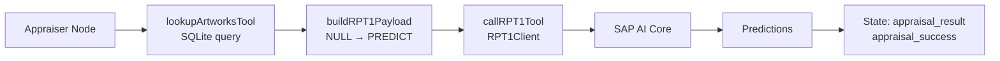

# Add Your First Tool to the Agent

In the previous exercise, you built a basic agent that could reason and respond using an LLM. Now you will extend it with **tools**: functions the agent node can call to access external services and work with real structured data from a database.

---

## Overview

In this exercise you will:

1. Add an `ArtworkRow` type for the SQLite database rows
2. Update `AgentState` to track appraisal success
3. Build a client for the SAP-RPT-1 model
4. Write two tool functions — one to query a SQLite database, one to build the API payload
5. Call those tools from the Appraiser node and update `main.ts`

> **SAP-RPT-1** — [SAP's Relational Pretrained Transformer model](https://www.sap.com/products/artificial-intelligence/sap-rpt.html) is a foundation model trained on structured tabular data. It is available in Generative AI Hub to predict missing values and classify rows from enterprise datasets. The model accepts rows of JSON data and returns predictions for any column you mark with the `[PREDICT]` placeholder.

---

## Check Out SAP-RPT-1

👉 Open the [SAP-RPT-1 Playground](https://rpt.cloud.sap/). Try one of the example files to see how the model handles rows with missing values.

---

## Step 1 — Add Types to `types.ts`

Open [`/project/JavaScript/starter-project/src/types.ts`](/project/JavaScript/starter-project/src/types.ts).

### 1a. Add the RPT-1 payload types

👉 Add the following type definitions at the end of the file. These mirror the JSON structure the RPT-1 API expects.

```typescript
export interface PredictionTargetColumn {
  name: string;
  prediction_placeholder: string;
  task_type: "regression" | "classification";
}

export interface PredictionConfig {
  target_columns: PredictionTargetColumn[];
}

export interface StolenItem {
  ITEM_ID: string;
  ITEM_NAME: string;
  ARTIST: string;
  ACQUISITION_DATE: string;
  INSURANCE_VALUE: number | string;
  ITEM_CATEGORY: string;
  DIMENSIONS: string;
  CONDITION_SCORE: number;
  RARITY_SCORE: number;
  PROVENANCE_CLARITY: number;
}

export interface RPT1Payload {
  prediction_config: PredictionConfig;
  index_column: string;
  rows: StolenItem[];
}
```

> 💡 **Why define these types?**
>
> The RPT-1 API is strict about its input shape. Defining interfaces gives you three concrete benefits:
>
> **1. The compiler catches shape mismatches before they reach the API.** If you write `predictionConfig` instead of `prediction_config`, TypeScript flags it immediately in your editor — no API error needed.
>
> **2. Each interface maps to one layer of the JSON structure.** `RPT1Payload` is the root object, `PredictionConfig` describes what to predict, and `StolenItem` describes one row of data.
>
> **3. Union types document allowed values.** `task_type: "regression" | "classification"` makes it impossible to pass a typo like `"Regression"`. `INSURANCE_VALUE: number | string` captures the reality that known values are numbers, while rows awaiting prediction carry the `"'[PREDICT]'"` string placeholder.

### 1b. Add the `ArtworkRow` type

The artwork data lives in a SQLite database (`data/artworks.db`). Each row comes out of the database with `NULL` for the two fields that need to be predicted. Add the database row type immediately above the `StolenItem` interface:

```typescript
// Row shape as stored in artworks.db — NULL means value is unknown (will become '[PREDICT]')
export interface ArtworkRow {
  ITEM_ID: string;
  ITEM_NAME: string;
  ARTIST: string;
  ACQUISITION_DATE: string;
  INSURANCE_VALUE: number | null;
  ITEM_CATEGORY: string | null;
  DIMENSIONS: string;
  CONDITION_SCORE: number;
  RARITY_SCORE: number;
  PROVENANCE_CLARITY: number;
}
```

> 💡 **`null` vs `"'[PREDICT]'"` — two representations of the same fact**
>
> The database uses SQL `NULL` to mean "this value is not yet known". The RPT-1 API needs the string `"'[PREDICT]'"` (with inner single quotes) to identify columns it should predict. `ArtworkRow` uses `null` (the honest database type), and `StolenItem` uses `number | string` (the API contract). The tool function you write in Step 3 translates between the two with the nullish coalescing operator `??`.

### 1c. Update `AgentState` to add `appraisal_success`

The parallel graph you will build in Exercise 04 needs a way to short-circuit if the appraisal fails. Add an `appraisal_success` field to `AgentState`. Also **remove** the `payload` field that existed in the old sequential version — the payload is now built inside the tool, so it no longer needs to be passed via state.

Your updated `AgentState` in `types.ts` should look like this:

```typescript
import { Annotation } from "@langchain/langgraph";

export const AgentState = Annotation.Root({
  suspect_names: Annotation<string>,
  appraisal_result: Annotation<string | undefined>({
    reducer: (_, update) => update,
    default: () => undefined,
  }),
  appraisal_success: Annotation<boolean>({
    reducer: (_, update) => update,
    default: () => false,
  }),
  evidence_analysis: Annotation<string | undefined>({
    reducer: (_, update) => update,
    default: () => undefined,
  }),
  final_conclusion: Annotation<string | undefined>({
    reducer: (_, update) => update,
    default: () => undefined,
  }),
  messages: Annotation<Array<{ role: string; content: string }>>({
    reducer: (current, update) => [...current, ...update],
    default: () => [],
  }),
});

export type AgentStateType = typeof AgentState.State;
```

> 💡 **`appraisal_success` uses `reducer: (_, update) => update`** — this is a last-write-wins reducer. Whatever the appraiser node writes last is what the rest of the graph sees. The default is `false`, so the graph safely routes to `END` if the appraiser never runs.

---

## Step 2 — Build the SAP-RPT-1 Client

The `@sap-ai-sdk/rpt` package provides a typed client for SAP-RPT-1.

👉 Create a new file [`/project/JavaScript/starter-project/src/rptClient.ts`](/project/JavaScript/starter-project/src/rptClient.ts)

```typescript
import { RptClient } from "@sap-ai-sdk/rpt";
import type { RPT1Payload } from "./types.js";

export class RPT1Client {
  private client: RptClient;

  constructor(
    modelDeployment: {
      modelName: "sap-rpt-1-small" | "sap-rpt-1-large";
      resourceGroup?: string;
    } = {
      modelName: "sap-rpt-1-large",
      resourceGroup: process.env.RESOURCE_GROUP!,
    },
  ) {
    this.client = new RptClient(modelDeployment);
  }

  async predictWithoutSchema(payload: RPT1Payload): Promise<any> {
    const prediction = await this.client.predictWithoutSchema(payload as any);
    return prediction;
  }
}
```

> 💡 **Understanding the wrapper class:**
>
> - `RptClient` from `@sap-ai-sdk/rpt` handles authentication against SAP AI Core automatically — no OAuth token management needed.
> - The constructor defaults to `sap-rpt-1-large` and reads `RESOURCE_GROUP` from `.env`. You can override both fields to target a different deployment.
> - `payload as any`: the `RPT1Payload` type you defined and the SDK's internal `PredictionData` type describe the same JSON structure, but TypeScript treats them as incompatible because they were written independently. The `as any` cast bypasses the compile-time check. The JSON sent to the API at runtime is identical either way.
> - `Promise<any>`: the SDK's full `PredictResponsePayload` type is complex and you do not need to type it precisely here.

---

## Step 3 — Create Two Tool Functions in `tools.ts`

In LangGraph, **tools are plain TypeScript functions**: no decorators, no schema wrappers. Your agent node calls them directly. You control exactly when and how each tool is invoked.

👉 Create a new file [`/project/JavaScript/starter-project/src/tools.ts`](/project/JavaScript/starter-project/src/tools.ts)

Start with the imports and module-level setup:

```typescript
import Database from "better-sqlite3";
import path from "path";
import { fileURLToPath } from "url";
import { RPT1Client } from "./rptClient.js";
import type { ArtworkRow, RPT1Payload, StolenItem } from "./types.js";

const __dirname = path.dirname(fileURLToPath(import.meta.url));
const DB_PATH = path.resolve(__dirname, "../data/artworks.db");

const rpt1Client = new RPT1Client();
```

> 💡 **`__dirname` in ESM modules** — Node.js ESM modules do not expose `__dirname` as a global. The `path.dirname(fileURLToPath(import.meta.url))` pattern reconstructs it from the module's URL, which always points to the compiled `.js` file in `dist/`. The `path.resolve` call then navigates one level up to find `data/artworks.db` regardless of where you run the command from.

> 💡 **Why define the client at module level?** `RPT1Client` is created once when the module loads, not on every tool call. This avoids repeated initialization and prevents duplicate SDK warning messages.

### 3a. Add `lookupArtworksTool`

This tool opens the SQLite database and returns all rows as typed `ArtworkRow` objects:

```typescript
export function lookupArtworksTool(): ArtworkRow[] {
  console.log(JSON.stringify({ event: "tool_call", tool: "lookup_artworks" }));
  const db = new Database(DB_PATH, { readonly: true });
  try {
    const rows = db.prepare("SELECT * FROM artworks ORDER BY ITEM_ID").all() as ArtworkRow[];
    console.log(JSON.stringify({ event: "tool_result", tool: "lookup_artworks", count: rows.length }));
    return rows;
  } finally {
    db.close();
  }
}
```

> 💡 **`readonly: true`** — Opening the database read-only ensures the tool cannot accidentally modify the artwork catalog, even if a bug introduces a write operation. The `finally` block guarantees the connection is closed even if the query throws.

### 3b. Add `buildRPT1Payload`

This function translates the raw database rows into the exact JSON structure the RPT-1 API expects. It replaces the old static `payload.ts` file:

```typescript
export function buildRPT1Payload(rows: ArtworkRow[]): RPT1Payload {
  const stolenItems: StolenItem[] = rows.map((row) => ({
    ITEM_ID: row.ITEM_ID,
    ITEM_NAME: row.ITEM_NAME,
    ARTIST: row.ARTIST,
    ACQUISITION_DATE: row.ACQUISITION_DATE,
    INSURANCE_VALUE: row.INSURANCE_VALUE ?? "'[PREDICT]'",
    ITEM_CATEGORY: row.ITEM_CATEGORY ?? "'[PREDICT]'",
    DIMENSIONS: row.DIMENSIONS,
    CONDITION_SCORE: row.CONDITION_SCORE,
    RARITY_SCORE: row.RARITY_SCORE,
    PROVENANCE_CLARITY: row.PROVENANCE_CLARITY,
  }));

  return {
    prediction_config: {
      target_columns: [
        { name: "INSURANCE_VALUE", prediction_placeholder: "'[PREDICT]'", task_type: "regression" },
        { name: "ITEM_CATEGORY", prediction_placeholder: "'[PREDICT]'", task_type: "classification" },
      ],
    },
    index_column: "ITEM_ID",
    rows: stolenItems,
  };
}
```

> 💡 **`?? "'[PREDICT]'"` — nullish coalescing as the translation layer**
>
> The `??` operator returns the left-hand side if it is not `null` or `undefined`, otherwise the right-hand side. This single expression is the entire bridge between the database's `NULL` and the API's placeholder string.
>
> **Why the nested quotes?** The API specification requires the placeholder to be `'[PREDICT]'` with literal single quotes inside the JSON string — so the TypeScript string value is `"'[PREDICT]'"`. If you write `"[PREDICT]"` without the inner single quotes, the API returns a `400` error.

### 3c. Add `callRPT1Tool`

This function sends the payload to the RPT-1 model and returns the raw JSON response as a string:

```typescript
export async function callRPT1Tool(payload: RPT1Payload): Promise<string> {
  console.log(JSON.stringify({ event: "tool_call", tool: "call_rpt1", rowCount: payload.rows.length }));
  try {
    const response = await rpt1Client.predictWithoutSchema(payload);
    const result = JSON.stringify(response, null, 2);
    console.log(JSON.stringify({ event: "tool_result", tool: "call_rpt1", success: true, outputLength: result.length }));
    return result;
  } catch (error) {
    const errorMessage = error instanceof Error ? error.message : String(error);
    console.error("❌ RPT-1 call failed:", errorMessage);
    return `Error calling RPT-1: ${errorMessage}`;
  }
}
```

> 💡 **Structured JSON logging** — Every tool logs a JSON object both on entry (`tool_call`) and on exit (`tool_result`). You can grep for these events in the terminal output to see exactly which tools ran, in what order, and what they returned. You will see the same pattern throughout all nodes in Exercise 04.

---

## Step 4 — Update the Appraiser Node in `investigationWorkflow.ts`

The appraiser node now composes the three tool functions instead of receiving a payload via state.

👉 Update the imports at the top of `investigationWorkflow.ts`:

```typescript
import { lookupArtworksTool, buildRPT1Payload, callRPT1Tool } from "./tools.js";
```

👉 Replace the `appraiserNode` method body:

```typescript
private async appraiserNode(_state: AgentStateType): Promise<Partial<AgentStateType>> {
  console.log(JSON.stringify({ event: "node_start", node: "appraiser" }));

  try {
    const artworks = lookupArtworksTool();
    const payload = buildRPT1Payload(artworks);
    const result = await callRPT1Tool(payload);

    const appraisalResult = `Insurance Appraisal Complete:\n${result}\nSummary: Successfully predicted missing insurance values and item categories.`;

    console.log(JSON.stringify({ event: "node_complete", node: "appraiser", success: true, outputLength: appraisalResult.length }));

    return {
      appraisal_result: appraisalResult,
      appraisal_success: true,
      messages: [{ role: "assistant", content: appraisalResult }],
    };
  } catch (error) {
    const errorMsg = `Error during appraisal: ${error}`;
    console.error(JSON.stringify({ event: "node_error", node: "appraiser", error: errorMsg }));
    return {
      appraisal_result: errorMsg,
      appraisal_success: false,
      messages: [{ role: "assistant", content: errorMsg }],
    };
  }
}
```

The node now follows a clear three-step pattern: **lookup → build → predict**. Each step is a separate tool with a single responsibility.

> 💡 **Why `appraisal_success: false` on error?** In Exercise 04 you will add a routing function that reads this field. If `appraisal_success` is `false`, the graph routes to `END` immediately instead of sending incomplete data to the Lead Detective. Writing the failure flag here is what makes that conditional edge possible.

---

## Step 5 — Update `kickoff` and `main.ts`

The `kickoff` method signature changes: `payload` is no longer a required input because the appraiser builds it internally.

👉 Update the `kickoff` method in `investigationWorkflow.ts`:

```typescript
async kickoff(inputs: { suspect_names: string }, threadId = "default"): Promise<string> {
  console.log("🚀 Starting Investigation Workflow...\n");

  const app = this.buildGraph().compile({
    checkpointer: this.checkpointer,
    interruptBefore: [],
  });

  const config = { configurable: { thread_id: threadId }, recursionLimit: 10 };

  await app.invoke({ suspect_names: inputs.suspect_names, messages: [] }, config);

  const snapshot = await app.getState(config);
  const result = snapshot.values;

  console.log("\n--- Appraisal Result ---");
  console.log(result.appraisal_result ?? "(not set)");

  return result.final_conclusion || "Investigation completed but no conclusion was reached.";
}
```

👉 Update `main.ts` to remove the payload import and pass only `suspect_names`:

```typescript
import "dotenv/config";
import { initialize } from "@traceloop/node-server-sdk";
import { InvestigationWorkflow } from "./investigationWorkflow.js";

initialize({ appName: "codejam-investigation", disableBatch: true });

async function main() {
  const workflow = new InvestigationWorkflow(process.env.MODEL_NAME!);
  const result = await workflow.kickoff({ suspect_names: "Sophie Dubois, Marcus Chen, Viktor Petrov" });
  console.log("\n📘 FINAL INVESTIGATION REPORT\n");
  console.log(result);
}

main();
```

---

## Step 6 — Run the Agent

```bash
npx tsx src/main.ts
```

In the output, look for the structured log lines. You should see something like:

```
{"event":"tool_call","tool":"lookup_artworks"}
{"event":"tool_result","tool":"lookup_artworks","count":14}
{"event":"tool_call","tool":"call_rpt1","rowCount":14}
{"event":"tool_result","tool":"call_rpt1","success":true,"outputLength":2048}
{"event":"node_complete","node":"appraiser","success":true,"outputLength":2112}
```

SAP-RPT-1 not only predicts the missing values but also returns a confidence score for each classification prediction.

---

## Understanding Tools in LangGraph

### What Just Happened?

You replaced a static hardcoded file (`payload.ts`) with a live database lookup and a structured transformation pipeline. The agent now:

1. **Queries the database** — `lookupArtworksTool` reads the current state of the artwork catalog from SQLite
2. **Transforms the data** — `buildRPT1Payload` translates database nulls into API placeholders
3. **Calls the model** — `callRPT1Tool` sends the payload to SAP-RPT-1 and returns predictions

### Why SQLite Instead of a Hardcoded Array?

| Hardcoded `payload.ts` | SQLite `artworks.db` |
|---|---|
| Data lives in source code | Data lives in a file separate from code |
| Editing data requires changing TypeScript | Editing data does not touch the source |
| No support for NULL — used string `"'[PREDICT]'"` directly | NULL maps naturally to missing values |
| Not queryable — must filter in code | Standard SQL for filtering, sorting, joining |
| Cannot be shared across services | Any process with file access can read it |

For a real investigation system, the database would be a proper managed database service. SQLite here gives you the same structural benefits (typed rows, NULL semantics, queryability) without any server setup.

### Tool Flow



### Tools in LangGraph vs CrewAI

In CrewAI, tools are Python functions decorated with `@tool()` and the LLM decides when to invoke them based on the task description. In LangGraph, **you decide when a tool is called**: it is a direct function call inside your node. This gives you full control and makes the execution path easy to trace.

```typescript
// LangGraph: explicit, sequential tool calls inside the node
const artworks = lookupArtworksTool();        // step 1: read DB
const payload  = buildRPT1Payload(artworks);  // step 2: transform
const result   = await callRPT1Tool(payload); // step 3: call API
```

For scenarios where you want the LLM to choose tools dynamically, LangGraph also supports `bind_tools()`. For this workshop, direct calls keep the execution explicit and deterministic.

---

## Key Takeaways

- **Tools are plain functions** — no decorators or wrappers needed in LangGraph
- **`ArtworkRow` uses `null`; `StolenItem` uses `string`** — two separate types for two separate concerns (database vs API)
- **`??` operator** maps database `NULL` to the `"'[PREDICT]'"` placeholder in one expression
- **Module-level client initialization** avoids repeated setup and duplicate SDK warnings
- **`appraisal_success`** in state is the flag that enables safe conditional routing in Exercise 04
- **Structured JSON logging** from every tool and node gives you a machine-readable trace of every execution step

---

## Troubleshooting

**Issue**: `Error calling RPT-1: 401 Unauthorized`

- **Solution**: Verify that `RESOURCE_GROUP` is set to `ai-agents-codejam` and your `AICORE_SERVICE_KEY` is correct in `.env`.

**Issue**: RPT-1 returns a `400` or `422` error

- **Solution**: The `prediction_placeholder` must be exactly `"'[PREDICT]'"` with inner single quotes. Check that `buildRPT1Payload` is producing them correctly by logging `JSON.stringify(payload, null, 2)` before the `callRPT1Tool` call.

**Issue**: `Cannot find module 'better-sqlite3'`

- **Solution**: Run `npm install` in the `starter-project` directory. The `better-sqlite3` package is listed in `package.json` but requires native compilation.

**Issue**: `ModuleNotFoundError: Cannot find module './rptClient.js'`

- **Solution**: Note the `.js` extension in the import path. This is required for TypeScript ESM modules even when the source file is `.ts`.

**Issue**: `TypeError: Cannot read properties of undefined` on `db.prepare`

- **Solution**: Check that the `data/artworks.db` file exists at `project/JavaScript/starter-project/data/artworks.db`. The `DB_PATH` resolves relative to the compiled `dist/` output, one level up to the project root.

---

## Next Steps

1. ✅ [Understand Generative AI Hub](00-understanding-genAI-hub.md)
2. ✅ [Set up your development space](01-setup-dev-space.md)
3. ✅ [Build a basic agent](02-build-a-basic-agent.md)
4. ✅ Add a database lookup + RPT-1 tool to the Appraiser (this exercise)
5. 📌 [Build a parallel multi-agent system](04-building-multi-agent-system.md) — fork the graph so Appraiser and Analyst run concurrently
6. 📌 [Integrate the Grounding Service](05-add-the-grounding-service.md) — give the Evidence Analyst real document access
7. 📌 [Solve the museum art theft mystery](06-solve-the-crime.md)

---

## Resources

- [SAP-RPT-1 Playground](https://rpt.cloud.sap/)
- [SAP Cloud SDK for AI — RPT Package](https://github.com/SAP/ai-sdk-js/tree/main/packages/rpt)
- [LangGraph.js Documentation](https://langchain-ai.github.io/langgraphjs/)
- [better-sqlite3 Documentation](https://github.com/WiseLibs/better-sqlite3/blob/HEAD/docs/api.md)

[Next exercise](04-building-multi-agent-system.md)
