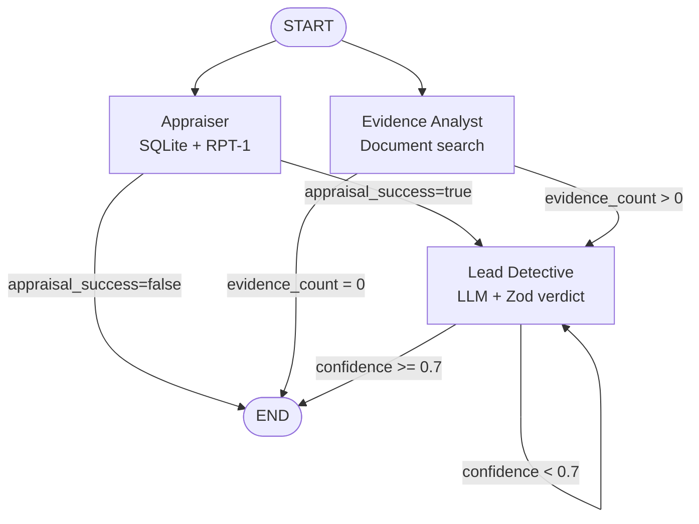

# Building a Parallel Multi-Agent System

In the previous exercise you gave the Appraiser a real database lookup and an RPT-1 tool. Now you will restructure the entire workflow: the Appraiser and the Evidence Analyst will run **in parallel**, join at a new Lead Detective node, and every node will emit structured JSON logs so you can observe the execution at a glance.

---

## Overview

In this exercise you will:

1. Restructure the graph from sequential to parallel fork (START → Appraiser AND START → Evidence Analyst)
2. Add three conditional routing functions that decide where the graph goes after each node
3. Add a `leadDetectiveNode` with an `OrchestrationClient` and Zod schema validation
4. Add structured JSON logging to every node
5. Enable LangSmith tracing via environment variables
6. Set `recursionLimit: 10` on the `app.invoke` call

---

## Prerequisites

- Exercise 03 is complete: `lookupArtworksTool`, `buildRPT1Payload`, and `callRPT1Tool` are exported from `tools.ts`
- `AgentState` has the `appraisal_success` field added in Exercise 03
- `npx tsx src/main.ts` runs without TypeScript errors

---

## Step 1 — Enable LangSmith Tracing

LangSmith is LangChain's tracing platform. When the environment variables below are present, LangGraph automatically uploads a trace of every graph run — nodes executed, state transitions, timing — with zero code changes.

👉 Open your `.env` file and add (or uncomment) these four lines:

```
LANGCHAIN_TRACING_V2=true
LANGCHAIN_ENDPOINT=https://api.smith.langchain.com
LANGCHAIN_API_KEY=<your key from smith.langchain.com>
LANGCHAIN_PROJECT=codejam-investigation
```

> 💡 **Zero-code tracing** — LangGraph reads these variables at startup. No SDK import, no wrapper, no instrumentation code is required. Every graph run you do for the rest of the workshop will appear in the LangSmith UI automatically, including the parallel branches you are about to build.
>
> Sign up for a free account at [smith.langchain.com](https://smith.langchain.com) and create a project named `codejam-investigation`.

---

## Step 2 — Add `evidence_count` to `AgentState`

The routing function that guards the Evidence Analyst exit needs to know whether any evidence was found. Add this field to `AgentState` in `types.ts`:

```typescript
evidence_count: Annotation<number>({
  reducer: (_, update) => update,
  default: () => 0,
}),
```

The full `AgentState` now has these fields: `suspect_names`, `appraisal_result`, `appraisal_success`, `evidence_analysis`, `evidence_count`, `final_conclusion`, `confidence_score`, and `messages`.

Also add `confidence_score` if it is not already present — the Lead Detective node writes its confidence into this field:

```typescript
confidence_score: Annotation<number>({
  reducer: (_, update) => update,
  default: () => 0,
}),
```

---

## Step 3 — Add Agent Configuration to `agentConfigs.ts`

System prompts for the Lead Detective are long and would clutter `investigationWorkflow.ts`. Keep them in a separate file for clarity.

👉 Create [`/project/JavaScript/starter-project/src/agentConfigs.ts`](/project/JavaScript/starter-project/src/agentConfigs.ts):

```typescript
export const AGENT_CONFIGS = {
  evidenceAnalyst: {
    systemPrompt: (suspectNames: string) => `You are an Evidence Analyst on a high-profile art theft case.
    You are a meticulous forensic analyst who specializes in connecting dots between evidence.

    Your goal: Analyze all available evidence to identify patterns and connections between suspects and the crime.

    You have access to three tools:
    - search_documents(query): Semantic search through the evidence document repository
    - list_suspects(): Returns the three suspects with known aliases and roles
    - lookup_timeline(dateRange): Filters evidence by a specific date range

    Suspects: ${suspectNames}

    Use the tools strategically — start by listing suspects to confirm aliases, then search
    for evidence per suspect, then cross-reference the timeline around the theft date.`,
  },
  leadDetective: {
    systemPrompt: (
      appraisalResult: string,
      evidenceAnalysis: string,
      suspectNames: string,
      witnessStatement?: string,
    ) => `You are the lead detective on this high-profile art theft case.
      You excel at synthesizing information from multiple sources and identifying the culprit.

      Your goal: Identify the most likely culprit and calculate the total insurance loss.

      INSURANCE APPRAISAL:
      ${appraisalResult}

      EVIDENCE ANALYSIS:
      ${evidenceAnalysis}

      SUSPECTS: ${suspectNames}
      ${witnessStatement ? `\nNEW WITNESS STATEMENT (just received — factor this into your analysis):\n${witnessStatement}` : ""}

      Assess confidence honestly. If evidence is ambiguous or contradictory, reflect that in a low confidence score.
      A confidence score below 0.7 means you should NOT commit to a verdict.`,
  },
};
```

> 💡 **System prompts as functions** — The `leadDetective.systemPrompt` function takes the appraisal result, evidence analysis, suspect names, and an optional witness statement as arguments. TypeScript template literals make it easy to interpolate runtime data. This is the typed, co-located equivalent of CrewAI's `agents.yaml` and `tasks.yaml`.

---

## Step 4 — Add `evidence_analyst` Placeholder Node

You will replace this with the real grounding-backed implementation in Exercise 05. For now, add a placeholder that produces stub output so the graph can run end-to-end.

👉 Add this method to `InvestigationWorkflow`:

```typescript
private async evidenceAnalystNode(state: AgentStateType): Promise<Partial<AgentStateType>> {
  console.log(JSON.stringify({ event: "node_start", node: "evidence_analyst", suspects: state.suspect_names }));

  try {
    const suspects = state.suspect_names.split(",").map((s) => s.trim());
    const evidenceResults: string[] = [];

    for (const suspect of suspects) {
      // Placeholder — replaced with real grounding tool in Exercise 05
      evidenceResults.push(`Evidence for ${suspect}: No evidence documents connected yet.`);
    }

    const evidenceAnalysis =
      `Evidence Analysis Complete:\n\n${evidenceResults.join("\n\n")}\n\n` +
      `Summary: Analyzed evidence for all suspects: ${state.suspect_names}`;

    console.log(JSON.stringify({ event: "node_complete", node: "evidence_analyst", success: true, documentCount: evidenceResults.length }));

    return {
      evidence_analysis: evidenceAnalysis,
      evidence_count: evidenceResults.length,
      messages: [{ role: "assistant", content: evidenceAnalysis }],
    };
  } catch (error) {
    const errorMsg = error instanceof Error ? error.message : String(error);
    console.error(JSON.stringify({ event: "node_error", node: "evidence_analyst", error: errorMsg }));
    return {
      evidence_analysis: `Error during evidence analysis: ${errorMsg}`,
      evidence_count: 0,
      messages: [{ role: "assistant", content: `Error during evidence analysis: ${errorMsg}` }],
    };
  }
}
```

> 💡 **`evidence_count` matters downstream** — This node writes `evidence_count: evidenceResults.length` into state. The routing function you add in Step 5 reads this field and sends the graph to `END` if it is `0`, preventing the Lead Detective from producing a verdict based on zero evidence.

---

## Step 5 — Add Routing Functions

Routing functions are plain TypeScript functions that read state and return a string matching one of the named edges. They live outside the class at the bottom of `investigationWorkflow.ts`.

👉 Add these three routing functions after the class definition:

```typescript
function routeAfterAppraisal(state: AgentStateType): "continue" | "failed" {
  if (!state.appraisal_success) {
    console.log(JSON.stringify({ event: "route", from: "appraiser", to: "END", reason: "appraisal_failed" }));
    return "failed";
  }
  return "continue";
}

function routeAfterAnalysis(state: AgentStateType): "continue" | "insufficient" {
  if (state.evidence_count === 0) {
    console.log(JSON.stringify({ event: "route", from: "evidence_analyst", to: "END", reason: "no_evidence" }));
    return "insufficient";
  }
  return "continue";
}

function routeAfterVerdict(state: AgentStateType): "committed" | "needs_review" {
  if (state.confidence_score >= 0.7) {
    console.log(JSON.stringify({ event: "route", from: "lead_detective", to: "END", reason: "verdict_committed", confidence: state.confidence_score }));
    return "committed";
  }
  console.log(JSON.stringify({ event: "route", from: "lead_detective", to: "interrupt", reason: "low_confidence", confidence: state.confidence_score }));
  return "needs_review";
}
```

> 💡 **Routing functions are the graph's decision logic** — they are the TypeScript equivalent of CrewAI's conditional task routing. Unlike CrewAI, where conditions are expressed in YAML or via decorator callbacks, LangGraph routing is plain TypeScript. The return value must be a string that matches one of the keys in the `addConditionalEdges` map you define in the next step.

---

## Step 6 — Add the Lead Detective Node

The Lead Detective receives both the appraisal and evidence results from state, calls the LLM via `OrchestrationClient`, and validates the response with a Zod schema.

### 6a. Add `zod` import and install the schema

👉 Add this import at the top of `investigationWorkflow.ts`:

```typescript
import { z } from "zod";
```

👉 Add the Zod schema and its inferred type just below your imports:

```typescript
const CONFIDENCE_THRESHOLD = 0.7;

const VerdictSchema = z.object({
  culprit: z.string(),
  confidence: z.number().min(0).max(1),
  reasoning: z.string(),
  totalInsuranceLoss: z.number(),
});

type Verdict = z.infer<typeof VerdictSchema>;
```

> 💡 **Why Zod for LLM output validation?**
>
> The LLM is asked to return a JSON object. It almost always does. But "almost always" is not good enough when downstream code reads `verdict.confidence` as a number to make a routing decision. Zod's `parse()` throws if the JSON is missing a field, has the wrong type, or if `confidence` is outside the `[0, 1]` range. That throw is caught in the node's `try/catch` and treated as a zero-confidence verdict — which routes the graph to a safe review state — rather than propagating as an unhandled runtime error.

### 6b. Add the node method

👉 Add `leadDetectiveNode` to the `InvestigationWorkflow` class:

```typescript
private async leadDetectiveNode(state: AgentStateType): Promise<Partial<AgentStateType>> {
  console.log(JSON.stringify({ event: "node_start", node: "lead_detective" }));

  try {
    const response = await this.orchestrationClient.chatCompletion({
      messages: [
        {
          role: "system",
          content: AGENT_CONFIGS.leadDetective.systemPrompt(
            state.appraisal_result ?? "No appraisal result available",
            state.evidence_analysis ?? "No evidence analysis available",
            state.suspect_names,
          ),
        },
        {
          role: "user",
          content:
            "Analyze all the evidence and identify the culprit. You MUST respond with a JSON object matching this exact schema:\n" +
            '{ "culprit": string, "confidence": number (0-1), "reasoning": string, "totalInsuranceLoss": number }\n' +
            "Respond with JSON only — no markdown, no preamble.",
        },
      ],
    });

    const raw = response.getContent() ?? "";
    let verdict: Verdict;

    try {
      verdict = VerdictSchema.parse(JSON.parse(raw));
    } catch {
      console.error(JSON.stringify({ event: "verdict_parse_error", node: "lead_detective", raw: raw.slice(0, 200) }));
      return { confidence_score: 0, final_conclusion: raw, messages: [{ role: "assistant", content: raw }] };
    }

    const conclusion =
      `VERDICT: ${verdict.culprit}\n` +
      `CONFIDENCE: ${(verdict.confidence * 100).toFixed(0)}%\n` +
      `TOTAL INSURANCE LOSS: $${verdict.totalInsuranceLoss.toLocaleString()}\n\n` +
      `REASONING:\n${verdict.reasoning}`;

    console.log(JSON.stringify({ event: "node_complete", node: "lead_detective", culprit: verdict.culprit, confidence: verdict.confidence }));

    return {
      final_conclusion: conclusion,
      confidence_score: verdict.confidence,
      messages: [{ role: "assistant", content: conclusion }],
    };
  } catch (error) {
    const errorMsg = `Error during final analysis: ${error}`;
    console.error(JSON.stringify({ event: "node_error", node: "lead_detective", error: errorMsg }));
    return {
      final_conclusion: errorMsg,
      confidence_score: 0,
      messages: [{ role: "assistant", content: errorMsg }],
    };
  }
}
```

---

## Step 7 — Rewrite `buildGraph` for Parallel Execution

This is the core structural change. Both the Appraiser and the Evidence Analyst now connect directly from `START`, which tells LangGraph to execute them in parallel. They both route into the Lead Detective, which only runs after both branches complete.

👉 Replace `buildGraph()` in `InvestigationWorkflow`:

```typescript
private buildGraph() {
  const workflow = new StateGraph(AgentState);

  workflow
    .addNode("appraiser", this.appraiserNode.bind(this))
    .addNode("evidence_analyst", this.evidenceAnalystNode.bind(this))
    .addNode("lead_detective", this.leadDetectiveNode.bind(this))
    // Parallel fork: both agents start from START and run concurrently
    .addEdge(START, "appraiser")
    .addEdge(START, "evidence_analyst")
    .addConditionalEdges("appraiser", routeAfterAppraisal, {
      continue: "lead_detective",
      failed: END,
    })
    .addConditionalEdges("evidence_analyst", routeAfterAnalysis, {
      continue: "lead_detective",
      insufficient: END,
    })
    .addConditionalEdges("lead_detective", routeAfterVerdict, {
      committed: END,
      needs_review: "lead_detective",
    });

  return workflow;
}
```

> 💡 **How LangGraph handles parallel branches**
>
> When multiple edges point away from `START`, LangGraph schedules those nodes concurrently in the same execution step. The Lead Detective node will not run until **both** the Appraiser and the Evidence Analyst have completed and written their results into shared state. LangGraph merges the partial state updates from both branches automatically using the reducers defined in `AgentState`.
>
> This is the correct architecture for this case because the Appraiser (database + RPT-1) and the Evidence Analyst (document search) have no dependency on each other. Running them sequentially would waste time. Running them in parallel means the total runtime is approximately `max(appraisal_time, analysis_time)` rather than the sum.

> 💡 **`needs_review` loops back to `lead_detective`** — If `confidence_score < 0.7`, `routeAfterVerdict` returns `"needs_review"`, which sends the graph back to the Lead Detective node for another attempt. In Exercise 06, this low-confidence path will pause for a human witness statement before resuming.

> ⚠️ **Chained API in LangGraph 0.2+** — You must chain `.addNode()` and `.addEdge()` calls together. Separate calls cause TypeScript type errors because node names are not known to the type system until all nodes are registered:
>
> ```typescript
> // ✅ Correct — chained
> workflow
>   .addNode("appraiser", ...)
>   .addNode("evidence_analyst", ...)
>   .addEdge(START, "appraiser")
>
> // ❌ Incorrect — separate calls cause type errors in LangGraph 0.2+
> workflow.addNode("appraiser", ...);
> workflow.addEdge(START, "appraiser");
> ```

---

## Step 8 — Update `kickoff` to Use `recursionLimit`

The `needs_review` cycle means the Lead Detective can run more than once. Set a recursion limit to prevent an infinite loop in case confidence never reaches the threshold.

👉 Update the `kickoff` method in `InvestigationWorkflow`:

```typescript
async kickoff(inputs: { suspect_names: string }, threadId = "default"): Promise<string> {
  console.log("🚀 Starting Investigation Workflow...\n");

  const app = this.buildGraph().compile({
    checkpointer: this.checkpointer,
    interruptBefore: [],
  });

  const config = { configurable: { thread_id: threadId }, recursionLimit: 10 };

  await app.invoke({ suspect_names: inputs.suspect_names, messages: [] }, config);

  const snapshot = await app.getState(config);
  const result = snapshot.values;

  console.log("\n--- Appraisal Result ---");
  console.log(result.appraisal_result ?? "(not set)");
  console.log("\n--- Evidence Analysis ---");
  console.log(result.evidence_analysis ?? "(not set)");
  console.log("\n--- Confidence Score ---");
  console.log(result.confidence_score ?? 0);

  return result.final_conclusion || "Investigation completed but no conclusion was reached.";
}
```

> 💡 **`recursionLimit: 10`** — LangGraph counts each node execution as one step toward this limit. Setting it to `10` means the graph can run at most 10 node executions in total before LangGraph throws a `GraphRecursionError`. This prevents runaway loops if `routeAfterVerdict` never returns `"committed"`. For the parallel fork (two nodes running simultaneously from `START`), both count as separate steps.

---

## Step 9 — Verify the Graph Shape

Make sure your constructor also initializes an `OrchestrationClient` for the Lead Detective node, and that `this.checkpointer = new MemorySaver()` is present:

```typescript
constructor(model: string = process.env.MODEL_NAME!) {
  this.orchestrationClient = new OrchestrationClient({
    promptTemplating: {
      model: {
        name: model,
        params: { temperature: 0.7, max_tokens: 2000 },
      },
    },
  });
  this.checkpointer = new MemorySaver();
}
```

Add the corresponding private field declarations at the top of the class:

```typescript
export class InvestigationWorkflow {
  private orchestrationClient: OrchestrationClient;
  private checkpointer: MemorySaver;
  // ...
}
```

Update the imports at the top of `investigationWorkflow.ts` to include everything needed:

```typescript
import { StateGraph, END, START, MemorySaver } from "@langchain/langgraph";
import { OrchestrationClient } from "@sap-ai-sdk/orchestration";
import { z } from "zod";
import { AgentState } from "./types.js";
import type { AgentStateType } from "./types.js";
import { lookupArtworksTool, buildRPT1Payload, callRPT1Tool } from "./tools.js";
import { AGENT_CONFIGS } from "./agentConfigs.js";
```

---

## Step 10 — Run the Parallel Workflow

```bash
npx tsx src/main.ts
```

Because both the Appraiser and the Evidence Analyst run concurrently, you will see their `node_start` events appear before either `node_complete` event:

```
{"event":"node_start","node":"appraiser"}
{"event":"node_start","node":"evidence_analyst","suspects":"Sophie Dubois, Marcus Chen, Viktor Petrov"}
{"event":"tool_call","tool":"lookup_artworks"}
{"event":"tool_result","tool":"lookup_artworks","count":14}
{"event":"tool_result","tool":"lookup_artworks","count":14}
...
{"event":"node_complete","node":"evidence_analyst","success":true,"documentCount":3}
{"event":"node_complete","node":"appraiser","success":true,"outputLength":2112}
{"event":"node_start","node":"lead_detective"}
{"event":"node_complete","node":"lead_detective","culprit":"...","confidence":0.85}
{"event":"route","from":"lead_detective","to":"END","reason":"verdict_committed","confidence":0.85}
```

> 💡 **Expected output for the Evidence Analyst** — With the placeholder implementation in place, it will produce stub output. The final report will name a culprit based primarily on the appraisal data. The real evidence search will be wired up in Exercise 05.

---

## Understanding the Architecture

### The Parallel Fork Pattern



The fork is the right model here because the Appraiser and the Analyst are completely independent: one talks to a structured database, the other will talk to a document store. Neither needs the other's output to run. Sequential execution would introduce artificial latency with no benefit.

### Structured Logging as Observability Foundation

Every node and tool now logs a compact JSON object. The pattern is consistent:

| Event | When | Fields |
|---|---|---|
| `tool_call` | Immediately before the tool runs | `tool`, task-specific fields |
| `tool_result` | Immediately after success | `tool`, `success: true`, output metadata |
| `node_start` | First line of every node | `node`, relevant state fields |
| `node_complete` | Last line before return (success path) | `node`, output metadata |
| `node_error` | Last line before return (error path) | `node`, `error` |
| `route` | Inside routing functions | `from`, `to`, `reason`, optional metrics |

Because these are JSON objects on `stdout`, you can pipe the output through `jq` to filter for only the events you care about:

```bash
npx tsx src/main.ts 2>/dev/null | grep '^{' | jq 'select(.event == "route")'
```

This is not just a debugging convenience. In production, a log aggregation system (Datadog, Cloud Logging, Kibana) would ingest these structured events and let you query them across thousands of agent runs without any code changes.

### LangGraph vs CrewAI — Multi-Agent Architecture

| CrewAI (Python) | LangGraph (TypeScript) |
|---|---|
| `agents.yaml` + `tasks.yaml` | `agentConfigs.ts` (typed objects) |
| `@CrewBase` class decorator | Plain TypeScript class |
| `Process.sequential` | Sequential edges |
| No built-in parallel mode | `addEdge(START, "nodeA")` + `addEdge(START, "nodeB")` |
| `@task` with `context=[...]` | Shared `AgentState` |
| Crew-level output | `final_conclusion` field in state |

---

## Key Takeaways

- **Parallel fork**: two `addEdge(START, ...)` calls schedule both nodes concurrently; LangGraph merges their state updates automatically
- **Conditional edges** replace `if/else` logic in the node: the routing function returns a string key, the edge map resolves the next node
- **`recursionLimit: 10`** prevents infinite loops when a cycle (`needs_review` → `lead_detective`) is part of the graph
- **Zod schema validation** converts LLM output from "probably a number" to "definitely a number, validated at runtime"
- **Structured JSON logging** is the foundation for production observability: one `grep` or `jq` filter replaces hours of log reading
- **LangSmith tracing** captures the full graph execution — parallel branches, state snapshots, timing — with only four environment variables

---

## Troubleshooting

**Issue**: `TypeError: this is undefined` inside node methods

- **Solution**: Ensure you are using `.bind(this)` when registering class methods as nodes: `.addNode("appraiser", this.appraiserNode.bind(this))`.

**Issue**: TypeScript error on `.addEdge()` — node name not recognized

- **Solution**: Chain `.addNode()` and `.addEdge()` calls. In LangGraph 0.2+, calling `addEdge` before all nodes are registered causes type errors.

**Issue**: Lead Detective runs before both parallel branches finish

- **Solution**: This should not happen with the parallel fork wiring described above. If it does, check that both `addEdge(START, "appraiser")` and `addEdge(START, "evidence_analyst")` are present. If only one is, the other runs sequentially after it.

**Issue**: `GraphRecursionError: Recursion limit of 10 exceeded`

- **Solution**: The `needs_review` cycle ran 10 times without `confidence_score` reaching `0.7`. This can happen if the LLM consistently returns malformed JSON (falling into the zero-confidence parse-error path). Check the `verdict_parse_error` log events to see what the LLM is returning.

**Issue**: LangSmith traces not appearing

- **Solution**: Verify that all four `LANGCHAIN_*` variables are set in `.env` and that `import "dotenv/config"` is the first line of `main.ts`. LangSmith reads these variables at module load time.

**Issue**: `process.env.MODEL_NAME` is `undefined`

- **Solution**: Ensure `import "dotenv/config"` is at the very top of `main.ts`, before any other import that might trigger model initialization.

---

## Next Steps

1. ✅ [Understand Generative AI Hub](00-understanding-genAI-hub.md)
2. ✅ [Set up your development space](01-setup-dev-space.md)
3. ✅ [Build a basic agent](02-build-a-basic-agent.md)
4. ✅ [Add database + RPT-1 tools](03-add-your-first-tool.md)
5. ✅ Build a parallel multi-agent workflow (this exercise)
6. 📌 [Add the Grounding Service](05-add-the-grounding-service.md) — give the Evidence Analyst real document access
7. 📌 [Solve the crime](06-solve-the-crime.md) — add the human-in-the-loop interrupt and the final verdict loop

---

## Resources

- [LangGraph.js StateGraph Documentation](https://langchain-ai.github.io/langgraphjs/concepts/low_level/)
- [LangGraph Parallel Node Execution](https://langchain-ai.github.io/langgraphjs/how-tos/branching/)
- [LangSmith Quickstart](https://docs.smith.langchain.com/how_to_guides/setup/create_account_api_key)
- [SAP Cloud SDK for AI (JavaScript)](https://github.com/SAP/ai-sdk-js)
- [Zod Documentation](https://zod.dev)

[Next exercise](05-add-the-grounding-service.md)
