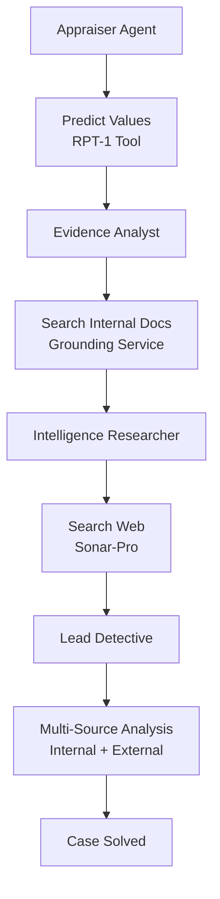

# Discover Connected Crimes with Web Search (JavaScript/TypeScript)

## Overview

In Exercise 05, you learned to search internal documents using the Grounding Service. Your Evidence Analyst can now retrieve factual evidence from security logs, bank records, and termination letters without hallucination.

But investigations don't happen in a vacuum. What if similar crimes happened elsewhere? What if your suspects have public criminal records? What if this heist is part of a larger criminal network?

In this exercise, you'll add **web search capabilities** using Perplexity's **sonar-pro model** to gather external intelligence and discover patterns across the internet.

---

## Understand Web Search with Sonar-Pro

### Why Do We Need Web Search?

Your current investigation system is powerful but limited to **internal data**:

| **What You Can Do Now**                         | **What You Can't Do Yet**                            |
| ----------------------------------------------- | ---------------------------------------------------- |
| ✅ Search museum's internal evidence documents  | ❌ Search public criminal databases                  |
| ✅ Retrieve bank records, security logs         | ❌ Find similar crimes in other cities               |
| ✅ Analyze suspects based on internal evidence  | ❌ Check if suspects have public criminal records    |
| ✅ Ground responses in factual documents        | ❌ Discover criminal network connections             |
| ✅ Avoid hallucination for internal data        | ❌ Monitor online art markets for stolen items       |

**The Problem**: Real investigations combine **internal evidence** (what happened here) with **external intelligence** (what's happening elsewhere). Your agents need both!

### Document Grounding vs. Web Search

You now have access to **two complementary search capabilities**:

| Aspect                 | Document Grounding (Exercise 05)         | Web Search (This Exercise)                |
| ---------------------- | ---------------------------------------- | ----------------------------------------- |
| **Data Source**        | Internal documents (pre-uploaded)        | Real-time web information                 |
| **Coverage**           | Organization-specific evidence           | Global public information                 |
| **Freshness**          | Historical documents (static)            | Current information (updated constantly)  |
| **Use Cases**          | Internal logs, private records, policies | News, criminal records, pattern analysis  |
| **Search Method**      | Vector similarity (semantic)             | Web search + LLM synthesis                |
| **Source Control**     | You control what documents exist         | Public internet (no control)              |
| **Tool Function**      | `callGroundingServiceTool()`             | `callSonarProSearchTool()`                |
| **Privacy**            | Private, secure                          | Public information only                   |
| **When to Use**        | "What does our evidence say?"            | "What do public records show?"            |

> 🎯 **Key Insight**: These are **not alternatives** — they work **together**! The best investigations use both internal evidence AND external intelligence.

### How Sonar-Pro Integrates with SAP Cloud SDK for AI

Sonar-Pro is called through the **OrchestrationClient** using the SAP Cloud SDK for AI, just like GPT-4 or Claude:

```typescript
import { OrchestrationClient } from '@sap-ai-sdk/orchestration'

const webSearchClient = new OrchestrationClient(
    {
        llm: {
            model_name: 'sonar-pro',  // Perplexity's web search model
            model_params: {
                temperature: 0.2,      // Lower for factual results
            },
        },
        templating: {
            template: [
                {
                    role: 'system',
                    content: 'Search for factual information with citations',
                },
                { role: 'user', content: '{{?search_query}}' },
            ],
        },
    },
    { resourceGroup: process.env.RESOURCE_GROUP },
)
```

**Key Differences**:
- `model_name: 'gpt-4o'` → Regular reasoning LLM
- `model_name: 'sonar-pro'` → Web search-enabled LLM
- Both use the same `OrchestrationClient` API!

---

## Add The Web Search Tool

### Step 1: Create the Sonar-Pro Search Tool

You'll create a tool that enables your agents to search the web for criminal patterns, suspect backgrounds, and related incidents.

👉 Open [`/project/JavaScript/solution/src/tools.ts`](/project/JavaScript/solution/src/tools.ts)

👉 Add this tool **after** the `callGroundingServiceTool` function (around line 68):

```typescript
/**
 * Web Search Tool - Uses Perplexity's sonar-pro model for real-time web search
 */
const webSearchClient = new OrchestrationClient(
    {
        llm: {
            model_name: 'sonar-pro',
            model_params: {
                temperature: 0.2, // Lower temperature for factual search
            },
        },
        templating: {
            template: [
                {
                    role: 'system',
                    content:
                        'You are a web search assistant specializing in criminal intelligence. Search for accurate, recent information and always provide source citations with URLs and dates.',
                },
                { role: 'user', content: '{{?search_query}}' },
            ],
        },
    },
    { resourceGroup: process.env.RESOURCE_GROUP },
)

export async function callSonarProSearchTool(search_query: string): Promise<string> {
    try {
        const response = await webSearchClient.chatCompletion({
            inputParams: { search_query },
        })
        return response.getContent() ?? 'No search results found'
    } catch (error) {
        const errorMessage = error instanceof Error ? error.message : String(error)
        console.error('❌ Sonar-pro web search failed:', errorMessage)
        if (error instanceof Error && error.stack) console.error(error.stack)
        return `Error calling sonar-pro web search: ${errorMessage}`
    }
}
```

> 💡 **Understanding the Web Search Tool:**
>
> **1. OrchestrationClient Configuration**
> - `model_name: 'sonar-pro'` - Uses Perplexity's web search-enabled model
> - `temperature: 0.2` - Lower temperature for factual, consistent results
> - Templating system defines the search context and user query format
>
> **2. Search Configuration**
> - System prompt guides the search focus (criminal intelligence)
> - `{{?search_query}}` template parameter receives the search query
> - User query contains specific search (e.g., "Marcus Chen criminal history")
>
> **3. Response Format**
> - Sonar-pro returns synthesized answers with web sources
> - Includes URLs, publication dates, and source reliability
> - Agent receives structured information to inform investigation
>
> **4. Error Handling**
> - Returns error as string (agent can handle gracefully)
> - Logs detailed error information for debugging
> - Agent workflow continues even if search fails

---

## Add The Intelligence Researcher Agent

### Step 1: Add Agent Configuration

👉 Open [`/project/JavaScript/solution/src/agentConfigs.ts`](/project/JavaScript/solution/src/agentConfigs.ts)

👉 Add this configuration **after** the `evidenceAnalyst` section and **before** the `leadDetective` section:

```typescript
    intelligenceResearcher: {
        systemPrompt: (suspectNames: string) => `You are an Open-Source Intelligence (OSINT) Researcher.
    You are an OSINT specialist who excels at finding patterns across multiple crime scenes.
    You search public databases, news archives, and criminal records to connect seemingly isolated incidents.
    Your expertise has uncovered several international art theft rings, and you know how to distinguish professional criminals from amateurs.

    Your goal: Search the web for similar art thefts, criminal patterns, and suspect backgrounds to determine if this heist is part of a larger criminal network

    You have access to the call_sonar_pro_search tool to find recent incidents, news reports, and public criminal records.
    Analyze the suspects: ${suspectNames}

    Search for:
    1. Public criminal records or prior convictions for each suspect
    2. Similar art theft incidents with the same modus operandi (insider job, no forced entry)
    3. Connections to known art theft rings or criminal networks
    4. News reports or public information about any of the suspects
    5. Recent museum heists in Europe with similar patterns`,
    },
```

> 💡 **Why This Agent Design?**
>
> - **Role**: OSINT Researcher - Establishes expertise in public information gathering
> - **Goal**: Specific search objectives (patterns, backgrounds, networks) with explicit tool mention
> - **Backstory**: Provides context and authority for web-based investigations
> - **System Prompt**: Includes detailed search criteria to guide the agent's web research

### Step 2: Update Lead Detective Configuration

👉 In the same file, update the `leadDetective` system prompt to include the intelligence report parameter:

```typescript
    leadDetective: {
        systemPrompt: (
            appraisalResult: string,
            evidenceAnalysis: string,
            intelligenceReport: string,  // NEW parameter
            suspectNames: string,
        ) =>
            `You are the lead detective on this high-profile art theft case. With years of
                experience solving complex crimes, you excel at synthesizing information from
                multiple sources and identifying the culprit based on evidence and expert analysis.

      Your goal: Synthesize all findings from the team to identify the most likely suspect and build a comprehensive case

      You have received the following information from your team:

      1. INSURANCE APPRAISAL: ${appraisalResult}
      2. EVIDENCE ANALYSIS (Internal Documents): ${evidenceAnalysis}
      3. INTELLIGENCE REPORT (Web Search): ${intelligenceReport}  // NEW
      4. SUSPECTS: ${suspectNames}

      Based on all the evidence and analysis, determine:
        - Who is the most likely culprit?
        - What evidence supports this conclusion?
        - What was their motive and opportunity?
        - Is this an isolated incident or part of a larger criminal network?  // NEW
        - Summarise the insurance appraisal values of the stolen artworks.
        - Calculate the total estimated insurance value of the stolen items based on the appraisal results.
        - Provide a comprehensive summary of the case.

      Be thorough and analytical in your conclusion.`,
    },
```

### Step 3: Update Type Definitions

👉 Open [`/project/JavaScript/solution/src/types.ts`](/project/JavaScript/solution/src/types.ts)

👉 Add the `intelligence_report` field to the `AgentState` interface:

```typescript
export interface AgentState {
    payload: RPT1Payload
    suspect_names: string
    appraisal_result?: string
    evidence_analysis?: string
    intelligence_report?: string  // NEW
    final_conclusion?: string
    messages: Array<{
        role: string
        content: string
    }>
}
```

### Step 4: Add Intelligence Researcher Node to Workflow

👉 Open [`/project/JavaScript/solution/src/investigationWorkflow.ts`](/project/JavaScript/solution/src/investigationWorkflow.ts)

👉 **First**, update the imports at the top to include the new tool:

```typescript
import { callRPT1Tool, callGroundingServiceTool, callSonarProSearchTool } from './tools.js'
```

👉 **Second**, add the Intelligence Researcher node **after** the `evidenceAnalystNode()` method and **before** the `leadDetectiveNode()` method:

```typescript
    /**
     * Intelligence Researcher Agent Node - Uses web search to find criminal patterns
     */
    private async intelligenceResearcherNode(state: AgentState): Promise<Partial<AgentState>> {
        console.log('\n🔍 Intelligence Researcher starting web search...')

        try {
            const suspects = state.suspect_names.split(',').map(s => s.trim())
            const intelligenceResults: string[] = []

            // Search for criminal records for each suspect
            for (const suspect of suspects) {
                console.log(`  Searching public records for: ${suspect}`)
                const query = `${suspect} criminal record art theft security technician Europe background check`
                const result = await callSonarProSearchTool(query)
                intelligenceResults.push(`Background check for ${suspect}:\n${result}`)
            }

            // Search for similar art theft patterns
            console.log('  Searching for similar art theft incidents...')
            const patternQuery =
                'museum art theft insider job no forced entry Europe similar incidents criminal network'
            const patternResult = await callSonarProSearchTool(patternQuery)
            intelligenceResults.push(`Similar Art Theft Patterns:\n${patternResult}`)

            const intelligenceReport = `Intelligence Research Complete: ${intelligenceResults.join('\n\n')}
      Summary: Conducted OSINT research on all suspects and identified similar crime patterns`

            console.log('✅ Intelligence research complete')

            return {
                intelligence_report: intelligenceReport,
                messages: [...state.messages, { role: 'assistant', content: intelligenceReport }],
            }
        } catch (error) {
            const errorMsg = error instanceof Error ? error.message : String(error)
            console.error('❌ Intelligence research failed:', errorMsg)
            if (error instanceof Error && error.stack) {
                console.error(error.stack)
            }
            return {
                intelligence_report: `Error during intelligence research: ${errorMsg}`,
                messages: [
                    ...state.messages,
                    { role: 'assistant', content: `Error during intelligence research: ${errorMsg}` },
                ],
            }
        }
    }
```

👉 **Third**, update the `leadDetectiveNode()` method to pass the intelligence report:

```typescript
    private async leadDetectiveNode(state: AgentState): Promise<Partial<AgentState>> {
        console.log('\n🔍 Lead Detective analyzing all findings...')

        const userMessage = 'Analyze all the evidence and identify the culprit. Provide a detailed conclusion.'

        try {
            const response = await this.orchestrationClient.chatCompletion({
                messages: [
                    {
                        role: 'system',
                        content: AGENT_CONFIGS.leadDetective.systemPrompt(
                            state.appraisal_result || 'No appraisal result available',
                            state.evidence_analysis || 'No evidence analysis available',
                            state.intelligence_report || 'No intelligence report available',  // NEW
                            state.suspect_names,
                        ),
                    },
                    { role: 'user', content: userMessage },
                ],
            })
            const conclusion = response.getContent() || 'No conclusion could be drawn.'

            console.log('✅ Investigation complete')

            return {
                final_conclusion: conclusion,
                messages: [...state.messages, { role: 'assistant', content: conclusion }],
            }
        } catch (error) {
            const errorMsg = `Error during final analysis: ${error}`
            console.error('❌', errorMsg)
            return {
                final_conclusion: errorMsg,
                messages: [...state.messages, { role: 'assistant', content: errorMsg }],
            }
        }
    }
```

👉 **Fourth**, update the `buildGraph()` method to include the intelligence researcher node:

```typescript
    private buildGraph(): StateGraph<AgentState> {
        const workflow = new StateGraph<AgentState>({
            channels: {
                payload: null,
                suspect_names: null,
                appraisal_result: null,
                evidence_analysis: null,
                intelligence_report: null,  // NEW
                final_conclusion: null,
                messages: null,
            },
        })

        // Add nodes and edges using chained API (required in LangGraph 0.2+)
        workflow
            .addNode('appraiser', this.appraiserNode.bind(this))
            .addNode('evidence_analyst', this.evidenceAnalystNode.bind(this))
            .addNode('intelligence_researcher', this.intelligenceResearcherNode.bind(this))  // NEW
            .addNode('lead_detective', this.leadDetectiveNode.bind(this))
            .addEdge(START, 'appraiser')
            .addEdge('appraiser', 'evidence_analyst')
            .addEdge('evidence_analyst', 'intelligence_researcher')  // NEW
            .addEdge('intelligence_researcher', 'lead_detective')    // NEW
            .addEdge('lead_detective', END)

        return workflow
    }
```

---

## Build and Run Your Enhanced Investigation

### Step 1: Build the TypeScript Project

👉 Build the project to compile your TypeScript changes:

```bash
# From repository root
npm run build --prefix ./project/JavaScript/solution
```

```bash
# From solution folder
npm run build
```

### Step 2: Run the Investigation

👉 Run your enhanced multi-agent system with web search:

```bash
# From repository root
npm start --prefix ./project/JavaScript/solution
```

```bash
# From solution folder
npm start
```

> ⏱️ **This may take 4-7 minutes** as your agents:
>
> 1. Predict stolen item values (Appraiser with RPT-1)
> 2. Search internal evidence documents (Evidence Analyst with Grounding)
> 3. Search the web for criminal patterns (Intelligence Researcher with Sonar-Pro) ← NEW!
> 4. Synthesize all findings (Lead Detective)

👉 Review the intelligence report from the web search:
- Did it find similar crimes?
- Do any suspects have public criminal records?
- Is there evidence of a criminal network?

---

## Understanding Web Search Integration

### What Just Happened?

You created a complete multi-source intelligence gathering system that:

1. **Searches Internal Documents** (Grounding Service) - Evidence from within the museum
2. **Searches External Web** (Sonar-Pro) - Public information from across the internet
3. **Combines Intelligence** - Both sources inform the investigation

### The Enhanced Investigation Flow



### When to Use Each Search Type

**Use Document Grounding** (`callGroundingServiceTool()`) when:
- ✅ Searching organization-specific documents
- ✅ Accessing private/confidential information
- ✅ Finding internal evidence (logs, records, policies)
- ✅ You control the document collection
- ✅ Need semantic search across your own data

**Use Web Search** (`callSonarProSearchTool()`) when:
- ✅ Searching public information
- ✅ Finding current events or recent news
- ✅ Checking criminal databases or public records
- ✅ Discovering patterns across multiple organizations
- ✅ Need real-time, up-to-date information

**Use Both** when:
- ✅ You need comprehensive intelligence (internal + external)
- ✅ Cross-referencing private evidence with public records
- ✅ Verifying internal findings against external sources
- ✅ Building a complete picture from multiple angles

---

## Key Takeaways

- **Web Search** extends your investigation beyond internal documents to public intelligence
- **Sonar-Pro** provides real-time web search with source citations via OrchestrationClient
- **SAP Cloud SDK for AI** uses the same API pattern for both regular LLMs and web search models
- **Multi-Source Intelligence** combines internal evidence + external intelligence
- **Complementary Tools**: Document grounding and web search work together, not in competition
- **Complete Investigation**: Real detectives use both internal records AND external research
- **Pattern Discovery**: Web search reveals connections that internal documents can't show
- **TypeScript Integration**: Type-safe implementation with proper error handling

---

## Next Steps

You now have a complete intelligence gathering system with:
1. ✅ Structured data predictions (RPT-1)
2. ✅ Internal document search (Grounding Service)
3. ✅ External web intelligence (Sonar-Pro)
4. ✅ Multi-agent coordination (LangGraph)

In the next exercise, you can refine your investigation or explore additional agent capabilities!

---

## Troubleshooting

**Issue**: `Module not found: @sap-ai-sdk/orchestration`

- **Solution**: Ensure all dependencies are installed:
  ```bash
  npm install
  ```

**Issue**: `Error: Model sonar-pro not found`

- **Solution**: Verify that:
  - Sonar-pro is available in your SAP AI Core Generative AI Hub model catalog
  - Your resource group has access to Perplexity models
  - Check SAP AI Launchpad → Generative AI Hub → Models for available models

**Issue**: Web search returns no results or very generic information

- **Solution**: Make your search queries more specific:
  - ❌ Bad: "art theft"
  - ✅ Good: "Marcus Chen security technician unauthorized access criminal record Europe"
  - Include suspect names, locations, and specific details

**Issue**: `TypeError: response.getContent is not a function`

- **Solution**: Ensure you're using the latest version of `@sap-ai-sdk/orchestration`:
  ```bash
  npm update @sap-ai-sdk/orchestration
  ```

**Issue**: TypeScript compilation errors

- **Solution**:
  - Run `npm run clean` to remove old build artifacts
  - Run `npm run build` to rebuild
  - Check that all type definitions are properly imported

**Issue**: Web search takes too long or times out

- **Solution**:
  - Sonar-pro queries can take 10-30 seconds per search
  - This is normal for real-time web crawling
  - Consider adjusting timeout settings in OrchestrationClient if needed

---

## Resources

- [SAP Cloud SDK for AI Documentation](https://sap.github.io/ai-sdk/docs/js/orchestration/chat-completion)
- [Perplexity API Documentation](https://docs.perplexity.ai/)
- [SAP AI Core Orchestration Workflow](https://help.sap.com/docs/sap-ai-core/generative-ai/orchestration-workflow-v2)
- [LangGraph Documentation](https://langchain-ai.github.io/langgraphjs/)

[Next exercise](07-solve-the-crime.md)
