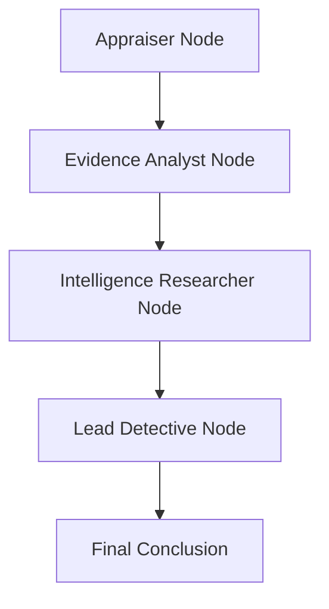

# Discover Connected Crimes with Web Search (TypeScript/LangGraph)

## Overview

In Exercise 05, you learned to search internal documents using the Grounding Service. Your Evidence Analyst can now retrieve factual evidence from security logs, bank records, and termination letters without hallucination.

But investigations don't happen in a vacuum. What if similar crimes happened elsewhere? What if your suspects have public criminal records? What if this heist is part of a larger criminal network?

In this exercise, you'll add **web search capabilities** using Perplexity's **sonar-pro model** to gather external intelligence and discover patterns across the internet.

---

## Understand Web Search with Sonar-Pro

### Why Do We Need Web Search?

Your current investigation system is powerful but limited to **internal data**:

| **What You Can Do Now**                         | **What You Can't Do Yet**                            |
| ----------------------------------------------- | ---------------------------------------------------- |
| ✅ Search museum's internal evidence documents  | ❌ Search public criminal databases                  |
| ✅ Retrieve bank records, security logs         | ❌ Find similar crimes in other cities               |
| ✅ Analyze suspects based on internal evidence  | ❌ Check if suspects have public criminal records    |
| ✅ Ground responses in factual documents        | ❌ Discover criminal network connections             |
| ✅ Avoid hallucination for internal data        | ❌ Monitor online art markets for stolen items       |

**The Problem**: Real investigations combine **internal evidence** (what happened here) with **external intelligence** (what's happening elsewhere). Your agents need both!

### Document Grounding vs. Web Search

| Aspect                 | Document Grounding (Exercise 05)         | Web Search (This Exercise)                |
| ---------------------- | ---------------------------------------- | ----------------------------------------- |
| **Data Source**        | Internal documents (pre-uploaded)        | Real-time web information                 |
| **Coverage**           | Organization-specific evidence           | Global public information                 |
| **Freshness**          | Historical documents (static)            | Current information (updated constantly)  |
| **Use Cases**          | Internal logs, private records, policies | News, criminal records, pattern analysis  |
| **Search Method**      | Vector similarity (semantic)             | Web search + LLM synthesis                |
| **Tool Function**      | `callGroundingServiceTool()`             | `callSonarProSearchTool()`                |
| **When to Use**        | "What does our evidence say?"            | "What do public records show?"            |

> 🎯 **Key Insight**: These are **not alternatives** — they work **together**!

### How Sonar-Pro Integrates with SAP Cloud SDK for AI

Sonar-Pro is called through the **OrchestrationClient** using the same `promptTemplating` API you already use for GPT-4o and Claude:

```typescript
import { OrchestrationClient } from "@sap-ai-sdk/orchestration";

const webSearchClient = new OrchestrationClient(
  {
    promptTemplating: {
      model: {
        name: "sonar-pro",  // Perplexity's web search model
        params: {
          temperature: 0.2,  // Lower for factual results
        },
      },
      prompt: {
        template: [
          {
            role: "system",
            content: "Search for factual information with citations",
          },
          { role: "user", content: "{{?search_query}}" },
        ],
      },
    },
  },
  { resourceGroup: process.env.RESOURCE_GROUP },
);
```

**Key Difference**:
- `model.name: "gpt-4o"` → Regular reasoning LLM
- `model.name: "sonar-pro"` → Web search-enabled LLM
- Both use the same `OrchestrationClient` API!

> ⚠️ **Before continuing**: Verify that `sonar-pro` is available in your SAP AI Core resource group. Go to **SAP AI Launchpad → Generative AI Hub → Models** and confirm you can see a Perplexity sonar-pro deployment. If it is not listed, ask your workshop instructor to enable it.

---

## Add The Web Search Tool

### Step 1: Create the Sonar-Pro Search Tool

👉 Open [`/project/JavaScript/starter-project/src/tools.ts`](/project/JavaScript/starter-project/src/tools.ts)

👉 Add this tool **after** the `callGroundingServiceTool` function:

```typescript
const webSearchClient = new OrchestrationClient(
  {
    promptTemplating: {
      model: {
        name: "sonar-pro",
        params: {
          temperature: 0.2,
        },
      },
      prompt: {
        template: [
          {
            role: "system",
            content:
              "You are a web search assistant specializing in criminal intelligence. Search for accurate, recent information and always provide source citations with URLs and dates.",
          },
          { role: "user", content: "{{?search_query}}" },
        ],
      },
    },
  },
  { resourceGroup: process.env.RESOURCE_GROUP },
);

export async function callSonarProSearchTool(search_query: string): Promise<string> {
  try {
    const response = await webSearchClient.chatCompletion({
      placeholderValues: { search_query },
    });
    return response.getContent() ?? "No search results found";
  } catch (error) {
    const errorMessage = error instanceof Error ? error.message : String(error);
    console.error("❌ Sonar-pro web search failed:", errorMessage);
    if (error instanceof Error && error.stack) console.error(error.stack);
    return `Error calling sonar-pro web search: ${errorMessage}`;
  }
}
```

> 💡 **Understanding the Web Search Tool:**
>
> - `model.name: "sonar-pro"` — Perplexity's web search-enabled model, called through SAP AI Core
> - `temperature: 0.2` — Lower temperature for factual, consistent results
> - `{{?search_query}}` — Template placeholder receives the search query
> - Returns synthesized answers with web source citations

---

## Add The Intelligence Researcher Agent

### Step 1: Update Type Definitions

👉 Open [`/project/JavaScript/starter-project/src/types.ts`](/project/JavaScript/starter-project/src/types.ts)

👉 Add the `intelligence_report` field to the `AgentState` annotation **after** `evidence_analysis` and **before** `final_conclusion`:

```typescript
  intelligence_report: Annotation<string | undefined>({
    reducer: (_, update) => update,
    default: () => undefined,
  }),
```

### Step 2: Add Agent Configuration

👉 Open [`/project/JavaScript/starter-project/src/agentConfigs.ts`](/project/JavaScript/starter-project/src/agentConfigs.ts)

👉 Add this configuration **after** `evidenceAnalyst` and **before** `leadDetective`:

```typescript
  intelligenceResearcher: {
    systemPrompt: (suspectNames: string) => `You are an Open-Source Intelligence (OSINT) Researcher.
    You are an OSINT specialist who excels at finding patterns across multiple crime scenes.
    You search public databases, news archives, and criminal records to connect seemingly isolated incidents.
    Your expertise has uncovered several international art theft rings, and you know how to distinguish professional criminals from amateurs.

    Your goal: Search the web for similar art thefts, criminal patterns, and suspect backgrounds to determine if this heist is part of a larger criminal network

    Analyze the suspects: ${suspectNames}

    Search for:
    1. Public criminal records or prior convictions for each suspect
    2. Similar art theft incidents with the same modus operandi (insider job, no forced entry)
    3. Connections to known art theft rings or criminal networks
    4. News reports or public information about any of the suspects
    5. Recent museum heists in Europe with similar patterns`,
  },
```

👉 Also update the `leadDetective` system prompt to include `intelligenceReport` as a third parameter before `suspectNames`:

```typescript
  leadDetective: {
    systemPrompt: (
      appraisalResult: string,
      evidenceAnalysis: string,
      intelligenceReport: string,
      suspectNames: string,
    ) =>
      `You are the lead detective on this high-profile art theft case...

      1. INSURANCE APPRAISAL: ${appraisalResult}
      2. EVIDENCE ANALYSIS (Internal Documents): ${evidenceAnalysis}
      3. INTELLIGENCE REPORT (Web Search): ${intelligenceReport}
      4. SUSPECTS: ${suspectNames}
      ...`
  }
```

(Use the full prompt text from the solution — don't truncate it in the actual file.)

### Step 3: Add the Intelligence Researcher Node

👉 Open [`/project/JavaScript/starter-project/src/investigationWorkflow.ts`](/project/JavaScript/starter-project/src/investigationWorkflow.ts)

👉 **First**, update the import to include the new tool:

```typescript
import { callRPT1Tool, callGroundingServiceTool, callSonarProSearchTool } from "./tools.js";
```

👉 **Second**, add the Intelligence Researcher node **after** `evidenceAnalystNode` and **before** `leadDetectiveNode`:

```typescript
  private async intelligenceResearcherNode(state: AgentStateType): Promise<Partial<AgentStateType>> {
    console.log("\n🔍 Intelligence Researcher starting web search...");

    try {
      const suspects = state.suspect_names.split(",").map((s) => s.trim());
      const intelligenceResults: string[] = [];

      for (const suspect of suspects) {
        console.log(`  Searching public records for: ${suspect}`);
        const query = `${suspect} criminal record art theft security technician Europe background check`;
        const result = await callSonarProSearchTool(query);
        intelligenceResults.push(`Background check for ${suspect}:\n${result}`);
      }

      console.log("  Searching for similar art theft incidents...");
      const patternQuery =
        "museum art theft insider job no forced entry Europe similar incidents criminal network";
      const patternResult = await callSonarProSearchTool(patternQuery);
      intelligenceResults.push(`Similar Art Theft Patterns:\n${patternResult}`);

      const rawResults = `Intelligence Research Complete:\n\n${intelligenceResults.join("\n\n")}`;

      const response = await this.orchestrationClient.chatCompletion({
        messages: [
          {
            role: "system",
            content: AGENT_CONFIGS.intelligenceResearcher.systemPrompt(state.suspect_names),
          },
          {
            role: "user",
            content: `Here are the web search results. Write a concise intelligence report:\n\n${rawResults}`,
          },
        ],
      });

      const intelligenceReport = response.getContent() || "No intelligence report could be generated.";
      console.log("✅ Intelligence research complete");

      return {
        intelligence_report: intelligenceReport,
        messages: [...state.messages, { role: "assistant", content: intelligenceReport }],
      };
    } catch (error) {
      const errorMsg = error instanceof Error ? error.message : String(error);
      console.error("❌ Intelligence research failed:", errorMsg);
      if (error instanceof Error && error.stack) {
        console.error(error.stack);
      }
      return {
        intelligence_report: `Error during intelligence research: ${errorMsg}`,
        messages: [
          ...state.messages,
          { role: "assistant", content: `Error during intelligence research: ${errorMsg}` },
        ],
      };
    }
  }
```

👉 **Third**, update `leadDetectiveNode` to pass `intelligence_report` to the system prompt. Find the `AGENT_CONFIGS.leadDetective.systemPrompt(...)` call and update it to:

```typescript
          content: AGENT_CONFIGS.leadDetective.systemPrompt(
            state.appraisal_result || "No appraisal result available",
            state.evidence_analysis || "No evidence analysis available",
            state.intelligence_report || "No intelligence report available",
            state.suspect_names,
          ),
```

👉 **Fourth**, update `buildGraph()` to include the intelligence researcher node and rewire edges:

```typescript
    workflow
      .addNode("appraiser", this.appraiserNode.bind(this))
      .addNode("evidence_analyst", this.evidenceAnalystNode.bind(this))
      .addNode("intelligence_researcher", this.intelligenceResearcherNode.bind(this))
      .addNode("lead_detective", this.leadDetectiveNode.bind(this))
      .addEdge(START, "appraiser")
      .addEdge("appraiser", "evidence_analyst")
      .addEdge("evidence_analyst", "intelligence_researcher")
      .addEdge("intelligence_researcher", "lead_detective")
      .addEdge("lead_detective", END);
```

👉 **Fifth**, update the `kickoff` method's logging to include the intelligence report:

```typescript
    console.log("\n--- Intelligence Report ---");
    console.log(result.intelligence_report ?? "(not set)");
```

(Add after the evidence analysis log line)

### Step 4: Verify TypeScript compiles

Run from `project/JavaScript/solution/`:
```bash
cd project/JavaScript/solution
npm run build
```

If it compiles without errors, all type changes are consistent.

---

## Run Your Enhanced Investigation

```bash
cd project/JavaScript/starter-project
npm install
npm run dev
```

> ⏱️ **This may take 3-6 minutes** as your agents run through all four steps.

---

## Understanding the Enhanced Graph



In LangGraph, each node receives the full `AgentState` and returns a **partial state update**. The `intelligence_report` field flows from the Intelligence Researcher node to the Lead Detective node through the state.

---

## Key Takeaways

- **Sonar-Pro** provides real-time web search through the same `OrchestrationClient` API you already use
- **LangGraph state** carries `intelligence_report` forward to the Lead Detective automatically
- **Deterministic orchestration**: the node calls the tool directly (no LLM tool-calling loop) — predictable and efficient
- **Multi-source intelligence**: grounding (internal) + web search (external) → detective synthesis

---

## Next Steps

You now have a complete intelligence gathering system with:
1. ✅ Structured data predictions (RPT-1)
2. ✅ Internal document search (Grounding Service)
3. ✅ External web intelligence (Sonar-Pro)

In the next exercise, you'll add the **Lead Detective Agent** who will synthesize all three sources to [solve the museum art theft mystery](07-solve-the-crime.md).

---

## Troubleshooting

**Issue**: `Error: Model sonar-pro not found` or 404 from OrchestrationClient

- **Solution**: Verify that sonar-pro is deployed in your SAP AI Core resource group. Check **SAP AI Launchpad → Generative AI Hub → Models**.

**Issue**: `callSonarProSearchTool is not exported`

- **Solution**: Ensure you exported the function: `export async function callSonarProSearchTool(...)`

**Issue**: TypeScript error on `state.intelligence_report`

- **Solution**: Ensure you added the `intelligence_report` field to `AgentState` in `types.ts` before the `Annotation.Root` closing brace.

**Issue**: Web search takes too long

- **Solution**: Sonar-pro queries can take 10-30 seconds per search; this is normal for real-time web crawling.

---

## Resources

- [Perplexity API Documentation](https://docs.perplexity.ai/)
- [SAP Cloud SDK for AI Documentation](https://sap.github.io/ai-sdk-js/)
- [LangGraph Documentation](https://langchain-ai.github.io/langgraphjs/)

[Next exercise](07-solve-the-crime.md)
