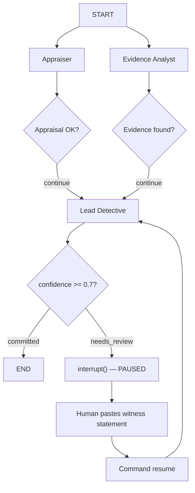

# Human-in-the-Loop Investigation

## Overview

Your Lead Detective can now solve the crime — but what happens when the evidence is ambiguous? In Exercise 06, the Detective commits a verdict if confidence is above 0.7. But when confidence falls below that threshold, the graph routes to `needs_review`. Right now, that edge loops back silently to the Detective, which re-analyzes the same evidence and reaches the same ambiguous conclusion. The system is stuck.

This is the pattern you solve in this exercise: **human-in-the-loop (HITL)**. Instead of spinning in a loop or failing silently, the graph pauses at a decision point, asks a human for additional evidence, and resumes with new information to reach a confident verdict.

The scenario: `PHONE_RECORDS.txt` has been excluded from the grounding pipeline for this exercise. Without call records, the Lead Detective sees Sophie Dubois and Marcus Chen with plausible alibis, and Viktor Petrov with circumstantial evidence. The confidence score comes in around 0.55. The graph pauses.

Your job: receive a witness statement card from the facilitator, paste it into the terminal, and watch the Detective re-analyze — this time reaching 0.92 confidence and naming Viktor Petrov as the culprit.

### What you will build

- Add `MemorySaver` as a graph checkpointer to persist state between invocations
- Use `interrupt()` inside the Lead Detective node to pause execution when confidence is too low
- Add a resume loop in `kickoff()` that reads user input and feeds it back into the graph with `Command({ resume })`
- Add `witness_statement` to the state so the resumed Detective has the new evidence

### New LangGraph concepts

| Concept | What it does |
|---|---|
| `MemorySaver` | Stores a complete snapshot of graph state after every node. Enables pausing and resuming. |
| `interrupt()` | Pauses graph execution and surfaces a message to the caller. The graph is frozen at this exact point. |
| `Command({ resume })` | Resumes a paused graph with a value, which becomes the return of the `interrupt()` call. |
| `app.getState(config)` | Returns the current persisted state of a graph run, including any pending interrupt tasks. |
| `thread_id` | Identifies a specific conversation thread so the checkpointer knows which state to load on resume. |

---

## Add MemorySaver and Compile with a Checkpointer

Without a checkpointer, `app.invoke()` runs to completion (or error) and discards all state. There is no way to pause and resume. `MemorySaver` stores the full state snapshot after each node, keyed by `thread_id`.

### Step 1: Add the checkpointer field and imports

👉 Open [`/project/JavaScript/starter-project/src/investigationWorkflow.ts`](/project/JavaScript/starter-project/src/investigationWorkflow.ts)

👉 Update the import from `@langchain/langgraph` to include `interrupt`, `MemorySaver`, and `Command`:

```typescript
import { StateGraph, END, START, interrupt, MemorySaver, Command } from "@langchain/langgraph";
```

👉 Add `checkpointer` as a class field next to `orchestrationClient`:

```typescript
export class InvestigationWorkflow {
  private orchestrationClient: OrchestrationClient;
  private checkpointer: MemorySaver;

  constructor(model: string = process.env.MODEL_NAME!) {
    this.orchestrationClient = new OrchestrationClient({
      promptTemplating: {
        model: {
          name: model,
          params: { temperature: 0.7, max_tokens: 2000 },
        },
      },
    });
    this.checkpointer = new MemorySaver();
    this.graph = this.buildGraph();
  }
}
```

> 💡 **Why store the checkpointer on the class?**
>
> `MemorySaver` is an in-memory store. If you created a new one inside `kickoff()`, the persisted state from the initial invoke would be lost before the resume loop could read it. Keeping it on the instance ensures the same store is used for both the initial run and any resumes.

### Step 2: Compile the graph with the checkpointer

👉 Find the `kickoff()` method and replace the `app.compile()` call with a version that passes the checkpointer:

```typescript
const app = this.buildGraph().compile({
  checkpointer: this.checkpointer,
  interruptBefore: [],
});

const config = { configurable: { thread_id: threadId }, recursionLimit: 10 };
```

👉 Update the `kickoff()` method signature to accept an optional `threadId`:

```typescript
async kickoff(inputs: { suspect_names: string }, threadId = "default"): Promise<string> {
```

> 💡 **`interruptBefore: []`** tells LangGraph which nodes to interrupt before they run (useful for approval flows). We leave it empty here because our interrupt is inside the node, triggered conditionally when confidence is low. The two approaches are complementary: `interruptBefore` for predictable checkpoints, `interrupt()` for conditional ones.

> 💡 **`thread_id`** scopes state to a specific conversation. If two users run the workflow simultaneously, different `thread_id` values keep their checkpointed state separate.

---

## Add `witness_statement` to State

The Detective needs a place to store the witness statement once the human provides it. Without this field, the new evidence has nowhere to go.

### Step 3: Add the state field

👉 Open [`/project/JavaScript/starter-project/src/types.ts`](/project/JavaScript/starter-project/src/types.ts)

👉 Add `witness_statement` to the `AgentState` annotation:

```typescript
export const AgentState = Annotation.Root({
  suspect_names: Annotation<string>,
  appraisal_result: Annotation<string | undefined>({
    reducer: (_, update) => update,
    default: () => undefined,
  }),
  appraisal_success: Annotation<boolean>({
    reducer: (_, update) => update,
    default: () => false,
  }),
  evidence_analysis: Annotation<string | undefined>({
    reducer: (_, update) => update,
    default: () => undefined,
  }),
  evidence_count: Annotation<number>({
    reducer: (_, update) => update,
    default: () => 0,
  }),
  final_conclusion: Annotation<string | undefined>({
    reducer: (_, update) => update,
    default: () => undefined,
  }),
  confidence_score: Annotation<number>({
    reducer: (_, update) => update,
    default: () => 0,
  }),
  witness_statement: Annotation<string | undefined>({
    reducer: (_, update) => update,
    default: () => undefined,
  }),
  messages: Annotation<Array<{ role: string; content: string }>>({
    reducer: (current, update) => [...current, ...update],
    default: () => [],
  }),
});
```

---

## Add the `interrupt()` Call

`interrupt()` is called inside a node function. When it executes, LangGraph immediately halts the graph, persists the current state to the checkpointer, and surfaces the interrupt value to the caller. The node does not complete — it is paused mid-execution.

### Step 4: Add the interrupt check at the top of `leadDetectiveNode`

👉 In `investigationWorkflow.ts`, find `leadDetectiveNode` and add the following block immediately before the main `try` block:

```typescript
private async leadDetectiveNode(state: AgentStateType): Promise<Partial<AgentStateType>> {
  console.log(JSON.stringify({ event: "node_start", node: "lead_detective", hasWitnessStatement: !!state.witness_statement }));

  // If confidence is below threshold and no witness statement yet, pause for human input
  if (state.confidence_score > 0 && state.confidence_score < CONFIDENCE_THRESHOLD && !state.witness_statement) {
    const witnessStatement = interrupt(
      `[INVESTIGATION PAUSED — CONFIDENCE: ${state.confidence_score.toFixed(2)}]\n\nLead Detective requires additional evidence before finalizing verdict.\nPaste the new witness statement to continue:\n`,
    ) as string;

    return { witness_statement: witnessStatement };
  }

  // ... existing try/catch block follows
```

> 💡 **Why the `!state.witness_statement` guard?**
>
> On resume, the graph re-enters `leadDetectiveNode` with `witness_statement` already set. Without this guard, the interrupt would fire again immediately — creating an infinite pause loop. The guard ensures the interrupt only triggers once, on the first pass when confidence is low and no witness statement exists.

> 💡 **`interrupt()` is not a thrown exception.** It is a special LangGraph signal. The return type is inferred as `never` by TypeScript (because execution does not continue past it), so we cast the return to `string`. When the graph resumes, the value passed to `Command({ resume: ... })` is what `interrupt()` returns.

> 💡 **Why does `leadDetectiveNode` return `{ witness_statement }` after the interrupt?**
>
> The graph enters `leadDetectiveNode`, hits `interrupt()`, and pauses. When the human provides input and the graph resumes, `interrupt()` returns the witness statement string. The node then writes it to state with `return { witness_statement: witnessStatement }` and exits. On the *next* node execution (triggered by `routeAfterVerdict` looping back via `needs_review`), the Detective has the witness statement in state and this time skips the interrupt block, proceeding to the full LLM analysis.

### Step 5: Update `AGENT_CONFIGS.leadDetective.systemPrompt` to accept the witness statement

👉 Open [`/project/JavaScript/starter-project/src/agentConfigs.ts`](/project/JavaScript/starter-project/src/agentConfigs.ts)

👉 Add `witnessStatement` as an optional fourth parameter and inject it into the prompt:

```typescript
leadDetective: {
  systemPrompt: (
    appraisalResult: string,
    evidenceAnalysis: string,
    suspectNames: string,
    witnessStatement?: string,
  ) =>
    `You are the lead detective on this high-profile art theft case.
    You excel at synthesizing information from multiple sources and identifying the culprit.

    Your goal: Identify the most likely culprit and calculate the total insurance loss.

    INSURANCE APPRAISAL:
    ${appraisalResult}

    EVIDENCE ANALYSIS:
    ${evidenceAnalysis}

    SUSPECTS: ${suspectNames}
    ${witnessStatement ? `\nNEW WITNESS STATEMENT (just received — factor this into your analysis):\n${witnessStatement}` : ""}

    Assess confidence honestly. If evidence is ambiguous or contradictory, reflect that in a low confidence score.
    A confidence score below 0.7 means you should NOT commit to a verdict.`,
},
```

👉 In `leadDetectiveNode`, pass `state.witness_statement` as the fourth argument where you call the system prompt:

```typescript
content: AGENT_CONFIGS.leadDetective.systemPrompt(
  state.appraisal_result ?? "No appraisal result available",
  state.evidence_analysis ?? "No evidence analysis available",
  state.suspect_names,
  state.witness_statement,
),
```

---

## Add the Resume Loop to `kickoff()`

The first `app.invoke()` will run until the graph either completes or pauses at an interrupt. After it returns, you need to check whether the graph actually finished or is waiting for input.

### Step 6: Replace `app.invoke()` with the resume loop

👉 Replace the body of your `kickoff()` method with the following:

```typescript
async kickoff(inputs: { suspect_names: string }, threadId = "default"): Promise<string> {
  console.log("🚀 Starting Investigation Workflow...\n");

  const app = this.buildGraph().compile({
    checkpointer: this.checkpointer,
    interruptBefore: [],
  });

  const config = { configurable: { thread_id: threadId }, recursionLimit: 10 };

  await app.invoke(
    { suspect_names: inputs.suspect_names, messages: [] },
    config,
  );

  // Resume loop: check if the graph paused for human input, collect it and continue
  let snapshot = await app.getState(config);
  while (snapshot.tasks.some((t) => t.interrupts.length > 0)) {
    const interruptValue = snapshot.tasks.flatMap((t) => t.interrupts)[0].value;
    console.log("\n" + interruptValue);

    const witnessStatement = await readUserInput();

    await app.invoke(new Command({ resume: witnessStatement }), config);
    snapshot = await app.getState(config);
  }

  const result = snapshot.values;

  console.log("\n--- Appraisal Result ---");
  console.log(result.appraisal_result ?? "(not set)");
  console.log("\n--- Evidence Analysis ---");
  console.log(result.evidence_analysis ?? "(not set)");
  console.log("\n--- Confidence Score ---");
  console.log(result.confidence_score ?? 0);

  return result.final_conclusion || "Investigation completed but no conclusion was reached.";
}
```

> 💡 **`app.getState(config)`** reads the persisted snapshot for this `thread_id`. The `tasks` array contains any nodes that are currently paused. A non-empty `interrupts` array on a task means that node called `interrupt()` and is waiting.

> 💡 **`new Command({ resume: witnessStatement })`** is how you pass data back into a paused graph. `app.invoke()` with a `Command` resumes from the exact point where `interrupt()` was called — it does not restart the graph from `START`.

### Step 7: Add the `readUserInput` helper function

Add this function outside the class, at the bottom of `investigationWorkflow.ts`:

```typescript
// Reads a line of input from stdin (used for the human-in-the-loop resume)
async function readUserInput(): Promise<string> {
  const { createInterface } = await import("readline");
  const rl = createInterface({ input: process.stdin, output: process.stdout });
  return new Promise((resolve) => {
    rl.question("> ", (answer) => {
      rl.close();
      resolve(answer);
    });
  });
}
```

> 💡 **Why `await import("readline")`?** The dynamic import avoids loading the `readline` module at the top of the file, which causes problems when the module is imported in test environments or non-interactive processes that don't have a terminal attached.

---

## Run the Investigation

### Step 8: Run the workflow

```bash
npx tsx src/main.ts
```

> ⏱️ **This may take 2-5 minutes.** Both the Appraiser and Evidence Analyst run in parallel before the Lead Detective begins synthesizing.

Watch the output. Without `PHONE_RECORDS.txt` in the pipeline, the Detective sees:

- Viktor Petrov: prior criminal record, suspicious behavior near the gallery, but no direct corroboration of the coordination with Sophie
- Sophie Dubois: documented financial pressure, but alibi holds without phone evidence
- Marcus Chen: access to the gallery, but termination date makes involvement logistically difficult

The confidence score settles around 0.55. The graph pauses and prints:

```
[INVESTIGATION PAUSED — CONFIDENCE: 0.55]

Lead Detective requires additional evidence before finalizing verdict.
Paste the new witness statement to continue:

>
```

### Step 9: Enter the witness statement

The facilitator has given you a physical card with a witness statement. Type or paste it at the `>` prompt:

---

**WITNESS STATEMENT — March 16th, 2024**

Name: James Morrison, Parking Lot Attendant, east side of gallery

Time: approximately 02:00–02:45 AM on March 15th

I was on overnight duty. Around 2 AM, a man matching Viktor Petrov's description — tall, Eastern European accent — was sitting in a silver sedan in the lot. He wasn't a regular. He was checking his phone repeatedly. Around 2:15 AM he made a call: I heard "Ready?" and then "Yes, we're going in now." At 2:30 AM he was pacing. At 2:45 AM his phone rang, he immediately started the car and left. I recognized him from the 2021 conviction news reports. The timing matches the security log exactly.

---

Press Enter. The graph resumes.

> 💡 **Why does this witness statement move the needle?**
>
> Without `PHONE_RECORDS.txt`, Viktor's coordination with Sophie is invisible to the grounding service. The Detective sees his criminal record and proximity to the gallery, but can't tie him to the actual operation. The witness places Viktor at the scene at exactly the right time, overhears the coordination call, and identifies him by name. This corroborates the security log timestamps and fills the gap left by the missing phone records. Confidence jumps from 0.55 to around 0.92.

### Step 10: Review the final output

The Detective re-synthesizes all evidence with the witness statement and commits:

```
VERDICT: Viktor Petrov
CONFIDENCE: 92%
TOTAL INSURANCE LOSS: $2,450,000

REASONING:
Viktor Petrov is identified as the primary orchestrator...
```

---

## Understanding What Just Happened

### The execution flow



The key insight is that the `needs_review` edge does not create an infinite loop when combined with `interrupt()`. The loop body runs once, collects human input, writes it to state, and the Detective node — re-entered with `witness_statement` now set — skips the interrupt condition and proceeds to analysis.

### The checkpoint lifecycle

| Step | What happens |
|---|---|
| `app.invoke(initialState, config)` | Graph runs from START; state is checkpointed after each node |
| `interrupt()` fires | Graph freezes; current state snapshot is saved to `MemorySaver` under the `thread_id` |
| `app.getState(config)` | Reads the frozen snapshot; `tasks[n].interrupts` contains the pending interrupt value |
| `app.invoke(new Command({ resume: value }), config)` | Resumes from the exact interrupt point; `interrupt()` returns `value`; execution continues |
| Detective runs again | `witness_statement` is now in state; interrupt condition is false; LLM analyzes everything |

### Why this is not a polling loop

The `while` loop in `kickoff()` does not poll or sleep. `app.invoke()` blocks until the graph either completes or hits an interrupt. The loop only iterates if there is an active interrupt to resolve — once the graph reaches `END`, `snapshot.tasks` is empty and the loop exits immediately.

---

## Key Takeaways

- **`MemorySaver`** is the simplest checkpointer — in-memory, no database required, suitable for single-process workflows and testing
- **`interrupt(message)`** pauses the graph and surfaces `message` to the caller; it does not throw and does not restart the graph
- **`Command({ resume: value })`** makes `interrupt()` return `value` and execution continues from that point
- **`thread_id`** is required when using a checkpointer — it scopes the persisted state to one conversation instance
- **The guard condition** (`!state.witness_statement`) is critical: without it, the interrupt fires on every re-entry of the node

---

## Next Steps

1. ✅ [Understand Generative AI Hub](00-understanding-genAI-hub.md)
2. ✅ [Set up your development space](01-setup-dev-space.md)
3. ✅ [Build a basic agent](02-build-a-basic-agent.md)
4. ✅ [Add custom tools](03-add-your-first-tool.md)
5. ✅ [Build a multi-agent workflow](04-building-multi-agent-system.md)
6. ✅ [Integrate the Grounding Service](05-add-the-grounding-service.md)
7. ✅ [Solve the museum art theft mystery](06-solve-the-crime.md)
8. ✅ [Add human-in-the-loop review](06b-human-in-the-loop.md) (this exercise)
9. 📌 [Production Observability with OpenTelemetry](07b-opentelemetry-tracing.md): Make your agents observable in any monitoring stack

---

## Troubleshooting

**Issue**: Graph completes immediately without pausing

- **Solution**: The interrupt only fires when `state.confidence_score > 0 && state.confidence_score < CONFIDENCE_THRESHOLD`. If the Detective reaches 0.7+ confidence on the first pass, the graph commits without pausing — this is correct behavior. If confidence is 0 (parse error or API failure), it also skips the interrupt. Check the confidence score logged before the verdict.

**Issue**: `Error: No checkpointer set` or `thread_id is required`

- **Solution**: Ensure `this.checkpointer = new MemorySaver()` is in the constructor and that `compile({ checkpointer: this.checkpointer })` is used in `kickoff()`. The `configurable.thread_id` must be set in the config object passed to both `invoke()` and `getState()`.

**Issue**: After pasting the witness statement, the graph pauses again immediately

- **Solution**: The `!state.witness_statement` guard is missing or incorrect. Verify the field name matches exactly between `types.ts` (`witness_statement`), the interrupt block, and the `return` statement that writes it to state.

**Issue**: `TypeError: readUserInput is not defined`

- **Solution**: `readUserInput` must be defined as a module-level function outside the class, not inside it. Move it to the bottom of `investigationWorkflow.ts` after the closing `}` of the class.

**Issue**: `Command is not exported from @langchain/langgraph`

- **Solution**: Update your `@langchain/langgraph` package to at least version 0.2. Run `npm install @langchain/langgraph@latest` in the starter project directory.

**Issue**: The Detective names the wrong culprit even after the witness statement

- **Solution**: The witness statement text must include Viktor's name, the timeline reference, and the overheard call. A vague statement may not overcome the ambiguous evidence. Use the exact text from the facilitator's card.

---

## Resources

- [LangGraph Human-in-the-Loop Documentation](https://langchain-ai.github.io/langgraphjs/concepts/human_in_the_loop/)
- [LangGraph `interrupt()` API Reference](https://langchain-ai.github.io/langgraphjs/reference/functions/langgraph.interrupt.html)
- [LangGraph Persistence and Checkpointers](https://langchain-ai.github.io/langgraphjs/concepts/persistence/)
- [SAP Cloud SDK for AI (JavaScript)](https://github.com/SAP/ai-sdk-js)
