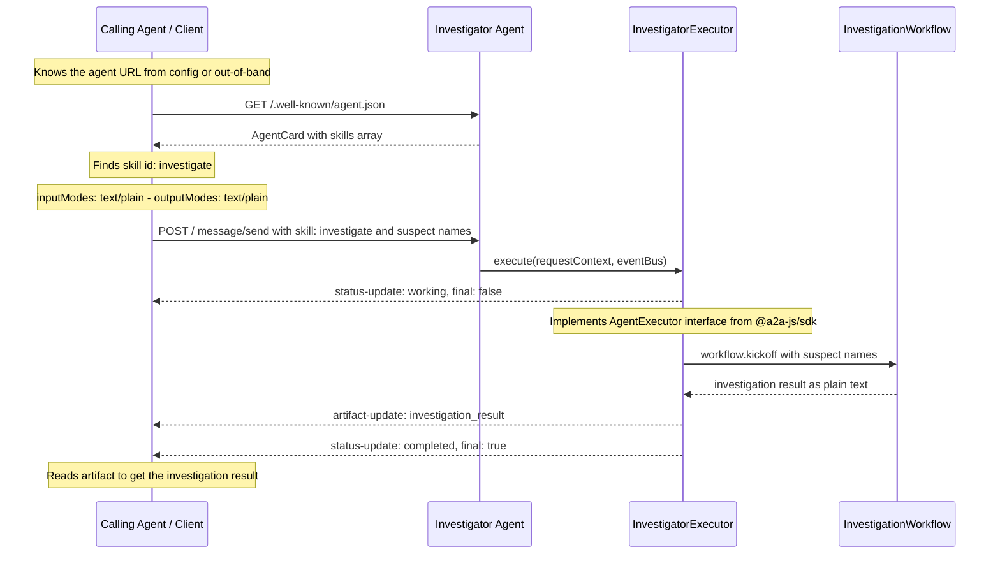
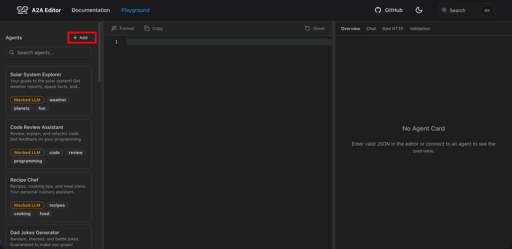
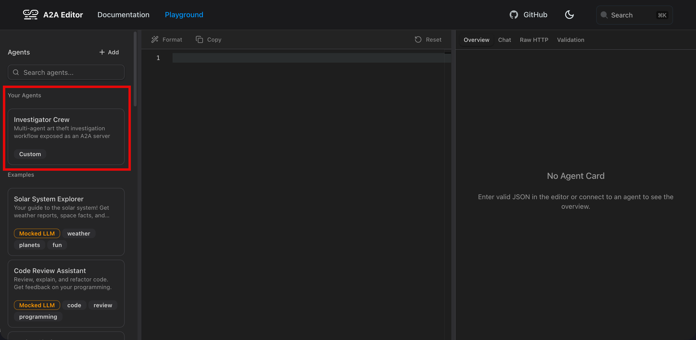
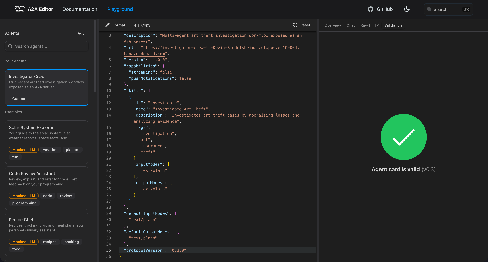
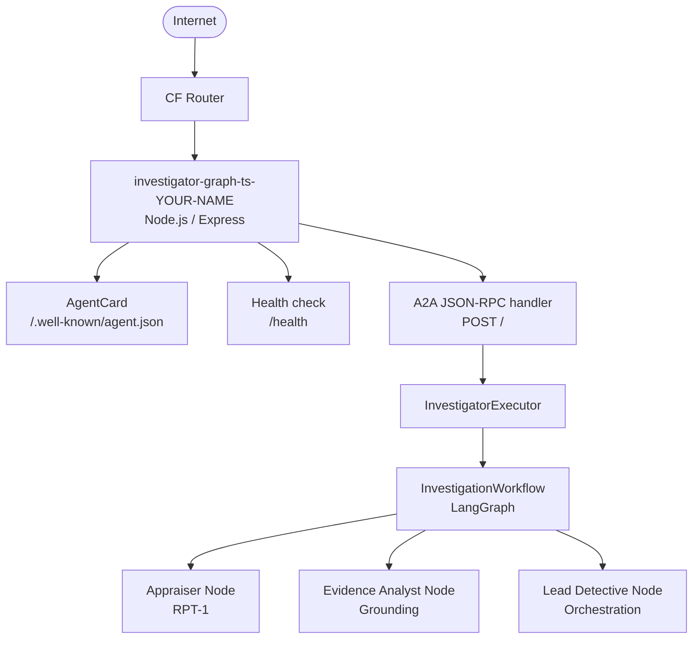

# Deploy Your Agent to Cloud Foundry with A2A

## Overview

Your investigator workflow is working great locally. But right now, it only runs on your machine. In this exercise, you'll expose it as a **web service** that anyone (or any other agent) can call remotely, and deploy it to **SAP BTP, Cloud Foundry runtime**.

To do that, you'll use the **A2A protocol** (Agent-to-Agent), an open standard that lets AI agents communicate with each other over HTTP — regardless of which framework or platform they were built on.

By the end of this exercise, your investigator workflow will be:

- ✅ Running as a persistent HTTP server
- ✅ Reachable via a public URL on SAP BTP
- ✅ Discoverable by other agents through the A2A standard

---

## Understand the A2A Protocol

### What is A2A?

**A2A (Agent-to-Agent)** is an open protocol, [originally developed by Google](https://a2a-protocol.org/latest/), that standardizes how AI agents communicate with each other over HTTP. Think of it as REST for agents.

| Concept        | What it is                                      | Example                        |
| -------------- | ----------------------------------------------- | ------------------------------ |
| **Agent Card** | A JSON document describing what an agent can do | "I can investigate art thefts" |
| **Skill**      | A specific capability of an agent               | `investigate` skill            |
| **Task**       | A unit of work sent to the agent                | "Find the suspect"             |
| **Event Bus**  | Stream of status updates while the agent works  | `working → completed`          |

### Why A2A Matters

Without A2A, each agent framework speaks its own language. With A2A:

| Without A2A                                 | With A2A                                                   |
| ------------------------------------------- | ---------------------------------------------------------- |
| ❌ Agents are locked into one framework     | ✅ Any agent can call any other agent                      |
| ❌ Custom integration code per tool/agent   | ✅ Standard HTTP endpoints, discoverable by URL            |
| ❌ No standard way to describe capabilities | ✅ Agent Card at `/.well-known/agent.json`                 |
| ❌ No standard way to report progress       | ✅ Event-based task status updates (`working → completed`) |

### How A2A Communication Works End to End

There are two distinct phases in every A2A interaction: **discovery** and **task execution** — and they happen in one continuous flow. The caller first reads the Agent Card to confirm the agent can handle the request, then immediately sends the task to it.



> 💡 **A2A does not define how you find the agent URL** — that is out of scope of the protocol. It could be a hardcoded config value, a platform service catalog (e.g. SAP BTP Open Resource Discovery), or a URL pasted by a human. Once the URL is known, the rest is standardized.
>
> **`InvestigatorExecutor` is not part of the investigation.** It is purely an A2A adapter — new code introduced in this exercise. Before this exercise, execution happened in `main.ts` by calling `workflow.kickoff()` directly. The executor does exactly the same thing, but wrapped in the A2A protocol so any HTTP client can trigger it.
>
> **What is `eventBus`?** It is a pub/sub channel provided by the SDK. Because `workflow.kickoff()` is a long-running async operation, the executor cannot just return a response synchronously. Instead it publishes events onto the bus while the workflow runs — `working` when it starts, the artifact when the result arrives, `completed` when it finishes. The SDK reads from the bus and streams those events back to the HTTP caller. This decouples the work from the HTTP response.
>
> **How the skill gets selected:** The caller includes the skill ID (`investigate`) in the POST request. In our agent there is only one executor so it handles all tasks. In a multi-skill agent you would branch inside `execute()` on `context.skill`.
>
> **Why `final: false` then `final: true`?** The event stream stays open between them, allowing intermediate progress updates. The caller keeps listening until it receives an event with `final: true`.

---

## Install the A2A SDK

### Step 1: Add the dependencies

👉 Open [`/project/JavaScript/starter-project/package.json`](/project/JavaScript/starter-project/package.json) and add to `dependencies`:

```json
"@a2a-js/sdk": "0.2.4",
"express": "^4.21.2",
"cors": "^2.8.5"
```

And to `devDependencies`:

```json
"@types/express": "^4.17.23",
"@types/cors": "^2.8.17"
```

Also update the `scripts` section:

```json
"scripts": {
  "build": "tsc",
  "start": "node dist/main.js",
  "start:server": "node dist/server.js",
  "dev": "tsx src/main.ts",
  "dev:server": "tsx src/server.ts",
  "clean": "rm -rf dist"
}
```

👉 Run `npm install`.

> 💡 **What these packages do:**
>
> - `@a2a-js/sdk` — The official A2A JavaScript/TypeScript SDK. Provides `AgentExecutor`, `DefaultRequestHandler`, `A2AExpressApp`, and in-memory task storage.
> - `express` — The HTTP server. `A2AExpressApp` mounts A2A routes onto your Express app.
> - `cors` — Allows cross-origin requests so browsers and other clients can reach your agent.

---

## Create the Server

### Step 2: Create server.ts

👉 Create a new file [`/project/JavaScript/starter-project/src/server.ts`](/project/JavaScript/starter-project/src/server.ts).

#### Part 1: Imports

```typescript
import "dotenv/config";
import express from "express";
import cors from "cors";
import { z } from "zod";
import {
  A2AExpressApp,
  AgentExecutor,
  DefaultRequestHandler,
  InMemoryTaskStore,
  RequestContext,
  ExecutionEventBus,
} from "@a2a-js/sdk/server";
import type {
  AgentCard,
  Task,
  TaskStatusUpdateEvent,
  TaskArtifactUpdateEvent,
} from "@a2a-js/sdk";
import { InvestigationWorkflow } from "./investigationWorkflow.js";
import { payload } from "./payload.js";

const InputSchema = z.object({
  suspect_names: z.string(),
});
```

> 💡 **What these imports do:**
>
> - `AgentExecutor` — Interface you implement. Defines `execute()` and `cancelTask()`, the two lifecycle methods A2A calls on your agent.
> - `RequestContext` — Carries the incoming task: the user message, task ID, and context ID.
> - `ExecutionEventBus` — Publish events here to report progress back to the caller. Accepts two event types: `TaskStatusUpdateEvent` (task state: `working`, `completed`, `failed`, `canceled`) and `TaskArtifactUpdateEvent` (the actual result payload — the output your agent produces).
> - `DefaultRequestHandler` — Wires your executor, task store, and the A2A protocol lifecycle together.
> - `A2AExpressApp` — Mounts A2A routes (agent card + JSON-RPC handler) onto your Express app in one call.
> - `InMemoryTaskStore` — Stores task state in memory. Sufficient for a single-instance deployment.
> - `TaskStatusUpdateEvent` — Carries a task state change (`working`, `completed`, `failed`, `canceled`). Set `final: true` on the last event to close the stream.
> - `TaskArtifactUpdateEvent` — Carries the result payload. An artifact has an ID, a name, and `parts` (e.g. `kind: "text"` for plain text). Separate from status so agents can stream partial results before signalling `completed`.

#### Part 2: The Executor

This is the heart of the server — the class that runs your workflow when a task arrives.

```typescript
class InvestigatorExecutor implements AgentExecutor {
  async execute(
    context: RequestContext,
    eventBus: ExecutionEventBus,
  ): Promise<void> {
    // 1. Register the task so the SDK can track it
    const task: Task = {
      kind: "task",
      id: context.taskId,
      contextId: context.contextId,
      status: { state: "submitted", timestamp: new Date().toISOString() },
      history: [],
    };
    eventBus.publish(task);

    // 2. Tell the caller we've started working
    const working: TaskStatusUpdateEvent = {
      kind: "status-update",
      taskId: context.taskId,
      contextId: context.contextId,
      status: { state: "working", timestamp: new Date().toISOString() },
      final: false,
    };
    eventBus.publish(working);

    try {
      // 2. Parse the incoming message
      const rawText =
        context.userMessage?.parts
          ?.filter(
            (p): p is { kind: "text"; text: string } => p.kind === "text",
          )
          .map((p) => p.text)
          .join("") ?? "";

      let suspectNames: string;
      try {
        const json = JSON.parse(rawText);
        const parsed = InputSchema.parse(json);
        suspectNames = parsed.suspect_names;
      } catch (error) {
        if (error instanceof SyntaxError) {
          console.warn("Input is not JSON, using raw text as suspect names");
        } else {
          console.warn("Input JSON is missing suspect_names, using raw text");
        }
        suspectNames = rawText;
      }

      // 3. Run the LangGraph workflow (async-native, no thread pool needed)
      const workflow = new InvestigationWorkflow(process.env.MODEL_NAME!);
      const result = await workflow.kickoff({
        payload,
        suspect_names: suspectNames,
      });

      // 4. Send the result back as an artifact
      const artifact: TaskArtifactUpdateEvent = {
        kind: "artifact-update",
        taskId: context.taskId,
        contextId: context.contextId,
        artifact: {
          artifactId: "investigation_result",
          name: "investigation_result",
          parts: [{ kind: "text", text: String(result) }],
        },
      };
      eventBus.publish(artifact);

      // 5. Mark the task as completed
      const completed: TaskStatusUpdateEvent = {
        kind: "status-update",
        taskId: context.taskId,
        contextId: context.contextId,
        status: { state: "completed", timestamp: new Date().toISOString() },
        final: true,
      };
      eventBus.publish(completed);
    } catch (error) {
      // 6. Signal failure so the caller is not left waiting
      eventBus.publish({
        kind: "status-update",
        taskId: context.taskId,
        contextId: context.contextId,
        status: { state: "failed", timestamp: new Date().toISOString() },
        final: true,
      });
    }
    eventBus.finished();
  }

  async cancelTask(taskId: string): Promise<void> {
    console.log(`Task ${taskId} cancellation requested`);
    // You could implement an AbortController which gets triggered if a cancellation is requested. This would require us to write custom code to cancel the workflow execution. For this workshop we are skipping this step for simplification.
  }
}
```

> 💡 **Understanding the executor step by step:**
>
> **Step 1 — Register the task**
> Before publishing any status updates, the executor must publish a `kind: "task"` event. This registers the task in the SDK's `ResultManager` — without it, the SDK has no task context and throws "Agent execution finished without a result, and no task context found" when the execution completes. The initial state is `submitted`.
>
> **Step 2 — Signal `working`**
> Tell the caller the task is in progress. `final: false` means more events will follow. Events use the `kind` discriminant (`"status-update"`, `"artifact-update"`) to identify their type — TypeScript enforces the correct shape at compile time.
>
> **Step 3 — Parse the input**
> A2A messages are not plain strings — they carry a `parts` array where each part has a `kind` (`"text"`, `"file"`, `"data"`). This lets a single message contain mixed content like text and a file attachment. We only care about text, so we filter to `kind: "text"` parts and join them into one string. The `(p): p is { kind: "text"; text: string }` syntax is a TypeScript type guard — without it, strict mode does not know the filtered items have a `.text` property and refuses to compile. In practice our caller always sends exactly one text part, but the filter handles the general case correctly.
>
> **Step 4 — Run the LangGraph workflow**
> Unlike Python's CrewAI, LangGraph is **async-native** — simply `await` the workflow. No `run_in_executor` or thread pool needed.
>
> **Step 5 — Return the result as an artifact**
> An artifact carries the result. Parts use `kind: "text"` since the workflow returns a plain text string.
>
> **Step 6 — Signal `completed`**
> `final: true` closes the task. `eventBus.finished()` then signals the SDK that no further events will be published.

#### Part 3: The Agent Card and App Assembly

```typescript
function resolveAppUrl(): string {
  const vcap = process.env.VCAP_APPLICATION;
  if (vcap) {
    const { application_uris } = JSON.parse(vcap);
    if (application_uris?.[0]) return `https://${application_uris[0]}`;
  }
  return `http://localhost:${process.env.PORT ?? "8080"}`;
}

const APP_URL = process.env.APP_URL ?? resolveAppUrl();

const agentCard = {
  name: "Investigator Graph",
  description:
    "Multi-agent art theft investigation graph exposed as an A2A server",
  url: APP_URL,
  version: "1.0.0",
  protocolVersion: "0.3.0",
  capabilities: { streaming: false, pushNotifications: false },
  skills: [
    {
      id: "investigate",
      name: "Investigate Art Theft",
      description:
        "Investigates art theft cases by appraising losses and analyzing evidence",
      tags: ["investigation", "art", "insurance", "theft"],
      inputModes: ["text/plain"],
      outputModes: ["text/plain"],
    },
  ],
  defaultInputModes: ["text/plain"],
  defaultOutputModes: ["text/plain"],
};

const requestHandler = new DefaultRequestHandler(
  agentCard,
  new InMemoryTaskStore(),
  new InvestigatorExecutor(),
);

const app = express();
app.use(cors());
app.use(express.json());

// eslint-disable-next-line @typescript-eslint/no-explicit-any
new A2AExpressApp(requestHandler).setupRoutes(app as any);

app.get("/health", (_req, res) => {
  res.json({ status: "ok" });
});

const port = parseInt(process.env.PORT ?? "8080", 10);
app.listen(port, "0.0.0.0", () => {
  console.log(`Investigator A2A server running on port ${port}`);
  console.log(`Agent card: ${APP_URL}/.well-known/agent.json`);
});
```

> 💡 **Understanding the Agent Card:**
>
> The `AgentCard` is the agent's public identity served at `GET /.well-known/agent.json`. It describes:
>
> - **What the agent is** (`name`, `description`, `version`)
> - **Which protocol version it implements** (`protocolVersion: "0.3.0"`) — required by A2A clients and tools like the A2A Editor to validate compatibility.
> - **Where it lives** (`url` — must be correct when deployed)
> - **What it can do** (`skills`)
> - **Whether it streams** (`capabilities.streaming: false`) — we return results all at once
>
> The `url` field is set from `APP_URL`. On CF, `resolveAppUrl()` reads the assigned route from `VCAP_APPLICATION` — a JSON object CF injects into every running app that includes the app's public URIs. This means the Agent Card always serves the correct URL without any manual configuration. Locally, `VCAP_APPLICATION` is not set, so the function falls back to `http://localhost:8080` — no `.env` entry needed.
>
> **`A2AExpressApp.setupRoutes()`** mounts the agent card endpoint and JSON-RPC handler onto your Express app automatically. The `as any` cast is needed because `@a2a-js/sdk` bundles its own copy of `@types/express` in its local `node_modules`. TypeScript sees the two copies as structurally different types even though they are identical at runtime — the cast suppresses the false positive.
>
> **The `/health` endpoint** is required by Cloud Foundry. CF polls it after deployment — if it doesn't return `200 OK`, the deployment fails.

### Step 3: Test the server locally

👉 Run in your current terminal:

```bash
npm run dev:server
```

Expected output:

```
Investigator A2A server running on port 8080
Agent card: http://localhost:8080/.well-known/agent.json
```

The server keeps running — **open a new terminal tab** for the next step.

👉 In the new terminal, verify the agent card is served:

```bash
curl http://localhost:8080/.well-known/agent.json
```

---

## Create the Deployment Manifest

Cloud Foundry uses a `manifest.yml` file to know how to run your application. It tells CF how much memory to allocate, which buildpack to use, what command to start the app with, and which services to bind.

### Step 4: Create manifest.yml

👉 Create a new file [`/project/JavaScript/starter-project/manifest.yml`](/project/JavaScript/starter-project/manifest.yml).

👉 Add YOUR NAME to the end of the application name as shown below!

```yaml
applications:
  - name: investigator-graph-ts-<YOUR NAME>
    memory: 512M
    disk_quota: 1024M
    instances: 1
    buildpacks:
      - nodejs_buildpack
    health-check-type: http
    health-check-http-endpoint: /health
    timeout: 180
    command: npm run start:server
    services:
      - generative-ai-hub
    env:
      MODEL_NAME: gpt-4o
      RESOURCE_GROUP: ai-agents-codejam
      GROUNDING_PIPELINE_ID: <YOUR_GROUNDING_PIPELINE_ID>
```

> ⚠️ **You must replace the placeholder value:**
>
> - `GROUNDING_PIPELINE_ID` — Copy from your local `.env` file (same value used in Exercise 05).

> 💡 **Understanding each field:**
>
> | Field                          | Purpose                                                                                      |
> | ------------------------------ | -------------------------------------------------------------------------------------------- |
> | `buildpacks: nodejs_buildpack` | Detects Node.js, runs `npm install` + `npm run build` (TypeScript compile) during staging    |
> | `command`                      | Startup command. CF injects `$PORT` — your app reads it via `process.env.PORT`               |
> | `services: generative-ai-hub`  | Injects SAP AI Core credentials as `VCAP_SERVICES` — the SAP AI SDK reads this automatically |
> | `memory: 512M`                 | Node.js + LangGraph needs less RAM than Python + CrewAI                                      |
> | `disk_quota: 1024M`            | Disk space for the app and npm packages                                                      |
> | `health-check-http-endpoint`   | The path CF polls after startup. Must return `200 OK`                                        |
> | `timeout: 180`                 | Seconds CF waits for the health check to pass before failing the deployment                  |

> 💡 **How credentials work on CF**
> Locally you set `AICORE_SERVICE_KEY` in `.env`. On CF, the `generative-ai-hub` service binding injects credentials as `VCAP_SERVICES`. The SAP AI SDK reads `VCAP_SERVICES` automatically — no code change needed.
>
> **Where does `generative-ai-hub` come from?** Service names in `manifest.yml` must match existing CF service instances in your space — they are pre-created by the workshop organizers. To see what is available in your space, run:
>
> ```bash
> cf services
> ```
>
> The name in the output is exactly what goes in `manifest.yml`. For this CodeJam, `generative-ai-hub` is the SAP AI Core instance that provides your model credentials.

### Step 5: Add a .cfignore file

Your local `.env` file contains API keys and credentials. You must not push it to CF.

👉 Create a new file [`/project/JavaScript/starter-project/.cfignore`](/project/JavaScript/starter-project/.cfignore):

```
.env
node_modules/
*.log
```

> ⚠️ **Important**: `.cfignore` works like `.gitignore` but for `cf push`. Always include `.env` to prevent uploading credentials. CF's buildpack runs `npm install` during staging, so excluding `node_modules/` keeps the upload small and fast without breaking the build.

---

## Deploy to Cloud Foundry

### Step 6: Log in to CF

👉 Open a terminal and log in to your SAP BTP CF environment:

```bash
cf login -a https://api.cf.eu10-004.hana.ondemand.com -u <provided-user-name> -p <provided-password> --origin a7rg4vxjp-platform
```

👉 Use the credentials provided in the system access email.

```
Email: cd-agents-###
Password: *******
```

> The `--origin` flag ensures CF redirects you to the correct custom identity provider for this CodeJam.

> 💡 When using `--origin` (SSO login), CF sometimes authenticates but skips org and space selection. Verify with:
>
> ```bash
> cf target
> ```
>
> If it says no org or space targeted, set them manually:
>
> ```bash
> cf orgs                              # list available orgs
> cf target -o <org-name>             # set org
> cf spaces                            # list spaces in that org
> cf target -o <org-name> -s <space-name>  # set both
> ```

### Step 7: Push the App

👉 Navigate to your starter-project folder: `cd project/JavaScript/starter-project`

> 💡 **No local build needed.** CF's `nodejs_buildpack` runs `npm install` and `npm run build` automatically during staging. However, it's good practice to run `npm run build` locally first to catch any TypeScript errors before pushing.

👉 Run:

```bash
cf push
```

CF will:

1. Upload your project files (excluding anything in `.cfignore`)
2. Detect Node.js via `nodejs_buildpack`, run `npm install` + `npm run build` (TypeScript compile)
3. Start the app with the `command` from `manifest.yml`
4. Poll `/health` until it returns `200 OK`

Once the push succeeds, CF prints the assigned route:

```
name:              investigator-graph-ts-<YOUR NAME>
requested state:   started
routes:            investigator-graph-ts-<YOUR NAME>-<random>.cfapps.eu10-004.hana.ondemand.com
```

> ⚠️ **The first push can take a few minutes** — CF is downloading and installing all npm packages. Subsequent pushes are faster.

> 💡 **Monitoring the deployment:** `cf push` prints staging progress inline. To get more detail, open a second terminal and stream live logs while the push is running:
>
> ```bash
> cf logs investigator-graph-ts-<YOUR NAME>
> ```
>
> After the push completes (or fails), use these commands to investigate:
>
> ```bash
> cf logs investigator-graph-ts-<YOUR NAME> --recent   # recent log output
> cf app investigator-graph-ts-<YOUR NAME>             # current status and instance health
> cf events investigator-graph-ts-<YOUR NAME>          # deployment and crash events
> ```

> 💡 The app reads its public URL from `VCAP_APPLICATION` at startup — a JSON object CF injects into every running app containing the assigned routes. The Agent Card always serves the correct URL automatically.

---

## Verify the Deployment

### Check the Agent Card

👉 Run:

```bash
curl https://<YOUR_APP_URL>/.well-known/agent.json
```

> In the terminal output you can read the URL behind `routes`. This is your app URL.

You should see your agent's description:

```json
{
  "name": "Investigator Graph",
  "description": "Multi-agent art theft investigation graph exposed as an A2A server",
  "url": "https://investigator-graph-ts-<YOUR NAME>-<random>.cfapps.eu10-004.hana.ondemand.com",
  "version": "1.0.0",
  "skills": [...]
}
```

### Check the Health Endpoint

```bash
curl https://<YOUR_APP_URL>/health
```

Expected response: `{"status":"ok"}`

### Test in the A2A Editor

👉 Open the [A2A Editor](https://open-resource-discovery.github.io/a2a-editor/playground/)

👉 Add your agent by pasting the URL: `https://<YOUR_APP_URL>/.well-known/agent.json`







👉 Open the Chat and paste:

```json
{
  "user_request": "Investigate the art theft at the museum",
  "suspect_names": "Sophie Dubois, Marcus Chen, Viktor Petrov"
}
```

### Check the Logs

If something went wrong during startup:

```bash
cf logs investigator-graph-ts-<YOUR NAME> --recent
```

---

## Understanding What Just Happened

### The Full Architecture

You now have a live, publicly reachable multi-agent system:



### How CF Manages Your App

| CF Feature          | What it does for you                                                       |
| ------------------- | -------------------------------------------------------------------------- |
| **Buildpack**       | Detects Node.js, runs `npm install` + `npm run build`, sets up the runtime |
| **Service Binding** | Injects SAP AI Core credentials into `VCAP_SERVICES` automatically         |
| **Health Check**    | Restarts the app if `/health` stops responding                             |
| **Router**          | Terminates TLS and routes HTTPS traffic to your app on `$PORT`             |
| **Env vars**        | Available at runtime via `process.env.*` — no `.env` file needed           |

### TypeScript vs Python: Key Differences

| Concern              | Python (CrewAI)                            | TypeScript (LangGraph)                          |
| -------------------- | ------------------------------------------ | ----------------------------------------------- |
| **Async**            | `run_in_executor` to offload blocking call | `await workflow.kickoff()` — fully async native |
| **Event API**        | `event_queue.enqueue_event(...)`           | `eventBus.publish({ kind: "...", ... })`        |
| **Server framework** | FastAPI (`A2AFastAPIApplication`)          | Express (`A2AExpressApp.setupRoutes()`)         |
| **Buildpack**        | `python-buildpack` + `runtime.txt`         | `nodejs_buildpack` (auto-detects Node.js)       |
| **Memory**           | 1024M                                      | 512M (Node.js lighter footprint)                |

---

## Key Takeaways

- **A2A** is an open protocol that lets agents communicate over HTTP regardless of framework
- **`AgentExecutor`** is the single interface you implement — it bridges A2A tasks to your LangGraph workflow
- **Events use `kind` discriminants** (`"status-update"`, `"artifact-update"`) — TypeScript enforces correct shapes at compile time
- **`A2AExpressApp.setupRoutes()`** mounts the agent card and JSON-RPC endpoints onto Express in one call
- **LangGraph is async-native** — no `run_in_executor` needed, just `await`
- **`manifest.yml`** is the single source of truth for deployment — it replaces manual `cf` commands
- **`.cfignore`** prevents sensitive files (`.env`) from being uploaded to CF
- **`VCAP_APPLICATION`** is injected by CF at runtime and contains the app's public routes — used to set the Agent Card URL automatically

---

## Next Steps

1. ✅ [Set up your development space](01-setup-dev-space.md)
2. ✅ [Build a basic agent](02-build-a-basic-agent.md)
3. ✅ [Add custom tools](03-add-your-first-tool.md)
4. ✅ [Build a multi-agent system](04-building-multi-agent-system.md)
5. ✅ [Add the Grounding Service](05-add-the-grounding-service.md)
6. ✅ [Solve the crime](06-solve-the-crime.md)
7. ✅ [Deploy your agent to CF with A2A](07-deploy-agent-to-cf-ts.md) (this exercise)

---

## Troubleshooting

**Issue**: `cf push` fails with `health check failed`

- **Solution**: Check `cf logs investigator-graph-ts-<YOUR NAME> --recent`. Common causes:
  - TypeScript compile error — run `npm run build` locally first to verify
  - Missing dependency in `package.json`
  - Service binding not found — verify the service name matches exactly (`generative-ai-hub`)

**Issue**: `Cannot find module '@a2a-js/sdk/server'`

- **Solution**: Ensure `@a2a-js/sdk` is in `dependencies` (not `devDependencies`) in `package.json`. CF runs `npm install --production` by default.

**Issue**: `/.well-known/agent.json` returns a wrong URL

- **Solution**: This should not happen — the URL is read from `VCAP_APPLICATION` automatically. If it does, verify that `VCAP_APPLICATION` is present by checking `cf env investigator-graph-ts-<YOUR NAME>`.

**Issue**: App crashes immediately after startup

- **Solution**: Check `cf logs investigator-graph-ts-<YOUR NAME> --recent`. Likely causes:
  - Missing `GROUNDING_PIPELINE_ID` or `MODEL_NAME` in `manifest.yml`
  - TypeScript not compiled — verify `dist/server.js` exists by running `npm run build` locally

**Issue**: SAP AI SDK cannot authenticate

- **Solution**: Verify the `generative-ai-hub` service instance exists in your CF space:
  ```bash
  cf services
  ```
  The service name in `manifest.yml` must match exactly.

**Issue**: `.env` was accidentally uploaded and credentials are exposed

- **Solution**: Add `.env` to `.cfignore`, run `cf push` to overwrite, then rotate your API credentials immediately in SAP BTP.

---

## Resources

- [A2A Protocol Specification](https://a2a-protocol.org/latest/)
- [@a2a-js/sdk on GitHub](https://github.com/google-a2a/a2a-js)
- [SAP BTP Cloud Foundry deployment guide](https://help.sap.com/docs/btp/sap-business-technology-platform/deploy-application)
- [CF Node.js Buildpack](https://docs.cloudfoundry.org/buildpacks/node/index.html)
- [LangGraph TypeScript documentation](https://langchain-ai.github.io/langgraphjs/)
