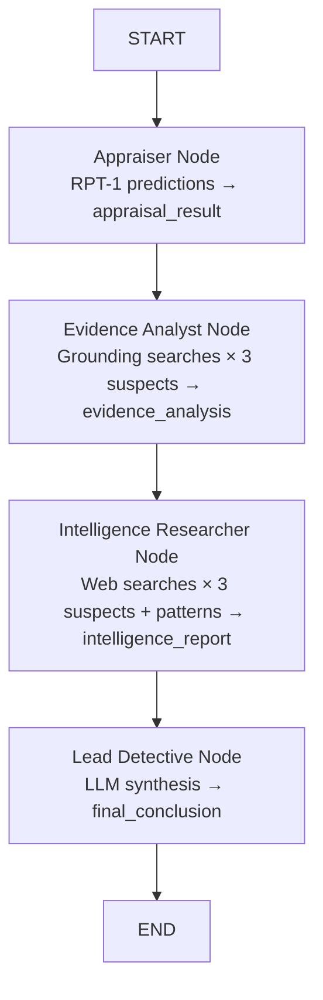

# Solve the Crime

The only thing missing now is your **Lead Detective**. This node will synthesize findings from the Appraiser, Evidence Analyst, and Intelligence Researcher to identify the culprit and calculate the total value of the stolen items.

## Build the Lead Detective Node

### What You Already Have

After completing Exercise 06, your system already includes:
1. ✅ Appraiser Agent (RPT-1 predictions)
2. ✅ Evidence Analyst (Internal document search)
3. ✅ Intelligence Researcher (Web search) ← NEW in Exercise 06
4. ✅ Lead Detective configuration in `agentConfigs.ts` ← Already updated in Exercise 06
5. ✅ Lead Detective node in `investigationWorkflow.ts` ← Already updated in Exercise 06

### Verify Your Implementation

👉 Open [`/project/JavaScript/solution/src/investigationWorkflow.ts`](/project/JavaScript/solution/src/investigationWorkflow.ts)

👉 Verify that you have the complete workflow with all four agents:

```typescript
    private buildGraph(): StateGraph<AgentState> {
        const workflow = new StateGraph<AgentState>({
            channels: {
                payload: null,
                suspect_names: null,
                appraisal_result: null,
                evidence_analysis: null,
                intelligence_report: null,  // Should be present from Exercise 06
                final_conclusion: null,
                messages: null,
            },
        })

        workflow
            .addNode('appraiser', this.appraiserNode.bind(this))
            .addNode('evidence_analyst', this.evidenceAnalystNode.bind(this))
            .addNode('intelligence_researcher', this.intelligenceResearcherNode.bind(this))  // Should be present
            .addNode('lead_detective', this.leadDetectiveNode.bind(this))
            .addEdge(START, 'appraiser')
            .addEdge('appraiser', 'evidence_analyst')
            .addEdge('evidence_analyst', 'intelligence_researcher')  // Should be present
            .addEdge('intelligence_researcher', 'lead_detective')    // Should be present
            .addEdge('lead_detective', END)

        return workflow
    }
```

> 💡 **The execution order is defined entirely by the edges:**
>
> 1. `START → appraiser` — workflow begins with the Appraiser
> 2. `appraiser → evidence_analyst` — after RPT-1 completes, Evidence Analyst runs
> 3. `evidence_analyst → intelligence_researcher` — after internal search completes, web search runs
> 4. `intelligence_researcher → lead_detective` — after web search completes, Lead Detective synthesizes
> 5. `lead_detective → END` — Lead Detective's conclusion becomes the final result

### Verify main.ts

👉 Check your [`/project/JavaScript/solution/src/main.ts`](/project/JavaScript/solution/src/main.ts): it needs no changes from Exercise 04.

```typescript
import 'dotenv/config'
import { InvestigationWorkflow } from './investigationWorkflow.js'
import { payload } from './payload.js'

async function main() {
    console.log('═══════════════════════════════════════════════════════════')
    console.log('   🔍 ART THEFT INVESTIGATION - MULTI-AGENT SYSTEM')
    console.log('═══════════════════════════════════════════════════════════\n')

    const workflow = new InvestigationWorkflow(process.env.MODEL_NAME!)
    const suspectNames = 'Sophie Dubois, Marcus Chen, Viktor Petrov'

    console.log('📋 Case Details:')
    console.log(`   • Stolen Items: ${payload.rows.length} artworks`)
    console.log(`   • Suspects: ${suspectNames}`)
    console.log(`   • Investigation Team: 4 specialized agents\n`)  // Updated to 4 agents

    const startTime = Date.now()

    const result = await workflow.kickoff({
        payload,
        suspect_names: suspectNames,
    })

    const duration = ((Date.now() - startTime) / 1000).toFixed(2)

    console.log('\n═══════════════════════════════════════════════════════════')
    console.log('   📘 FINAL INVESTIGATION REPORT')
    console.log('═══════════════════════════════════════════════════════════\n')
    console.log(result)
    console.log('\n═══════════════════════════════════════════════════════════')
    console.log(`   ⏱️  Investigation completed in ${duration} seconds`)
    console.log('═══════════════════════════════════════════════════════════\n')
}

main()
```

---

## Solve the Crime

👉 Run your complete investigation workflow:

```bash
# From repository root
npm start --prefix ./project/JavaScript/solution
```

```bash
# From solution folder
npm start
```

> ⏱️ **This may take 4-7 minutes** as your agents:
>
> 1. Predict insurance values for stolen items using SAP-RPT-1
> 2. Search internal evidence documents for each suspect using the Grounding Service
> 3. Search the web for criminal patterns and suspect backgrounds using Sonar-Pro
> 4. Analyze all findings and identify the culprit

👉 Review the final output. Who does your Lead Detective identify as the thief?

👉 Call for the instructor and share your suspect.

### If Your Answer is Incorrect

If the Lead Detective identifies the wrong suspect, refine the system prompts in `agentConfigs.ts`.

**Which prompts to adjust:**

1. **Lead Detective's system prompt** (`agentConfigs.ts → leadDetective.systemPrompt`)
   - Make it more specific about what evidence to prioritize
   - Example: Add "Focus on alibis, financial motives, and access to the museum on the night of the theft"

2. **Evidence Analyst's grounding query** (`investigationWorkflow.ts → evidenceAnalystNode`)
   - Make the search query more specific
   - Example: `"Find evidence about ${suspect}'s alibi, financial records, and museum access on the night of the theft"`

3. **Intelligence Researcher's web queries** (`investigationWorkflow.ts → intelligenceResearcherNode`)
   - Add more specific search terms
   - Example: Include specific dates, locations, or patterns mentioned in internal evidence

**Tips for improving prompts:**

- ✅ Be specific about what to analyze (alibi, motive, opportunity)
- ✅ Ask the detective to cite specific documents and web sources
- ✅ Request cross-referencing of internal and external evidence
- ✅ Instruct the detective to explain reasoning step-by-step
- ✅ Ask the detective to assess whether it's an isolated incident or organized crime
- ❌ Avoid vague instructions like "solve the crime" without guidance
- ❌ Don't assume the LLM knows which evidence is most important

---

## Understanding Multi-Agent Orchestration

### What Just Happened?

You completed a full multi-agent investigation system where:

1. **Appraiser Node** — Calls SAP-RPT-1 to predict missing insurance values from structured data
2. **Evidence Analyst Node** — Searches 8 evidence documents via the Grounding Service for each suspect
3. **Intelligence Researcher Node** — Searches the web via Sonar-Pro for criminal patterns and public records
4. **Lead Detective Node** — Synthesizes all findings using an LLM to identify the culprit and calculate total losses
5. **State** — Flows through all nodes, accumulating results that later nodes build upon

### The Complete Investigation Flow



### The Role of agentConfigs.ts

The `AGENT_CONFIGS` object in `agentConfigs.ts` serves the same purpose as CrewAI's YAML files: it separates agent "personality" from orchestration logic. But as TypeScript objects:

- System prompts are **functions** that accept runtime data and return a string
- No YAML parsing, no indentation errors, no key synchronization issues
- Your IDE can trace exactly where a system prompt is used and refactor it

### Multi-Source Intelligence

Your Lead Detective now analyzes **three independent sources**:

1. **Structured Data** (`appraisal_result`) — Financial impact from RPT-1
2. **Internal Documents** (`evidence_analysis`) — Private evidence from Grounding Service
3. **External Web** (`intelligence_report`) — Public intelligence from Sonar-Pro

This multi-source approach mirrors real-world investigations:
- **Internal evidence** proves what happened at the scene
- **External intelligence** reveals patterns and backgrounds
- **Financial data** establishes motive and impact

### Why This Matters

Multi-agent systems with multi-source intelligence are powerful because they:

- **Distribute Responsibilities** across specialized agents with distinct roles
- **Enable Collaboration** through task delegation and information sharing
- **Combine Data Sources** by integrating internal and external intelligence
- **Improve Reasoning** by providing multiple expert perspectives
- **Handle Complexity** by breaking down large problems into manageable subtasks
- **Scale Efficiently** as new agents and tools can be added without disrupting existing ones

### Why This Architecture Matters

**Benefits of multi-agent LangGraph systems:**

- **Specialization** — Each node has exactly the tools and context it needs
- **Different models per node** — You could use GPT-4o for the detective and a cheaper model for search
- **Explicit data flow** — State fields make it clear what each node produces and consumes
- **Debuggability** — Every state transition is observable; add `console.log` to any node
- **Extensibility** — Adding a new agent is `.addNode()` + `.addEdge()` + a new node function
- **Multi-Source Analysis** — Seamlessly combine internal documents, web search, and structured data

**Real-world applications:**

- **Customer service**: Routing agent → Internal KB search → Web search → Escalation agent
- **Research**: Data collection agent → Internal archive search → Web research → Analysis agent → Report generation agent
- **DevOps**: Monitoring agent → Internal logs → Public status pages → Diagnosis agent → Remediation agent
- **Due Diligence**: Company info agent → Internal records → Public filings → News search → Risk assessment

---

## Key Takeaways

- **Multi-node LangGraph workflows** decompose complex problems into specialized, sequential steps
- **Shared state** is how nodes communicate: earlier results flow to later nodes via state fields
- **Multi-source intelligence** combines internal documents (Grounding) + external web (Sonar-Pro) + structured data (RPT-1)
- **System prompts with runtime data** (`AGENT_CONFIGS.leadDetective.systemPrompt(...)`) enable context-aware synthesis
- **Edges define execution order**: the Lead Detective waits for all predecessors to complete
- **`state.intelligence_report || 'No intelligence report available'`**: always provide fallbacks when reading optional state fields
- **SAP Cloud SDK for AI** provides a unified API for LLMs, web search, grounding, and structured data models
- **Prompt engineering** is iterative: run, observe, refine until the detective identifies the right suspect

---

## Congratulations!

You've successfully built a sophisticated multi-agent AI investigation system in TypeScript that can:

- **Predict financial values** using the SAP-RPT-1 structured data model
- **Search internal evidence documents** using the SAP Grounding Service (RAG)
- **Search the web for public intelligence** using Perplexity's Sonar-Pro model
- **Synthesize multi-source findings** across multiple agents using LangGraph state
- **Solve complex problems** through collaborative, code-based agent orchestration

---

## Next Steps Checklist

1. ✅ [Understand Generative AI Hub](00-understanding-genAI-hub.md)
2. ✅ [Set up your development space](01-setup-dev-space.md)
3. ✅ [Build a basic agent](02-build-a-basic-agent.md)
4. ✅ [Add custom tools](03-add-your-first-tool.md) (RPT-1 model integration)
5. ✅ [Build a multi-agent workflow](04-building-multi-agent-system.md)
6. ✅ [Integrate the Grounding Service](05-add-the-grounding-service.md)
7. ✅ [Add web search capabilities](06-discover-connected-crimes.md)
8. ✅ [Solve the museum art theft mystery](07-solve-the-crime.md) (this exercise)

---

## Troubleshooting

**Issue**: Lead Detective's conclusion doesn't include intelligence report findings

- **Solution**: Ensure the `leadDetective.systemPrompt` in `agentConfigs.ts` explicitly references the `intelligenceReport` parameter and asks the LLM to analyze web findings. The LLM only includes what you ask for.

**Issue**: `state.intelligence_report` is `undefined` in the Lead Detective node

- **Solution**: Check that the Intelligence Researcher node is returning the `intelligence_report` field in its return object. Add `console.log(state.intelligence_report)` at the start of `leadDetectiveNode` to debug.

**Issue**: Web search returns no relevant information

- **Solution**: Refine the search queries in `intelligenceResearcherNode`. Make them more specific by including suspect names, locations, and dates from internal evidence.

**Issue**: Investigation runs but conclusion doesn't cross-reference internal and external evidence

- **Solution**: Update the Lead Detective's system prompt to explicitly ask: "Cross-reference internal evidence with web findings to determine if this is an isolated incident or part of a pattern."

**Issue**: Agent identifies the wrong suspect after multiple runs

- **Solution**: LLMs are non-deterministic by default. Lower `temperature` in `model_params` (try `0.3`) for more consistent reasoning. Also refine the Lead Detective's system prompt to be more specific about how to weigh evidence from different sources.

**Issue**: `Error during intelligence research: Error: 429 Too Many Requests`

- **Solution**: You've hit the API rate limit. Wait a moment and retry. Web search is more resource-intensive than grounding, so consider reducing the number of searches or adding delays between them.

**Issue**: TypeScript compilation errors after adding intelligence_report

- **Solution**: Ensure you've updated the `AgentState` interface in `types.ts` to include the `intelligence_report?: string` field.

---

## Resources

- [LangGraph.js Documentation](https://langchain-ai.github.io/langgraphjs/)
- [SAP Cloud SDK for AI (JavaScript)](https://sap.github.io/ai-sdk/docs/js/orchestration/chat-completion)
- [SAP Generative AI Hub](https://help.sap.com/docs/sap-ai-core/sap-ai-core-service-guide/generative-ai-hub-in-sap-ai-core-7db524ee75e74bf8b50c167951fe34a5)
- [SAP-RPT-1 Playground](https://rpt.cloud.sap/)
- [SAP AI Core Grounding Management](https://help.sap.com/docs/sap-ai-core/sap-ai-core-service-guide/document-grounding)
- [Perplexity API Documentation](https://docs.perplexity.ai/)
