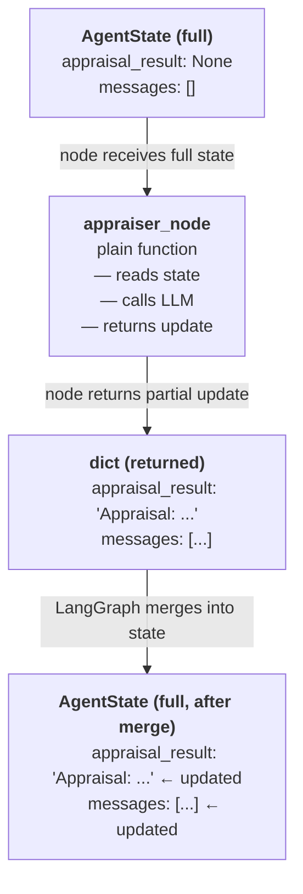
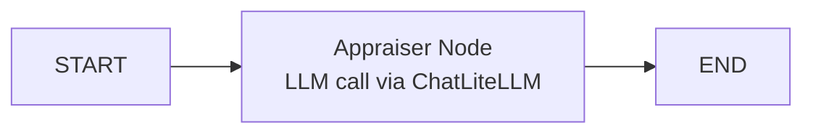

# Build your first AI Agent

For this CodeJam, you will build three agents (Stolen Goods Loss Appraiser, Criminal Evidence Analyst and Lead Detective). Each of these agents will take an active part in solving a burglary and executing a loss appraisal for an insurance claim.

After any good burglary you need a loss appraiser who determines the insurance claims. That will be the first agent you are going to build.

---

## Overview

In this exercise, you will build an agent with Python, LiteLLM, SAP Cloud SDK for AI and LangGraph.

[**LiteLLM**](https://docs.litellm.ai/docs/) is a library that provides a unified, provider-agnostic API for calling large language models (LLMs). It standardizes request/response handling and includes utilities that speed up integration with agent frameworks and tooling. Essentially it is a gateway between LLM providers and AI Agent frameworks.

That means you can use your Generative AI Hub credentials to build state of the art AI Agents with any of the models available through GenAI Hub and any of the AI Agent frameworks compatible with LiteLLM. This combination is extremely powerful because that means you can use LLMs hosted and managed by SAP (Mistral, Llama, Nvidia), and models from our partners such as Azure OpenAI, Amazon Bedrock (including Anthropic) and Gemini.

[**SAP Cloud SDK for AI**](https://help.sap.com/doc/generative-ai-hub-sdk/CLOUD/en-US/index.html) is SAP's official Python SDK for interacting with SAP AI Core and the Generative AI Hub. It provides convenient clients and utilities for tasks such as document grounding, embeddings, retrieval and model predictions — including SAP's own RPT-1 model. In later exercises you will use the SDK to integrate SAP-RPT-1 and the Grounding Service into your agents.

[**LangGraph**](https://langchain-ai.github.io/langgraph/) is an open-source Python library for building stateful, graph-based AI agent workflows. LangGraph gives you fine-grained control over agent state, message flow, and tool use. You define agents as **nodes** in a graph connected by **edges**, which makes the execution flow explicit and easy to reason about. You will use LangGraph as the AI Agent framework for your agents going forward.

---

## Create a Basic Agent

### Step 1: Define the Agent State

LangGraph agents are built around **explicit state**: a typed dictionary that you define and that is passed between nodes as the workflow progresses.

**Why does LangGraph make you manage state yourself?**

You might expect the framework to handle this automatically — track what each agent produced, route it to the next one, and stitch everything together behind the scenes. LangGraph takes the opposite approach deliberately. Here is why:

- **Your workflow is unique.** Different applications need different data flowing between steps. An investigation workflow needs appraisal results, evidence analysis, and suspect names. No generic "agent result" object could cover all these cases well.
- **Explicit state is debuggable.** When something goes wrong, you can `print(state)` at the start of any node and see the complete picture. There is no hidden internal state to guess at.
- **Nodes stay isolated and testable.** Because each node is a plain function that takes state and returns a partial update, you can test any node in isolation.

👉 Create a new file [`/project/Python-LangGraph/starter-project/basic_agent.py`](/project/Python-LangGraph/starter-project/basic_agent.py)

👉 Add the following lines of code to import the necessary packages and define the state:

```python
from pathlib import Path
from typing import TypedDict, Optional
from dotenv import load_dotenv
from langchain_litellm import ChatLiteLLM
from langchain_core.messages import SystemMessage, HumanMessage
from langgraph.graph import StateGraph, START, END

# Load .env from the same directory as this script
env_path = Path(__file__).parent / '.env'
load_dotenv(dotenv_path=env_path)


class AgentState(TypedDict):
    appraisal_result: Optional[str]
    messages: list
```

> 💡 **What these imports do:**
>
> - `TypedDict` — defines the state as a typed dictionary; each field has a known type
> - `ChatLiteLLM` — LangChain-compatible LLM wrapper that routes calls through LiteLLM to any provider, including SAP Generative AI Hub
> - `SystemMessage`, `HumanMessage` — represent different roles in a conversation
> - `StateGraph`, `START`, `END` — LangGraph's graph builder and built-in entry/exit sentinels

### Step 2: Initialize the Model

LangGraph nodes call the LLM directly using LangChain-compatible chat models. `ChatLiteLLM` provides this while routing calls through SAP Generative AI Hub.

👉 Add the model initialization below your imports:

```python
# Initialize the LLM via LiteLLM pointing to SAP Generative AI Hub
model = ChatLiteLLM(model="sap/amazon--nova-pro", temperature=0)

system_prompt = """You are an experienced Stolen Goods Loss Appraiser specializing in fine art and valuables.
Your goal is to assess the value of stolen items and provide a professional insurance appraisal report.
You provide detailed assessments based on your expertise and rely strictly on evidence — you never guess values."""
```

> 💡 **Understanding the `model` string:**
>
> The format is `provider/model-name`. Setting the `provider` to `sap` tells LiteLLM to route requests through the SAP Generative AI Hub orchestration service. The `model-name` (here set to `amazon--nova-pro`) identifies the model deployment registered in your resource group. Setting `temperature=0` makes the model's outputs more deterministic, which is useful when you want consistent appraisal reports.

### Step 3: Build the Agent Node

In LangGraph, a **node** is a plain function that represents one step in your workflow. Every node follows the same contract:

- **Input**: the current `AgentState` — the full state object as it exists at that point in the graph
- **Output**: a `dict` with only the fields this node changed — LangGraph merges the update into the full state



👉 Add the appraiser node below after the AgentState class definition:

```python
def appraiser_node(state: AgentState) -> dict:
    response = model.invoke([
        SystemMessage(content=system_prompt),
        HumanMessage(content="Provide a brief explanation of how an insurance appraiser would approach assessing stolen artwork and valuables."),
    ])

    appraisal_result = response.content

    return {
        "appraisal_result": appraisal_result,
        "messages": state["messages"] + [{"role": "assistant", "content": appraisal_result}],
    }
```

> 💡 **Understanding the node:**
>
> - `model.invoke([...])` — sends a list of messages to the LLM and returns a response object
> - `response.content` — the text of the LLM's reply
> - The node only returns the fields it changed. LangGraph merges that into the full state before calling the next node. Fields not mentioned in the return value remain exactly as they were.

### Step 4: Build the LangGraph Workflow

Now wire the node into a LangGraph `StateGraph`.

👉 Add the graph builder and entry point:

```python
def build_graph():
    workflow = StateGraph(AgentState)

    workflow.add_node("appraiser", appraiser_node)
    workflow.add_edge(START, "appraiser")
    workflow.add_edge("appraiser", END)

    return workflow.compile()


def main():
    app = build_graph()

    result = app.invoke({
        "appraisal_result": None,
        "messages": [],
    })

    print("\n" + "="*50)
    print("Insurance Appraiser Report:")
    print("="*50)
    print(result["appraisal_result"])


if __name__ == "__main__":
    main()
```

> 💡 **Understanding the StateGraph:**
>
> - `StateGraph(AgentState)` — creates a graph that uses your typed state definition
> - `.add_node("appraiser", appraiser_node)` — registers the function as a node with the name `"appraiser"`
> - `.add_edge(START, "appraiser")` — connects the graph start to the appraiser node
> - `.add_edge("appraiser", END)` — when the appraiser finishes, the workflow ends
> - `.compile()` — validates the graph and returns an executable app
> - `app.invoke(initial_state)` — runs the workflow and returns the final state

---

### Step 5: Run Your Agent

👉 Execute the agent:

> ☝️ Make sure you're in the repository root directory (e.g., `codejam-code-based-agents`) when running this command.

**From repository root:**

_macOS / Linux / BAS_

```bash
python3 ./project/Python-LangGraph/starter-project/basic_agent.py
```

_Windows (PowerShell)_

```powershell
python .\project\Python-LangGraph\starter-project\basic_agent.py
```

**From starter-project folder:**

_macOS / Linux / BAS_

```bash
python3 basic_agent.py
```

_Windows (PowerShell / Command Prompt)_

```powershell
python basic_agent.py
```

You should see:

- A professional explanation of the appraisal process

> 👆 At the moment the LLM is reasoning from its training knowledge only — the actual RPT-1 tool is not connected yet. You will implement this in the next exercise.

---

## Understanding Your First Agent

### What Just Happened?

You created and ran a working AI agent that:

1. **Defined State**: Created an `AgentState` TypedDict that tracks data flowing through the workflow
2. **Initialized a Model**: Connected to Claude via SAP Generative AI Hub through LiteLLM
3. **Built a Node**: Wrote a plain function that calls the LLM and returns a state update
4. **Wired a Graph**: Connected the node into a `StateGraph` with edges from `START` to `END`

The basic workflow is:



### Understanding Nodes

A node is the fundamental building block of a LangGraph workflow. Every node is a plain function with this exact signature:

```python
def my_node(state: AgentState) -> dict:
    # read from state
    # do work (call LLM, call a tool, transform data, ...)
    # return only what changed
    return {"some_field": new_value}
```

**Nodes can do anything a Python function can do:**

- Call an LLM via `ChatLiteLLM`
- Call an external API or database
- Run a prediction model (like SAP-RPT-1 in the next exercise)
- Transform or validate data

**What nodes must NOT do:**

- Mutate `state` directly — always return a new dict
- Return the full state — only return the fields that changed

### LangGraph vs CrewAI Concepts

If you're also doing the CrewAI (Python) version of this CodeJam, here's how the concepts map:

| CrewAI (Python)        | LangGraph (Python)                      |
| ---------------------- | --------------------------------------- |
| `Agent`                | Node function (`appraiser_node`)        |
| `Task`                 | Handled by the node's system prompt     |
| `Crew`                 | `StateGraph`                            |
| `role`, `goal`         | `SystemMessage` in `model.invoke([...])` |
| `crew.kickoff(inputs)` | `app.invoke(initial_state)`             |
| YAML config files      | Code-based configuration in `.py`       |

---

## Key Takeaways

- **LangGraph** models agent workflows as stateful graphs — nodes are steps, edges are transitions
- **`AgentState`** is the shared data structure passed between nodes — nodes return partial updates
- **`ChatLiteLLM`** connects LangGraph to SAP Generative AI Hub with a single model string
- **System prompts** define the agent's identity, expertise, and behaviour
- **`StateGraph`** is the core building block — explicit, debuggable, and fully under your control

---

## Next Steps

1. ✅ Build a basic agent (this exercise)
2. 📌 [Add custom tools](03-add-your-first-tool.md) to your agent so it can call SAP-RPT-1
3. 📌 Create a multi-agent graph with sequential specialist agents
4. 📌 Integrate the Grounding Service for evidence retrieval
5. 📌 Solve the museum art theft mystery using your fully-featured agent team

---

## Troubleshooting

**Issue**: `ModuleNotFoundError: No module named 'langchain_litellm'`

- **Solution**: Install the required packages:

```bash
pip install langgraph langchain-litellm langchain-core
```

**Issue**: `AuthenticationError` or `401 Unauthorized`

- **Solution**: Ensure your `.env` file is in the `starter-project` folder and contains valid `AICORE_*` credentials.

---

## Resources

- [LangGraph Documentation](https://langchain-ai.github.io/langgraph/)
- [LangGraph StateGraph](https://langchain-ai.github.io/langgraph/concepts/low_level/)
- [LangGraph with SAP GenAI Hub Example](https://sap-contributions.github.io/litellm-agentic-examples/_notebooks/examples/langgraph_agent.html)
- [SAP Generative AI Hub](https://help.sap.com/docs/sap-ai-core/sap-ai-core-service-guide/generative-ai-hub-in-sap-ai-core-7db524ee75e74bf8b50c167951fe34a5)
- [LiteLLM Documentation](https://docs.litellm.ai/)
- [SAP Cloud SDK for AI Documentation](https://help.sap.com/doc/generative-ai-hub-sdk/CLOUD/en-US/index.html)

[Next exercise](03-add-your-first-tool.md)
