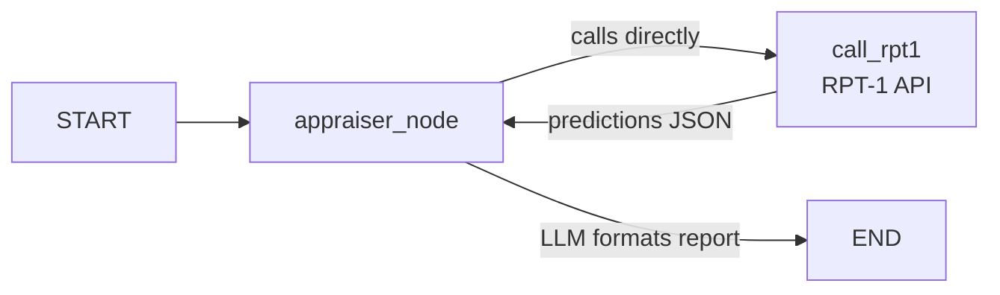

# Add Your First Tool to the Agent

Your Loss Appraiser agent can reason and respond, but it's currently relying on general knowledge. To make real insurance predictions, it needs access to SAP's RPT-1 model — a machine learning model trained specifically for predicting insurance values and item categories.

In this exercise you will give your agent its first **tool**: a function that calls the RPT-1 model and returns structured predictions.

---

## Overview

In LangGraph, **tools are plain Python functions** — there is no special decorator or framework wrapper required. Your agent node calls them directly. This is different from the ReAct pattern where the LLM decides when to call a tool: because you write the node yourself, you decide exactly when the tool is called.

> **SAP-RPT-1** — [SAP's Relational Pretrained Transformer model](https://www.sap.com/products/artificial-intelligence/sap-rpt.html) is a foundation model trained on structured data. It is available in Generative AI Hub to gain predictive insights from enterprise data. The model works by uploading example data rows as JSON and can do classification and regression predictions on your dataset.

---

## Step 0: Install and Import Required SAP Cloud SDK for AI Libraries

👉 If you haven't installed the SAP AI SDK yet, run:

```bash
pip install --require-virtualenv sap-ai-sdk-gen
```

> 💡 This installs the [SAP Cloud SDK for AI (Python) - generative](https://help.sap.com/doc/generative-ai-hub-sdk/CLOUD/en-US/_reference/README_sphynx.html), which provides tools for document grounding, embeddings, retrieval, as well as RPT-1 predictions.

---

## Step 1: Create the Payload Data File

The RPT-1 model needs a structured dataset of stolen items to predict missing insurance values and categories.

👉 Create a new file [`/project/Python-LangGraph/starter-project/payload.py`](/project/Python-LangGraph/starter-project/payload.py) and paste in the following data:

```python
# Payload data for stolen items appraisal
payload = {
    "prediction_config": {
        "target_columns": [
            {
                "name": "INSURANCE_VALUE",
                "prediction_placeholder": "[PREDICT]",
                "task_type": "regression",
            },
            {
                "name": "ITEM_CATEGORY",
                "prediction_placeholder": "[PREDICT]",
                "task_type": "classification",
            },
        ]
    },
    "index_column": "ITEM_ID",
    "rows": [
        {"ITEM_ID": "ART_001", "ITEM_NAME": "Water Lilies - Series 1", "ARTIST": "Claude Monet", "ACQUISITION_DATE": "1987-03-15", "INSURANCE_VALUE": 45000000, "ITEM_CATEGORY": "Painting", "DIMENSIONS": "200x180cm", "CONDITION_SCORE": 9, "RARITY_SCORE": 9, "PROVENANCE_CLARITY": 8},
        {"ITEM_ID": "ART_002", "ITEM_NAME": "Japanese Bridge at Giverny", "ARTIST": "Claude Monet", "ACQUISITION_DATE": "1995-06-22", "INSURANCE_VALUE": 42000000, "ITEM_CATEGORY": "Painting", "DIMENSIONS": "92x73cm", "CONDITION_SCORE": 8, "RARITY_SCORE": 8, "PROVENANCE_CLARITY": 9},
        {"ITEM_ID": "ART_003", "ITEM_NAME": "Irises", "ARTIST": "Vincent van Gogh", "ACQUISITION_DATE": "2001-11-08", "INSURANCE_VALUE": "[PREDICT]", "ITEM_CATEGORY": "Painting", "DIMENSIONS": "71x93cm", "CONDITION_SCORE": 7, "RARITY_SCORE": 9, "PROVENANCE_CLARITY": 8},
        {"ITEM_ID": "ART_004", "ITEM_NAME": "Starry Night Over the Rhone", "ARTIST": "Vincent van Gogh", "ACQUISITION_DATE": "1998-09-14", "INSURANCE_VALUE": 48000000, "ITEM_CATEGORY": "Painting", "DIMENSIONS": "73x92cm", "CONDITION_SCORE": 8, "RARITY_SCORE": 9, "PROVENANCE_CLARITY": 9},
        {"ITEM_ID": "ART_005", "ITEM_NAME": "The Birth of Venus", "ARTIST": "Sandro Botticelli", "ACQUISITION_DATE": "1992-04-30", "INSURANCE_VALUE": 55000000, "ITEM_CATEGORY": "Painting", "DIMENSIONS": "172x278cm", "CONDITION_SCORE": 6, "RARITY_SCORE": 10, "PROVENANCE_CLARITY": 10},
        {"ITEM_ID": "ART_006", "ITEM_NAME": "Primavera", "ARTIST": "Sandro Botticelli", "ACQUISITION_DATE": "1989-02-19", "INSURANCE_VALUE": 52000000, "ITEM_CATEGORY": "Painting", "DIMENSIONS": "203x314cm", "CONDITION_SCORE": 7, "RARITY_SCORE": 10, "PROVENANCE_CLARITY": 10},
        {"ITEM_ID": "ART_007", "ITEM_NAME": "Girl with a Pearl Earring", "ARTIST": "Johannes Vermeer", "ACQUISITION_DATE": "2003-07-11", "INSURANCE_VALUE": "[PREDICT]", "ITEM_CATEGORY": "Painting", "DIMENSIONS": "44x39cm", "CONDITION_SCORE": 8, "RARITY_SCORE": 10, "PROVENANCE_CLARITY": 9},
        {"ITEM_ID": "ART_008", "ITEM_NAME": "The Music Lesson", "ARTIST": "Johannes Vermeer", "ACQUISITION_DATE": "1994-05-20", "INSURANCE_VALUE": 38000000, "ITEM_CATEGORY": "Painting", "DIMENSIONS": "64x73cm", "CONDITION_SCORE": 8, "RARITY_SCORE": 9, "PROVENANCE_CLARITY": 9},
        {"ITEM_ID": "ART_009", "ITEM_NAME": "The Persistence of Memory", "ARTIST": "Salvador Dalí", "ACQUISITION_DATE": "2005-03-10", "INSURANCE_VALUE": 35000000, "ITEM_CATEGORY": "[PREDICT]", "DIMENSIONS": "24x33cm", "CONDITION_SCORE": 9, "RARITY_SCORE": 9, "PROVENANCE_CLARITY": 10},
        {"ITEM_ID": "ART_010", "ITEM_NAME": "Metamorphosis of Narcissus", "ARTIST": "Salvador Dalí", "ACQUISITION_DATE": "1996-08-12", "INSURANCE_VALUE": 32000000, "ITEM_CATEGORY": "Painting", "DIMENSIONS": "51x78cm", "CONDITION_SCORE": 8, "RARITY_SCORE": 8, "PROVENANCE_CLARITY": 8},
        {"ITEM_ID": "ART_011", "ITEM_NAME": "The Bronze Dancer", "ARTIST": "Auguste Rodin", "ACQUISITION_DATE": "1991-07-22", "INSURANCE_VALUE": 8500000, "ITEM_CATEGORY": "Sculpture", "DIMENSIONS": "Height: 1.8m", "CONDITION_SCORE": 9, "RARITY_SCORE": 7, "PROVENANCE_CLARITY": 8},
        {"ITEM_ID": "ART_012", "ITEM_NAME": "The Thinker", "ARTIST": "Auguste Rodin", "ACQUISITION_DATE": "2000-11-05", "INSURANCE_VALUE": "[PREDICT]", "ITEM_CATEGORY": "Sculpture", "DIMENSIONS": "Height: 1.9m", "CONDITION_SCORE": 9, "RARITY_SCORE": 7, "PROVENANCE_CLARITY": 9},
        {"ITEM_ID": "ART_013", "ITEM_NAME": "Hope Diamond Replica - Royal Cut", "ARTIST": "Unknown Jeweler", "ACQUISITION_DATE": "1988-02-19", "INSURANCE_VALUE": 12000000, "ITEM_CATEGORY": "Jewelry", "DIMENSIONS": "Width: 15cm", "CONDITION_SCORE": 10, "RARITY_SCORE": 10, "PROVENANCE_CLARITY": 7},
        {"ITEM_ID": "ART_014", "ITEM_NAME": "Cartier Ruby Necklace - 1920s", "ARTIST": "Cartier", "ACQUISITION_DATE": "2002-09-11", "INSURANCE_VALUE": 9500000, "ITEM_CATEGORY": "Jewelry", "DIMENSIONS": "Length: 45cm", "CONDITION_SCORE": 9, "RARITY_SCORE": 8, "PROVENANCE_CLARITY": 9},
    ],
    "data_schema": {
        "ITEM_ID": {"dtype": "string"},
        "ITEM_NAME": {"dtype": "string"},
        "ARTIST": {"dtype": "string"},
        "ACQUISITION_DATE": {"dtype": "date"},
        "INSURANCE_VALUE": {"dtype": "numeric"},
        "ITEM_CATEGORY": {"dtype": "string", "categories": ["Painting", "Sculpture", "Jewelry"]},
        "DIMENSIONS": {"dtype": "string"},
        "CONDITION_SCORE": {"dtype": "numeric", "range": [1, 10], "description": "1=Poor to 10=Pristine"},
        "RARITY_SCORE": {"dtype": "numeric", "range": [1, 10], "description": "1=Common to 10=Extremely Rare"},
        "PROVENANCE_CLARITY": {"dtype": "numeric", "range": [1, 10], "description": "1=Unknown to 10=Perfect Documentation"},
    },
}
```

> 💡 **What is `[PREDICT]`?**
>
> Some items have `"INSURANCE_VALUE": "[PREDICT]"` or `"ITEM_CATEGORY": "[PREDICT]"`. These are the missing values you want RPT-1 to fill in. The model uses the known values in the dataset (condition, rarity, provenance, comparable items) to predict the unknowns.

---

## Step 2: Update `basic_agent.py` with Imports and RPT-1 Client

👉 Open your `basic_agent.py` and update the imports section:

```python
from pathlib import Path
from typing import TypedDict, Optional
from dotenv import load_dotenv
from langchain_litellm import ChatLiteLLM
from langchain_core.messages import SystemMessage, HumanMessage
from langgraph.graph import StateGraph, START, END
from gen_ai_hub.proxy.native.sap.client import RPTClient
import json

from payload import payload

# Load .env from the same directory as this script
env_path = Path(__file__).parent / '.env'
load_dotenv(dotenv_path=env_path)

# Initialize RPT-1 client after loading environment variables
rpt1_client = RPTClient()
```

> 💡 **What changed:**
>
> - `RPTClient` from `gen_ai_hub` — SAP's client for calling the RPT-1 model
> - `json` — to serialize the RPT-1 response into a readable string
> - `payload` — the stolen items dataset you just created

---

## Step 3: Build the RPT-1 Tool Function

In LangGraph, tools are **plain Python functions** — no decorators needed. Your node will call this function directly, so you have full control over when and how it runs.

👉 Add this function above your model initialization:

```python
def call_rpt1(payload: dict) -> str:
    """Call the SAP RPT-1 model to predict missing insurance values and item categories."""
    try:
        response = rpt1_client.predict(body=payload, model_name="sap-rpt-1-large")
        if response:
            return json.dumps(response.model_dump(), indent=2)
        else:
            return f"Error {response.status_code}: {response.text}"
    except Exception as e:
        return f"Error calling RPT-1: {str(e)}"
```

> 💡 **Why return error strings instead of raising exceptions?**
>
> Returning an error string means the node can pass the failure message to the LLM, which can then include it in the report. Raising an exception would crash the entire graph. Always return, never raise, in tool functions.

---

## Step 4: Update the Appraiser Node to Call the Tool

👉 Update your `appraiser_node` to call `call_rpt1` directly and pass the result to the LLM:

```python
# Initialize the LLM via LiteLLM pointing to SAP Generative AI Hub
model = ChatLiteLLM(model="sap/anthropic--claude-4.5-opus", temperature=0)

system_prompt = """You are an experienced Stolen Goods Loss Appraiser specializing in fine art and valuables.
Your goal is to assess the value of stolen items and provide a professional insurance appraisal report.
You receive predictions from RPT-1 and turn them into a clear appraisal summary — you never guess values yourself."""


def appraiser_node(state: AgentState) -> dict:
    print("\n🔍 Appraiser Agent starting...")

    rpt1_result = call_rpt1(payload)

    response = model.invoke([
        SystemMessage(content=system_prompt),
        HumanMessage(content=f"Here are the RPT-1 predictions for the stolen items. Write a professional appraisal summary:\n\n{rpt1_result}"),
    ])

    appraisal_result = response.content
    print("✅ Appraisal complete")

    return {
        "appraisal_result": appraisal_result,
        "messages": state["messages"] + [{"role": "assistant", "content": appraisal_result}],
    }
```

> 💡 **How the tool call works:**
>
> The node calls `call_rpt1(payload)` directly — no framework magic involved. The predictions come back as a JSON string, which the node passes to the LLM as context. The LLM then writes the appraisal summary. You, not the LLM, decide when the tool is called.

---

### Step 5: Update the `.env` file with the Correct SAP-RPT-1 URL

👉 Go to [SAP AI Launchpad](https://genai-codejam-luyq1wkg.ai-launchpad.prod.eu-central-1.aws.ai-prod.cloud.sap/aic/index.html#/workspaces&/a/detail/TwoColumnsMidExpanded/?workspace=api-connection&resourceGroup=s3-grounding)

☝️ In this subaccount the connection between the SAP AI Core service instance and the SAP AI Launchpad application is already established. Otherwise you would have to add a new AI runtime using the SAP AI Core service key information.

> DO NOT USE THE `default` RESOURCE GROUP!

👉 Go to **Workspaces**.

👉 Select your workspace (like `codejam`) and your resource group `ai-agents-codejam`.

👉 Make sure it is set as a context. The proper name of the context, like `codejam (ai-agents-codejam)` should show up at the top next to SAP AI Launchpad.

👉 Navigate to `ML Operations > Deployments > sap-rpt-1-large_autogenerated`

👉 Copy the ID of the SAP-RPT-1 deployment and paste it into the [.env](project/Python/starter-project/.env) file.

```bash
RPT1_DEPLOYMENT_URL="https://api.ai.prod.eu-central-1.aws.ml.hana.ondemand.com/v2/inference/deployments/<ID GOES HERE>/predict"
```

---

## Step 6: Run Your Agent

👉 Run the updated agent:

_macOS / Linux / BAS_

```bash
python3 ./project/Python-LangGraph/starter-project/basic_agent.py
```

_Windows (PowerShell / Command Prompt)_

```powershell
python .\project\Python-LangGraph\starter-project\basic_agent.py
```

You should see the agent:
1. Calling RPT-1 and receiving predictions
2. Producing a formatted appraisal report with the predicted values filled in

---

## Understanding What Just Happened



The node flow:
1. Node calls `call_rpt1(payload)` directly
2. RPT-1 returns predicted values as JSON
3. Node passes the predictions to the LLM as context
4. LLM writes the final appraisal report
5. Node returns the result as a state update

---

## Understanding Tools in LangGraph

### Tools in LangGraph vs CrewAI

In CrewAI, tools are Python functions decorated with `@tool()` and the LLM decides when to call them based on the task description.

In LangGraph, **you decide when a tool is called** — it's a regular function call inside your node. This gives you more control and makes the code easier to understand and debug.

```python
# LangGraph: explicit tool call inside the node
def appraiser_node(state: AgentState) -> dict:
    rpt1_result = call_rpt1(payload)  # you call it directly
    ...
```

For more complex scenarios where LLM-driven tool selection is needed, LangGraph also supports `bind_tools()` — but for this workshop, direct calls keep things simple and reliable.

---

## Key Takeaways

- **Tools are plain functions** in LangGraph — no decorators or wrappers needed
- **`RPTClient`** from `gen_ai_hub` handles authentication and the RPT-1 API call
- **You control tool invocation** — the node explicitly calls the function
- **Return error strings, not exceptions** — lets the LLM report failures gracefully
- **Module-level client initialization** avoids repeated setup on every call

---

## Troubleshooting

**Issue**: `ModuleNotFoundError: No module named 'gen_ai_hub'`

- **Solution**: Install the SAP AI SDK: `pip install sap-ai-sdk-gen`

**Issue**: `Error calling RPT-1: ...`

- **Solution**: Check your `.env` for valid `AICORE_*` credentials and that `RPT1_DEPLOYMENT_URL` is set.

---

## Resources

- [LangGraph Documentation](https://langchain-ai.github.io/langgraph/)
- [SAP Cloud SDK RPT-1 Documentation](https://help.sap.com/doc/generative-ai-hub-sdk/CLOUD/en-US/_reference/gen_ai_hub.html)
- [SAP-RPT-1 Playground](https://rpt.cloud.sap/)

[Next exercise](04-building-multi-agent-system.md)
