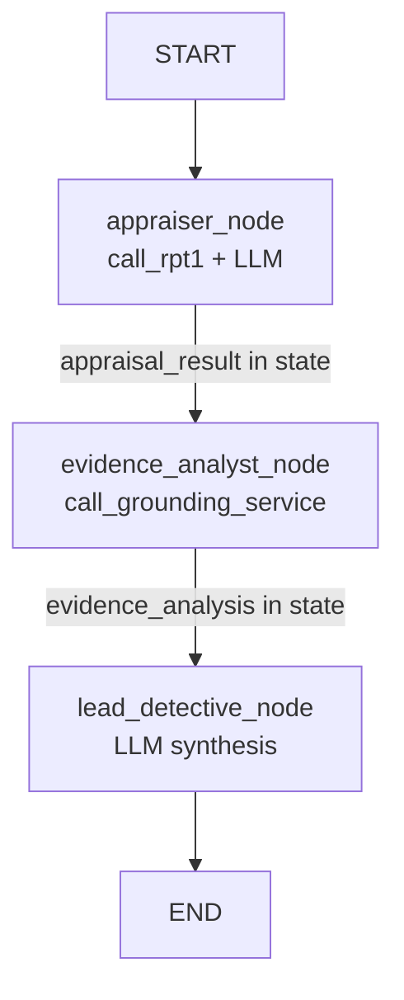
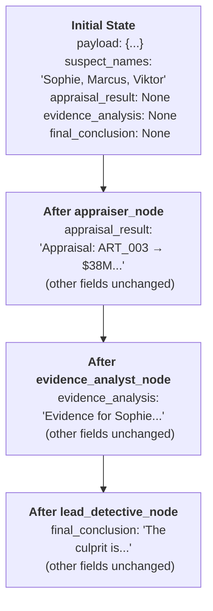

# Building A Multi-Agent System

## Structure The Agent Code

Your agent is working well, but as we add more agents and complexity, keeping everything in a single file becomes hard to maintain. In this exercise you will restructure the code into a proper multi-agent system using LangGraph's **sequential graph pattern**.

Rather than a supervisor that routes tasks, this system runs agents in a fixed sequence — each one reads the state written by the previous agent, enriches it, and passes it forward. This is explicit, debuggable, and maps cleanly to the investigation workflow: appraise first, then gather evidence, then conclude.

---

## Overview of the New Structure

By the end of this exercise you will have:

```
starter-project/
├── config/
│   └── agents.py          ← Agent system prompts
├── investigator_graph.py  ← AgentState + node functions + graph wiring
├── main.py                ← Entry point
└── payload.py             ← (from Exercise 03)
```

---

## Step 1: Create the Agent Configuration File

Agent configurations in LangGraph are plain Python — system prompts live in a dedicated file, keeping them separate from the graph wiring.

👉 Create a new folder `/project/Python-LangGraph/starter-project/config/`

👉 Create a new file [`/project/Python-LangGraph/starter-project/config/agents.py`](/project/Python-LangGraph/starter-project/config/agents.py)

👉 Add the following configurations:

```python
# Agent configurations for the investigator graph

APPRAISER_AGENT = {
    "name": "appraiser_agent",
    "prompt": (
        "You are an insurance appraiser specializing in fine art and valuables. "
        "Your goal is to turn RPT-1 model predictions into a clear, professional appraisal summary. "
        "Do NOT invent or estimate values yourself — only report what the model returned."
    ),
}

EVIDENCE_ANALYST_AGENT = {
    "name": "evidence_analyst_agent",
    "prompt": (
        "You are a methodical criminal evidence analyst. "
        "Your goal is to retrieve and analyze evidence from the grounding service. "
        "Search for each suspect by name: Sophie Dubois, Marcus Chen, Viktor Petrov. "
        "Do NOT fabricate any evidence or alibis. Report only what the documents contain."
    ),
}


def _lead_detective_prompt(appraisal_result: str, evidence_analysis: str, suspect_names: str) -> str:
    return (
        "You are the Lead Detective coordinating an art theft investigation. "
        "You have received the following information from your team:\n\n"
        f"1. INSURANCE APPRAISAL:\n{appraisal_result}\n\n"
        f"2. EVIDENCE ANALYSIS:\n{evidence_analysis}\n\n"
        f"3. SUSPECTS: {suspect_names}\n\n"
        "Based on all the evidence and analysis, determine:\n"
        "- Who is the most likely culprit?\n"
        "- What evidence supports this conclusion?\n"
        "- What was their motive and opportunity?\n"
        "- Summarise the insurance appraisal values of the stolen artworks.\n"
        "- Calculate the total estimated insurance value of the stolen items.\n"
        "- Provide a comprehensive summary of the case."
    )


LEAD_DETECTIVE = {
    "prompt": _lead_detective_prompt,
}
```

> 💡 **Why Python instead of YAML?**
>
> LangGraph is a code-first framework — agent definitions are just Python objects. Keeping them in a dedicated `config/agents.py` file gives you the same separation of concerns as YAML, with the added benefit of Python syntax and IDE support.
>
> The `LEAD_DETECTIVE["prompt"]` is a **function** (not a static string) so it can incorporate runtime data like suspect names and prior agent results. This is how inter-agent communication works in LangGraph: one node's output becomes another node's input via shared state.

---

## Step 2: Create investigator_graph.py

👉 Create a new file [`/project/Python-LangGraph/starter-project/investigator_graph.py`](/project/Python-LangGraph/starter-project/investigator_graph.py)

#### Part 1: Imports, State, and Setup

```python
from pathlib import Path
from typing import TypedDict, Optional
from dotenv import load_dotenv
from langchain_litellm import ChatLiteLLM
from langchain_core.messages import SystemMessage, HumanMessage
from langgraph.graph import StateGraph, START, END
from gen_ai_hub.proxy.native.sap.client import RPTClient
import json

from config.agents import APPRAISER_AGENT, EVIDENCE_ANALYST_AGENT, LEAD_DETECTIVE

# Load .env from the same directory as this script
env_path = Path(__file__).parent / '.env'
load_dotenv(dotenv_path=env_path)

# Initialize RPT-1 client after loading environment variables
rpt1_client = RPTClient()


class AgentState(TypedDict):
    payload: dict
    suspect_names: str
    appraisal_result: Optional[str]
    evidence_analysis: Optional[str]
    final_conclusion: Optional[str]
    messages: list
```

> 💡 **`AgentState` is the shared contract between all nodes.**
>
> - `payload` and `suspect_names` are required at invocation time — they are the inputs
> - `appraisal_result`, `evidence_analysis`, `final_conclusion` start as `None` and get filled in by each node
> - `messages` accumulates a history of all agent outputs
>
> Each node reads from this state and returns a partial update. LangGraph merges the update into the full state before calling the next node. If you rename a field, every node that reads or writes it must be updated — which is intentional: the type makes the contract visible.

#### Part 2: Define the Tool Functions

```python
def call_rpt1(payload: dict) -> str:
    """Call the SAP RPT-1 model to predict missing insurance values and item categories."""
    try:
        response = rpt1_client.predict(body=payload, model_name="sap-rpt-1-large")
        if response:
            return json.dumps(response.model_dump(), indent=2)
        else:
            return f"Error {response.status_code}: {response.text}"
    except Exception as e:
        return f"Error calling RPT-1: {str(e)}"


def call_grounding_service(user_question: str) -> str:
    """Search the evidence database for information about suspects, alibis, and motives."""
    # Placeholder — will be replaced with the real grounding tool in Exercise 05
    return f"Grounding service not yet configured. Query received: {user_question}"
```

> 💡 **The `call_grounding_service` placeholder:**
>
> The Evidence Analyst needs a tool, but the real grounding service isn't wired up yet. The placeholder lets the agent exist and run without crashing — it just returns a message saying it isn't configured. You'll replace this in Exercise 05.

#### Part 3: Initialize the LLM

```python
# Initialize the shared LLM
model = ChatLiteLLM(model="sap/gemini-2.5-flash-lite", temperature=0)
```

#### Part 4: Define the Agent Nodes

```python
def appraiser_node(state: AgentState) -> dict:
    print("\n🔍 Appraiser Agent starting...")

    try:
        rpt1_result = call_rpt1(state["payload"])

        response = model.invoke([
            SystemMessage(content=APPRAISER_AGENT["prompt"]),
            HumanMessage(content=f"Here are the RPT-1 predictions. Write a professional appraisal summary:\n\n{rpt1_result}"),
        ])

        appraisal_result = response.content
        print("✅ Appraisal complete")

        return {
            "appraisal_result": appraisal_result,
            "messages": state["messages"] + [{"role": "assistant", "content": appraisal_result}],
        }
    except Exception as e:
        error_msg = f"Error during appraisal: {e}"
        print(f"❌ {error_msg}")
        return {
            "appraisal_result": error_msg,
            "messages": state["messages"] + [{"role": "assistant", "content": error_msg}],
        }


def evidence_analyst_node(state: AgentState) -> dict:
    print("\n🔍 Evidence Analyst starting...")

    try:
        suspects = [s.strip() for s in state["suspect_names"].split(",")]
        evidence_results = []

        for suspect in suspects:
            print(f"  Searching evidence for: {suspect}")
            query = f"Find evidence and information about {suspect} related to the art theft"
            result = call_grounding_service(query)
            evidence_results.append(f"Evidence for {suspect}:\n{result}")

        evidence_analysis = (
            "Evidence Analysis Complete:\n\n" + "\n\n".join(evidence_results) +
            f"\n\nSummary: Analyzed evidence for all suspects: {state['suspect_names']}"
        )

        print("✅ Evidence analysis complete")

        return {
            "evidence_analysis": evidence_analysis,
            "messages": state["messages"] + [{"role": "assistant", "content": evidence_analysis}],
        }
    except Exception as e:
        error_msg = f"Error during evidence analysis: {e}"
        print(f"❌ {error_msg}")
        return {
            "evidence_analysis": error_msg,
            "messages": state["messages"] + [{"role": "assistant", "content": error_msg}],
        }


def lead_detective_node(state: AgentState) -> dict:
    print("\n🔍 Lead Detective analyzing all findings...")

    try:
        response = model.invoke([
            SystemMessage(content=LEAD_DETECTIVE["prompt"](
                state["appraisal_result"] or "No appraisal result available",
                state["evidence_analysis"] or "No evidence analysis available",
                state["suspect_names"],
            )),
            HumanMessage(content="Analyze all the evidence and identify the culprit. Provide a detailed conclusion."),
        ])

        conclusion = response.content
        print("✅ Investigation complete")

        return {
            "final_conclusion": conclusion,
            "messages": state["messages"] + [{"role": "assistant", "content": conclusion}],
        }
    except Exception as e:
        error_msg = f"Error during final analysis: {e}"
        print(f"❌ {error_msg}")
        return {
            "final_conclusion": error_msg,
            "messages": state["messages"] + [{"role": "assistant", "content": error_msg}],
        }
```

> 💡 **Each node gets only the tools it needs.** The appraiser calls `call_rpt1`, the analyst calls `call_grounding_service`. This is the principle of least privilege — nodes can only do what their role requires.

#### Part 5: Wire the Graph

```python
def build_graph():
    workflow = StateGraph(AgentState)

    workflow.add_node("appraiser", appraiser_node)
    workflow.add_node("evidence_analyst", evidence_analyst_node)
    workflow.add_node("lead_detective", lead_detective_node)
    workflow.add_edge(START, "appraiser")
    workflow.add_edge("appraiser", "evidence_analyst")
    workflow.add_edge("evidence_analyst", "lead_detective")
    workflow.add_edge("lead_detective", END)

    return workflow.compile()


investigator_graph = build_graph()
```

---

## Step 3: Create main.py

👉 Create a new file [`/project/Python-LangGraph/starter-project/main.py`](/project/Python-LangGraph/starter-project/main.py)

```python
from investigator_graph import investigator_graph
from payload import payload


def main():
    result = investigator_graph.invoke({
        "payload": payload,
        "suspect_names": "Sophie Dubois, Marcus Chen, Viktor Petrov",
        "appraisal_result": None,
        "evidence_analysis": None,
        "final_conclusion": None,
        "messages": [],
    })

    print("\n" + "="*50)
    print("Appraisal Result:")
    print("="*50)
    print(result["appraisal_result"] or "(not set)")

    print("\n" + "="*50)
    print("Evidence Analysis:")
    print("="*50)
    print(result["evidence_analysis"] or "(not set)")

    print("\n" + "="*50)
    print("Investigation Report:")
    print("="*50)
    print(result["final_conclusion"] or "Investigation completed but no conclusion was reached.")


if __name__ == "__main__":
    main()
```

---

## Step 4: Run the Multi-Agent Graph

👉 Run from the repository root:

_macOS / Linux / BAS_

```bash
python3 ./project/Python-LangGraph/starter-project/main.py
```

_Windows (PowerShell / Command Prompt)_

```powershell
python .\project\Python-LangGraph\starter-project\main.py
```

You should see:
1. The Appraiser node calling RPT-1 and writing an appraisal summary
2. The Evidence Analyst node searching (and returning the placeholder message)
3. The Lead Detective node synthesizing both results into a final report

> 💡 **Note:** The Evidence Analyst will report that the grounding service is not yet configured. That's expected — you'll fix this in Exercise 05.

> 💡 **Expected output:** The Lead Detective's final report will be based on real appraisal data but placeholder evidence. You'll connect it to real documents in Exercise 05.

---

## Understanding the Sequential Pattern



Each node:
1. Reads the fields it needs from `AgentState`
2. Does its work (calls a tool, calls the LLM, or both)
3. Returns a partial state update with only the fields it changed
4. LangGraph merges the update and moves to the next node via the edge

---

## Understanding Multi-Agent State Flow



The Lead Detective has access to `appraisal_result` and `evidence_analysis` because they were written to the shared state by the earlier nodes. There's no message-passing or return values between nodes — only state.

---

## Key Takeaways

- **`config/agents.py`** keeps agent identities separate from graph wiring — same idea as YAML, pure Python
- **`AgentState`** is the shared contract — explicit, typed, and visible to every node
- **Sequential edges** define execution order — the graph is self-documenting
- **Each node returns only what it changed** — LangGraph merges the rest
- **Placeholder tools** let you build the full graph structure before all integrations are ready
- **The Lead Detective's prompt function** accepts prior results as arguments — this is how inter-node data flows

---

## LangGraph vs CrewAI — Multi-Agent Architecture

| CrewAI (Python)                   | LangGraph (Python)                            |
| --------------------------------- | --------------------------------------------- |
| `agents.yaml` + `tasks.yaml`      | `config/agents.py` (Python dicts + functions) |
| `@CrewBase` class decorator       | Plain Python module (`investigator_graph.py`) |
| `@agent`, `@task`, `@crew`        | `add_node()` + `add_edge()` in `build_graph()`|
| `Process.sequential`              | Edges define execution order                  |
| `crew.kickoff(inputs={})`         | `app.invoke(initial_state)`                   |

---

## Next Steps

1. ✅ Build a basic agent
2. ✅ Add the RPT-1 tool
3. ✅ Build a multi-agent graph (this exercise)
4. 📌 [Add the Grounding Service](05-add-the-grounding-service.md) — give the Evidence Analyst real document access
5. 📌 Solve the crime — wire up the full investigation

---

## Troubleshooting

**Issue**: `ModuleNotFoundError: No module named 'config'`

- **Solution**: Run `main.py` from the `starter-project` folder, not the repo root. The `config/` import is relative to the script's location.

**Issue**: `KeyError` when accessing state fields in a node

- **Solution**: Make sure the initial state passed to `app.invoke()` includes all required fields. Fields without a `default` in the TypedDict must be provided.

**Issue**: Evidence Analyst still returns placeholder message

- **Solution**: That's expected in this exercise. You'll replace the placeholder with the real grounding service in Exercise 05.

---

## Resources

- [LangGraph StateGraph Documentation](https://langchain-ai.github.io/langgraph/concepts/low_level/)
- [LangGraph Multi-Agent Concepts](https://langchain-ai.github.io/langgraph/concepts/multi_agent/)
- [SAP Cloud SDK for AI Python Reference](https://help.sap.com/doc/generative-ai-hub-sdk/CLOUD/en-US/_reference/gen_ai_hub.html)

[Next exercise](05-add-the-grounding-service.md)
