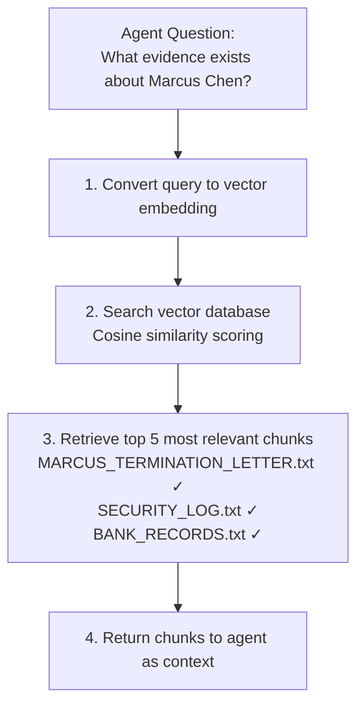
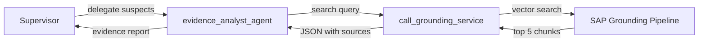

# Add The Grounding Service

## Overview

Your Evidence Analyst agent exists but is currently using a placeholder tool that returns nothing useful. In this exercise you will replace it with a real **grounding service** — connecting the agent to a vector database of actual evidence documents.

---

## Understand The Grounding Service

### What is Grounding?

**Grounding** (also called **RAG — Retrieval-Augmented Generation**) connects LLMs to external, up-to-date data sources, giving them access to facts they weren't trained on. It solves one of AI's biggest problems: **hallucination**.

| **Without Grounding** | **With Grounding** |
|---|---|
| ❌ LLM makes up plausible-sounding "facts" | ✅ LLM retrieves real documents first |
| ❌ No source citations | ✅ Cites specific documents (e.g., "MARCUS_TERMINATION_LETTER.txt") |
| ❌ Can't access recent or private data | ✅ Accesses your latest documents (evidence, contracts, logs) |
| ❌ Unreliable for critical decisions | ✅ Factual, auditable, trustworthy |

**Example in Our Case:**

**Ungrounded Agent (BAD):**
> "Marcus Chen was likely fired due to performance issues. He probably had financial troubles."
> *(Pure hallucination — sounds convincing but is made up!)*

**Grounded Agent (GOOD):**
> "According to MARCUS_TERMINATION_LETTER.txt, Marcus Chen was terminated on 2024-01-15 due to 'unauthorized access to secured areas.' BANK_RECORDS.txt shows large cash deposits of €50,000 on 2024-01-20."
> *(Facts retrieved from actual documents with sources!)*

### Available Evidence Documents

The following documents are pre-loaded in the grounding pipeline for this CodeJam:

- 📄 **BANK_RECORDS.txt** — Financial transactions of all suspects
- 📄 **SECURITY_LOG.txt** — Museum access logs with timestamps
- 📄 **PHONE_RECORDS.txt** — Call history between suspects
- 📄 **MARCUS_TERMINATION_LETTER.txt** — Why Marcus was fired
- 📄 **MARCUS_EXIT_LOG.txt** — Marcus's building access records
- 📄 **SOPHIE_LOAN_DOCUMENTS.txt** — Sophie's financial situation
- 📄 **VIKTOR_CRIMINAL_RECORD.txt** — Viktor's past convictions
- 📄 **STOLEN_ITEMS_INVENTORY.txt** — Details of stolen art

### How the SAP Grounding Service Works



> 💡 **Good news:** The pipeline and all evidence documents are already set up for you. You just need to connect your agent to it.

---

## Step 1: Get the Pipeline ID from SAP AI Launchpad

👉 Open [SAP AI Launchpad](https://genai-codejam-luyq1wkg.ai-launchpad.prod.eu-central-1.aws.ai-prod.cloud.sap/aic/index.html#/workspaces&/a/detail/TwoColumnsMidExpanded/?workspace=codejam&resourceGroup=ai-agents-codejam)

👉 Go to **Workspaces** → select your workspace → resource group `ai-agents-codejam`

👉 Go to **Generative AI Hub > Grounding Management** and open the existing pipeline

👉 Copy the **Pipeline ID** — you'll need it in the next step

> 💡 **(Optional)** Click **Run Search** and try searching for "Marcus Chen" or "Sophie Dubois" to see which document chunks are retrieved. This is exactly what your agent will do.

---

## Step 2: Add the Grounding Imports to investigator_graph.py

👉 Open [`/project/Python-LangGraph/starter-project/investigator_graph.py`](/project/Python-LangGraph/starter-project/investigator_graph.py)

👉 Add these imports after the existing ones:

```python
from gen_ai_hub.document_grounding.client import RetrievalAPIClient
from gen_ai_hub.document_grounding.models.retrieval import (
    RetrievalSearchInput,
    RetrievalSearchFilter,
)
from gen_ai_hub.orchestration.models.document_grounding import DataRepositoryType
```

> 💡 **What these do:**
>
> - `RetrievalAPIClient` — connects to SAP's grounding service using your `.env` credentials
> - `RetrievalSearchInput` — structures the search query
> - `RetrievalSearchFilter` — configures vector search parameters (which pipeline, how many chunks)
> - `DataRepositoryType` — specifies the type of data source (vector database)

---

## Step 3: Replace the Placeholder Tool with the Real Implementation

👉 In `investigator_graph.py`, replace the placeholder `call_grounding_service` function with:

```python
def call_grounding_service(user_question: str) -> str:
    """Search the evidence database for information about suspects, alibis, and motives."""
    retrieval_client = RetrievalAPIClient()

    search_filter = RetrievalSearchFilter(
        id="vector",
        dataRepositoryType=DataRepositoryType.VECTOR.value,
        dataRepositories=["YOUR_PIPELINE_ID_HERE"],  # 👈 Replace with your pipeline ID
        searchConfiguration={
            "maxChunkCount": 5  # Retrieve top 5 most relevant document chunks
        },
    )

    search_input = RetrievalSearchInput(
        query=user_question,
        filters=[search_filter],
    )

    response = retrieval_client.search(search_input)
    return json.dumps(response.model_dump(), indent=2)
```

👉 Replace `"YOUR_PIPELINE_ID_HERE"` with the Pipeline ID you copied from SAP AI Launchpad:

```python
dataRepositories=["0d3b132a-cbe1-4c75-abe7-adfbbab7e002"],  # your actual pipeline ID
```

> 💡 **Understanding the grounding call:**
>
> - `RetrievalAPIClient()` — initialises the client using your `.env` credentials automatically
> - `dataRepositories` — points to the specific evidence pipeline by its ID
> - `maxChunkCount: 5` — retrieves the top 5 most semantically similar document chunks
> - `response.model_dump()` — converts the response (chunks + source filenames + scores) to a dict the agent can read

---

## Step 4: Run the Graph

👉 Run from the repository root:

_macOS / Linux / BAS_

```bash
python3 ./project/Python-LangGraph/starter-project/main.py
```

_Windows (PowerShell / Command Prompt)_

```powershell
python .\project\Python-LangGraph\starter-project\main.py
```

Your Evidence Analyst should now retrieve real document excerpts and cite sources like `"MARCUS_TERMINATION_LETTER.txt"` instead of returning the placeholder message.

---

## Understanding the Grounding Flow



---

## Key Takeaways

- **Grounding** prevents hallucination by giving agents access to real documents
- **`RetrievalAPIClient`** handles authentication and the vector search automatically
- **Pipeline ID** is the only thing that needs to change per deployment — the rest is reusable
- The **docstring** of `call_grounding_service` tells the agent when and how to call it — keep it descriptive
- **`maxChunkCount`** controls how much context is retrieved — increase it if the agent misses relevant evidence

---

## Next Steps

1. ✅ Build a basic agent
2. ✅ Add the RPT-1 tool
3. ✅ Build a multi-agent graph with supervisor
4. ✅ Add the Grounding Service (this exercise)
5. 📌 [Solve the crime](06-solve-the-crime.md) — add a Lead Detective and wire up the full investigation
6. 📌 Deploy to Cloud Foundry with A2A

---

## Troubleshooting

**Issue**: `AttributeError: 'module' object has no attribute 'RetrievalAPIClient'`

- **Solution**: `pip install sap-ai-sdk-gen`

**Issue**: Pipeline not found or authentication error

- **Solution**: Verify your resource group is `ai-agents-codejam`, the pipeline ID is correct, and your `.env` has valid `AICORE_*` credentials.

**Issue**: Evidence Analyst still returns placeholder message

- **Solution**: Make sure you replaced the entire function body, not just the pipeline ID. The import block also needs the new grounding imports.

---

## Resources

- [SAP AI Core Grounding Management](https://help.sap.com/docs/sap-ai-core/sap-ai-core-service-guide/document-grounding)
- [SAP Cloud SDK for AI Python Reference](https://help.sap.com/doc/generative-ai-hub-sdk/CLOUD/en-US/_reference/gen_ai_hub.html)

[Next exercise](06-solve-the-crime.md)