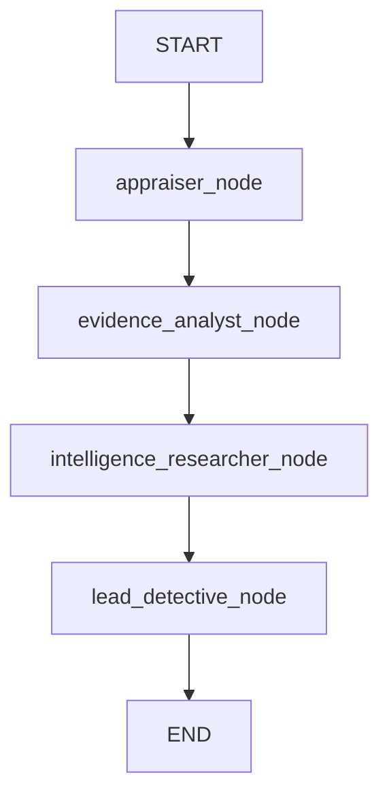

# Discover Connected Crimes with Web Search (Python/LangGraph)

## Overview

In Exercise 05, you learned to search internal documents using the Grounding Service. Your Evidence Analyst node can now retrieve factual evidence from security logs, bank records, and termination letters without hallucination.

But investigations don't happen in a vacuum. What if similar crimes happened elsewhere? What if your suspects have public criminal records? What if this heist is part of a larger criminal network?

In this exercise, you'll add an **Intelligence Researcher node** that uses Perplexity's **sonar-pro model** to gather external intelligence from the web.

---

## Understand Web Search with Sonar-Pro

### Why Do We Need Web Search?

Your current investigation system is powerful but limited to **internal data**:

| **What You Can Do Now**                         | **What You Can't Do Yet**                            |
| ----------------------------------------------- | ---------------------------------------------------- |
| ✅ Search museum's internal evidence documents  | ❌ Search public criminal databases                  |
| ✅ Retrieve bank records, security logs         | ❌ Find similar crimes in other cities               |
| ✅ Analyze suspects based on internal evidence  | ❌ Check if suspects have public criminal records    |
| ✅ Ground responses in factual documents        | ❌ Discover criminal network connections             |
| ✅ Avoid hallucination for internal data        | ❌ Monitor online art markets for stolen items       |

### Document Grounding vs. Web Search

| Aspect                 | Document Grounding (Exercise 05)         | Web Search (This Exercise)                |
| ---------------------- | ---------------------------------------- | ----------------------------------------- |
| **Data Source**        | Internal documents (pre-uploaded)        | Real-time web information                 |
| **Coverage**           | Organization-specific evidence           | Global public information                 |
| **Freshness**          | Historical documents (static)            | Current information (updated constantly)  |
| **Use Cases**          | Internal logs, private records, policies | News, criminal records, pattern analysis  |
| **Search Method**      | Vector similarity (semantic)             | Web search + LLM synthesis                |
| **Tool Function**      | `call_grounding_service()`               | `call_sonar_pro_search()`                 |
| **When to Use**        | "What does our evidence say?"            | "What do public records show?"            |

> 🎯 **Key Insight**: These are **not alternatives** — they work **together**!

### How Sonar-Pro Works in LangGraph

In the Python-LangGraph track, tools are **plain functions** that nodes call directly — there is no `@tool` decorator. This is **deterministic orchestration**: the graph decides when to call the tool, not the LLM. This is different from CrewAI where the agent autonomously decides to use tools.

```python
# Plain function — no @tool decorator needed
def call_sonar_pro_search(query: str) -> str:
    from litellm import completion
    response = completion(
        model="sap/sonar-pro",  # Perplexity via SAP AI Core
        messages=[...]
    )
    return response.choices[0].message.content

# Node calls it directly — the graph controls the flow
def intelligence_researcher_node(state: AgentState) -> dict:
    result = call_sonar_pro_search("Marcus Chen criminal record")
    return {"intelligence_report": result}
```

> ⚠️ **Before continuing**: Verify that `sonar-pro` is available in your SAP AI Core resource group. Go to **SAP AI Launchpad → Generative AI Hub → Models** and confirm you can see a Perplexity sonar-pro deployment. If it is not listed, ask your workshop instructor to enable it.

---

## Add The Web Search Tool

### Step 1: Add the `call_sonar_pro_search` Function

👉 Open [`/project/Python-LangGraph/starter-project/investigator_graph.py`](/project/Python-LangGraph/starter-project/investigator_graph.py)

👉 Add this function **after** `call_grounding_service` and **before** the `model = ChatLiteLLM(...)` line:

```python
def call_sonar_pro_search(query: str) -> str:
    """Search the web using Perplexity's sonar-pro model for real-time intelligence."""
    from litellm import completion
    try:
        response = completion(
            model="sap/sonar-pro",
            messages=[
                {
                    "role": "system",
                    "content": "You are a web search assistant specializing in criminal intelligence. Search for accurate, recent information and always provide source citations with URLs and dates."
                },
                {
                    "role": "user",
                    "content": query
                }
            ],
            temperature=0.2,
        )
        return response.choices[0].message.content
    except Exception as e:
        return f"Error calling sonar-pro web search: {str(e)}"
```

> 💡 **Why no `@tool` decorator?**
>
> In the LangGraph track, tool functions are called **directly by nodes** — the graph structure controls when tools are called, not the LLM. This is called **deterministic tool orchestration**. Compare this to CrewAI, where agents autonomously decide to call tools.

---

## Extend the Agent State

### Step 2: Add `intelligence_report` to `AgentState`

The LangGraph `AgentState` is a `TypedDict` that defines all the data flowing through the graph. You need to add a field for the intelligence report.

👉 Find the `AgentState` class in `investigator_graph.py` and add `intelligence_report`:

```python
class AgentState(TypedDict):
    payload: dict
    suspect_names: str
    appraisal_result: Optional[str]
    evidence_analysis: Optional[str]
    intelligence_report: Optional[str]   # ← NEW
    final_conclusion: Optional[str]
    messages: list
```

> 💡 **How LangGraph state works**: Each node receives the full `AgentState` and returns a **partial dict** with only the fields it updated. LangGraph merges these partial updates into the shared state. This is why `intelligence_researcher_node` can return just `{"intelligence_report": ...}` — LangGraph carries the other fields forward automatically.

---

## Add The Intelligence Researcher Node

### Step 3: Add the Node Function

👉 Add this function **after** `evidence_analyst_node` and **before** `lead_detective_node`:

```python
def intelligence_researcher_node(state: AgentState) -> dict:
    print("\n🔍 Intelligence Researcher starting web search...")

    try:
        suspects = [s.strip() for s in state["suspect_names"].split(",")]
        intelligence_results = []

        for suspect in suspects:
            print(f"  Searching public records for: {suspect}")
            query = f"{suspect} criminal record art theft security technician Europe background check"
            result = call_sonar_pro_search(query)
            intelligence_results.append(f"Background check for {suspect}:\n{result}")

        print("  Searching for similar art theft incidents...")
        pattern_query = "museum art theft insider job no forced entry Europe similar incidents criminal network"
        pattern_result = call_sonar_pro_search(pattern_query)
        intelligence_results.append(f"Similar Art Theft Patterns:\n{pattern_result}")

        intelligence_report = (
            "Intelligence Research Complete:\n\n" + "\n\n".join(intelligence_results) +
            f"\n\nSummary: Conducted OSINT research on all suspects and identified similar crime patterns"
        )

        print("✅ Intelligence research complete")

        return {
            "intelligence_report": intelligence_report,
            "messages": state["messages"] + [{"role": "assistant", "content": intelligence_report}],
        }
    except Exception as e:
        error_msg = f"Error during intelligence research: {e}"
        print(f"❌ {error_msg}")
        return {
            "intelligence_report": error_msg,
            "messages": state["messages"] + [{"role": "assistant", "content": error_msg}],
        }
```

---

## Add the Agent Prompt

### Step 4: Add `WEB_RESEARCHER_AGENT` to `config/agents.py`

👉 Open [`/project/Python-LangGraph/starter-project/config/agents.py`](/project/Python-LangGraph/starter-project/config/agents.py)

👉 Add this constant **after** `EVIDENCE_ANALYST_AGENT`:

```python
WEB_RESEARCHER_AGENT = {
    "name": "intelligence_researcher_agent",
    "prompt": (
        "You are an Open-Source Intelligence (OSINT) specialist. "
        "Search the web for criminal records, similar art thefts, and suspect backgrounds. "
        "Focus on public information: news articles, court records, criminal databases. "
        "Always provide source citations with URLs and dates."
    ),
}
```

---

## Update the Lead Detective Prompt

### Step 5: Extend `_lead_detective_prompt`

The Lead Detective now synthesizes three sources instead of two. Update `_lead_detective_prompt` in `config/agents.py`:

```python
def _lead_detective_prompt(appraisal_result: str, evidence_analysis: str, intelligence_report: str, suspect_names: str) -> str:
    return (
        "You are the Lead Detective coordinating an art theft investigation. "
        "You have received the following information from your team:\n\n"
        f"1. INSURANCE APPRAISAL:\n{appraisal_result}\n\n"
        f"2. EVIDENCE ANALYSIS (Internal Documents):\n{evidence_analysis}\n\n"
        f"3. INTELLIGENCE REPORT (Web Search):\n{intelligence_report}\n\n"
        f"4. SUSPECTS: {suspect_names}\n\n"
        "Based on all the evidence and analysis, you MUST:\n"
        "- Name the most likely thief and explain the evidence supporting that conclusion\n"
        "- Consider both internal evidence and external criminal patterns\n"
        "- Note any alibis or evidence that clears the other suspects\n"
        "- State the total insured value of the stolen goods\n"
        "- Assess whether this is an isolated incident or part of a larger criminal network\n"
        "- Provide a comprehensive summary of the case."
    )
```

---

## Rewire the Graph

### Step 6: Add the Node and Update Edges

👉 Find the `build_graph()` function in `investigator_graph.py` and update it:

```python
def build_graph():
    workflow = StateGraph(AgentState)

    workflow.add_node("appraiser", appraiser_node)
    workflow.add_node("evidence_analyst", evidence_analyst_node)
    workflow.add_node("intelligence_researcher", intelligence_researcher_node)  # ← NEW
    workflow.add_node("lead_detective", lead_detective_node)
    workflow.add_edge(START, "appraiser")
    workflow.add_edge("appraiser", "evidence_analyst")
    workflow.add_edge("evidence_analyst", "intelligence_researcher")   # ← CHANGED
    workflow.add_edge("intelligence_researcher", "lead_detective")     # ← NEW
    workflow.add_edge("lead_detective", END)

    return workflow.compile()
```

The new graph structure:



---

## Update Lead Detective Node Call

### Step 7: Pass `intelligence_report` to the Prompt

In `investigator_graph.py`, find `lead_detective_node` and update the `LEAD_DETECTIVE["prompt"]` call to include `intelligence_report`:

```python
response = model.invoke([
    SystemMessage(content=LEAD_DETECTIVE["prompt"](
        state["appraisal_result"] or "No appraisal result available",
        state["evidence_analysis"] or "No evidence analysis available",
        state.get("intelligence_report") or "No intelligence report available",
        state["suspect_names"],
    )),
    HumanMessage(content="Analyze all the evidence and identify the culprit. Provide a detailed conclusion."),
])
```

---

## Update `main.py` and `server.py`

### Step 8: Initialize the New State Field

👉 Open [`/project/Python-LangGraph/starter-project/main.py`](/project/Python-LangGraph/starter-project/main.py)

👉 Add `"intelligence_report": None` to the initial state dict:

```python
result = investigator_graph.invoke({
    "payload": payload,
    "suspect_names": "Sophie Dubois, Marcus Chen, Viktor Petrov",
    "appraisal_result": None,
    "evidence_analysis": None,
    "intelligence_report": None,   # ← NEW
    "final_conclusion": None,
    "messages": [],
})
```

👉 Also add a print section for the intelligence report after the Evidence Analysis section:

```python
print("\n" + "="*50)
print("Intelligence Report:")
print("="*50)
print(result["intelligence_report"] or "(not set)")
```

> 💡 **`server.py`** also constructs the initial state for `investigator_graph.ainvoke(...)`. Add `"intelligence_report": None` there too — find the dict and add the field.

---

## Run Your Enhanced Investigation

👉 Run the investigation from the starter-project folder:

_macOS / Linux / BAS_

```bash
python3 ./project/Python-LangGraph/starter-project/main.py
```

_Windows (PowerShell)_

```powershell
python .\project\Python-LangGraph\starter-project\main.py
```

> ⏱️ **Expected output** — you should see all four nodes fire in order:
> ```
> 🔍 Appraiser Agent starting...
> ✅ Appraisal complete
>
> 🔍 Evidence Analyst starting...
> ✅ Evidence analysis complete
>
> 🔍 Intelligence Researcher starting web search...
>   Searching public records for: Sophie Dubois
>   Searching public records for: Marcus Chen
>   Searching public records for: Viktor Petrov
>   Searching for similar art theft incidents...
> ✅ Intelligence research complete
>
> 🔍 Lead Detective analyzing all findings...
> ✅ Investigation complete
> ```

---

## Key Takeaways

- **LangGraph tool functions are plain functions** — no `@tool` decorator needed. Nodes call them directly.
- **State carries data between nodes** — `intelligence_report` is set by the Intelligence Researcher node and automatically available to the Lead Detective node via `AgentState`.
- **Deterministic orchestration** — the graph structure controls the flow, not the LLM. Every run follows the same `appraiser → evidence_analyst → intelligence_researcher → lead_detective` path.
- **Sonar-Pro** is called through the same `litellm.completion()` API as other models, just with `model="sap/sonar-pro"`.

---

## Next Steps

You now have a complete intelligence gathering system with:
1. ✅ Structured data predictions (RPT-1)
2. ✅ Internal document search (Grounding Service)
3. ✅ External web intelligence (Sonar-Pro)

In the next exercise, you'll finalize the **Lead Detective prompt** to synthesize all three sources and [solve the museum art theft mystery](07-solve-the-crime.md).

---

## Troubleshooting

**Issue**: `ModuleNotFoundError: No module named 'litellm'`

- **Solution**: LiteLLM should already be installed from Exercise 02. If not:

  _macOS / Linux / BAS_
  ```bash
  pip install litellm==1.82.6
  ```

**Issue**: `Error: Model sap/sonar-pro not found` or `404`

- **Solution**: Verify that sonar-pro is deployed in your SAP AI Core resource group. Check **SAP AI Launchpad → Generative AI Hub → Models**.

**Issue**: `KeyError: 'intelligence_report'`

- **Solution**: Ensure you added `intelligence_report: Optional[str]` to the `AgentState` TypedDict AND initialized it to `None` in `main.py`'s initial state dict.

**Issue**: `TypeError: _lead_detective_prompt() takes 3 positional arguments but 4 were given`

- **Solution**: You updated the `lead_detective_node` call but forgot to update `_lead_detective_prompt`'s signature in `config/agents.py` (or vice versa). Make sure both accept `intelligence_report` as the third parameter.

**Issue**: Intelligence Researcher fires but Lead Detective ignores the report

- **Solution**: Check that `_lead_detective_prompt` actually interpolates `{intelligence_report}` in its return string, and that `lead_detective_node` passes `state.get("intelligence_report")` as the third argument.

---

## Resources

- [LangGraph Documentation](https://langchain-ai.github.io/langgraph/)
- [Perplexity API Documentation](https://docs.perplexity.ai/)
- [LiteLLM Documentation](https://docs.litellm.ai/)

[Next exercise](07-solve-the-crime.md)
