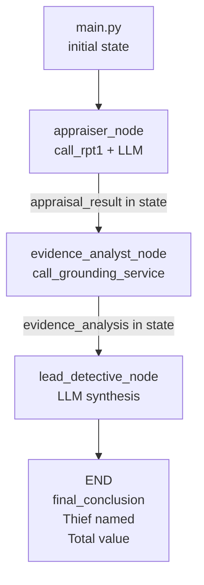

# Use Your AI Agents to Solve the Crime

The full investigation system is almost ready. In this exercise you'll refine the **Lead Detective's prompt** to produce an accurate, well-reasoned conclusion — then run the complete investigation to identify the thief.

---

## Why This Exercise Is Different from Exercise 04

In LangGraph, the Lead Detective **is** the supervisor you already built. There is no new agent class or additional code to write — the architecture is complete. What makes the difference between a vague report and a correct accusation is the **quality of the Lead Detective's prompt**.

In Exercise 04 the `_lead_detective_prompt` function ends with a generic instruction:

> *"Provide a comprehensive summary of the case."*

This is enough to make the system run, but the Lead Detective may stop short of naming a suspect, or jump to conclusions without cross-referencing evidence. In this exercise you'll sharpen that closing instruction.

---

## Step 1: Update the Lead Detective Prompt

👉 Open [`/project/Python-LangGraph/starter-project/config/agents.py`](/project/Python-LangGraph/starter-project/config/agents.py)

👉 Update the `_lead_detective_prompt` function in `config/agents.py` with a more specific closing instruction:

```python
def _lead_detective_prompt(appraisal_result: str, evidence_analysis: str, suspect_names: str) -> str:
    return (
        "You are the Lead Detective coordinating an art theft investigation. "
        "You have received the following information from your team:\n\n"
        f"1. INSURANCE APPRAISAL:\n{appraisal_result}\n\n"
        f"2. EVIDENCE ANALYSIS:\n{evidence_analysis}\n\n"
        f"3. SUSPECTS: {suspect_names}\n\n"
        "Based on all the evidence and analysis, you MUST:\n"
        "- Name the most likely thief and explain the evidence supporting that conclusion\n"
        "- Note any alibis or evidence that clears the other suspects\n"
        "- State the total insured value of the stolen goods\n"
        "- Provide a comprehensive summary of the case."
    )
```

> 💡 **What changed and why:**
>
> | Before | After |
> |---|---|
> | "Provide a comprehensive summary of the case." | "You MUST name the most likely thief…" |
> | No ordering requirement | Explicit bullet points for the expected conclusion |
>
> The LLM reads this prompt before writing its final report. Specificity reduces the chance it writes a vague summary without committing to a conclusion.

---

## Step 2: Run the Full Investigation

👉 Run from the repository root:

_macOS / Linux / BAS_

```bash
python3 ./project/Python-LangGraph/starter-project/main.py
```

_Windows (PowerShell / Command Prompt)_

```powershell
python .\project\Python-LangGraph\starter-project\main.py
```

> ⏱️ **This may take 2–5 minutes** — the Lead Detective calls both specialist agents, each of which makes external API calls (RPT-1 and the grounding service).

👉 Review the final report — who does the Lead Detective identify as the thief?

👉 Share your suspect with the instructor.

---

## If the Answer Looks Wrong or Vague

The Lead Detective's conclusion depends entirely on the quality of the evidence the analyst retrieved and how the detective reasons about it. If the answer is off, iterate on the prompt.

**Strategies for improving the Lead Detective's prompt:**

- ✅ Ask it to cross-reference alibis against security logs explicitly
- ✅ Instruct it to explain *why* each suspect is ruled in or out
- ✅ Ask for step-by-step reasoning before a final conclusion
- ❌ Avoid vague instructions like "solve the crime" without guidance

**Example refinement:**

```python
"Before naming a suspect, reason through each one: "
"who had access to the museum, who had financial motive, "
"and whose alibi does not hold up under scrutiny."
```

👉 After updating the prompt, run `main.py` again.

---

## Understanding What Just Happened



The Lead Detective node receives `appraisal_result` and `evidence_analysis` from the shared state written by the earlier nodes. Its prompt is the only thing controlling how well it reasons — no additional code is needed.

---

## Key Takeaways

- **In LangGraph, the supervisor IS the Lead Detective** — no new agent class is needed
- **Prompt quality determines conclusion quality** — the same architecture produces very different results depending on how specific the instructions are
- **Iterative refinement** is normal and expected — the first prompt rarely produces the perfect output
- **`config/agents.py`** is the right place to tune prompts — keeps them separate from the graph wiring and easy to change without touching logic code

---

## Next Steps

1. ✅ Build a basic agent
2. ✅ Add the RPT-1 tool
3. ✅ Build a multi-agent graph with Lead Detective and specialist agents
4. ✅ Add the Grounding Service
5. ✅ Solve the crime (this exercise)
6. 📌 [Deploy to Cloud Foundry with A2A](07-deploy-agent-to-cf.md)

---

## Troubleshooting

**Issue**: Lead Detective doesn't name a suspect, just summarises findings

- **Solution**: Add to the prompt: `"You MUST name one suspect as the most likely thief and explain why."`

**Issue**: Evidence Analyst returns empty results or skips suspects

- **Solution**: Check the pipeline ID in `call_grounding_service` is correct and the grounding service is reachable.

**Issue**: Report cuts off or says "awaiting further information"

- **Solution**: The supervisor ran out of turns. This can happen with very long evidence reports. Try reducing `maxChunkCount` from 5 to 3 in `call_grounding_service`.

[Next exercise](07-deploy-agent-to-cf.md)