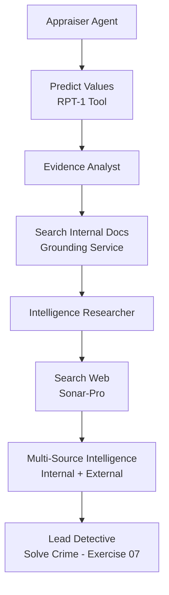

# Discover Connected Crimes with Web Search

## Overview

In Exercise 05, you learned to search internal documents using the Grounding Service. Your Evidence Analyst can now retrieve factual evidence from security logs, bank records, and termination letters without hallucination.

But investigations don't happen in a vacuum. What if similar crimes happened elsewhere? What if your suspects have public criminal records? What if this heist is part of a larger criminal network?

In this exercise, you'll add **web search capabilities** using Perplexity's **sonar-pro model** to gather external intelligence and discover patterns across the internet.

---

## Understand Web Search with Sonar-Pro

### Why Do We Need Web Search?

Your current investigation system is powerful but limited to **internal data**:

| **What You Can Do Now**                         | **What You Can't Do Yet**                            |
| ----------------------------------------------- | ---------------------------------------------------- |
| ✅ Search museum's internal evidence documents  | ❌ Search public criminal databases                  |
| ✅ Retrieve bank records, security logs         | ❌ Find similar crimes in other cities               |
| ✅ Analyze suspects based on internal evidence  | ❌ Check if suspects have public criminal records    |
| ✅ Ground responses in factual documents        | ❌ Discover criminal network connections             |
| ✅ Avoid hallucination for internal data        | ❌ Monitor online art markets for stolen items       |

**The Problem**: Real investigations combine **internal evidence** (what happened here) with **external intelligence** (what's happening elsewhere). Your agents need both!

### Document Grounding vs. Web Search

You now have access to **two complementary search capabilities**:

| Aspect                 | Document Grounding (Exercise 05)         | Web Search (This Exercise)                |
| ---------------------- | ---------------------------------------- | ----------------------------------------- |
| **Data Source**        | Internal documents (pre-uploaded)        | Real-time web information                 |
| **Coverage**           | Organization-specific evidence           | Global public information                 |
| **Freshness**          | Historical documents (static)            | Current information (updated constantly)  |
| **Use Cases**          | Internal logs, private records, policies | News, criminal records, pattern analysis  |
| **Search Method**      | Vector similarity (semantic)             | Web search + LLM synthesis                |
| **Source Control**     | You control what documents exist         | Public internet (no control)              |
| **Tool**               | `call_grounding_service`                 | `call_sonar_pro_search`                   |
| **Privacy**            | Private, secure                          | Public information only                   |
| **When to Use**        | "What does our evidence say?"            | "What do public records show?"            |

> 🎯 **Key Insight**: These are **not alternatives** — they work **together**! The best investigations use both internal evidence AND external intelligence.

### What is Sonar-Pro?

**Sonar-Pro** is Perplexity's AI model with built-in web search capabilities. Unlike regular LLMs:

| Regular LLM (e.g., GPT-4, Claude)       | Sonar-Pro (Perplexity)                       |
| --------------------------------------- | -------------------------------------------- |
| Knowledge cutoff (training data only)   | Real-time web search                         |
| Can't access recent events              | Finds current information                    |
| No source verification                  | Returns citations with URLs                  |
| "I think..." or "Based on my training"  | "According to [source], dated [date]"        |
| Static knowledge                        | Dynamic, up-to-date intelligence             |

**How Sonar-Pro Works**:
```
Your Query → Sonar-Pro searches web → Retrieves relevant pages →
Synthesizes answer → Returns result with source citations
```

### How Sonar-Pro Integrates with SAP AI Core

Sonar-Pro is called as a **model** through SAP's orchestration service, just like GPT-4 or Claude:

```python
from litellm import completion

response = completion(
    model="sap/sonar-pro",  # Perplexity via SAP orchestration
    messages=[
        {"role": "system", "content": "Search for factual information"},
        {"role": "user", "content": "Your search query"}
    ]
)
```

**Key Differences**:
- `sap/gpt-4o` → Regular reasoning LLM
- `sap/sonar-pro` → Web search-enabled LLM
- Both use the same `completion()` API!

> ⚠️ **Before continuing**: Verify that `sonar-pro` is available in your SAP AI Core resource group. Go to **SAP AI Launchpad → Generative AI Hub → Models** and confirm you can see a Perplexity sonar-pro deployment. If it is not listed, ask your workshop instructor to enable it.

---

## Add The Web Search Tool

### Step 1: Create the Sonar-Pro Search Tool

You'll create a tool that enables your agents to search the web for criminal patterns, suspect backgrounds, and related incidents.

👉 Open [`/project/Python/starter-project/investigator_crew.py`](/project/Python/starter-project/investigator_crew.py)

👉 Add this tool **after** the `call_grounding_service` tool (around line 50):

```python
@tool("call_sonar_pro_search")
def call_sonar_pro_search(search_query: str) -> str:
    """Search the web using Perplexity's sonar-pro model for real-time information
    about crimes, suspects, and criminal patterns. Use this to find similar incidents,
    criminal networks, public records, or patterns that are not in internal documents.

    Args:
        search_query: The search query about crimes, suspects, or criminal patterns

    Returns:
        Search results with source citations from the web
    """
    from litellm import completion

    try:
        response = completion(
            model="sap/sonar-pro",  # Perplexity model with web search
            messages=[
                {
                    "role": "system",
                    "content": "You are a web search assistant specializing in criminal intelligence. Search for accurate, recent information and always provide source citations with URLs and dates."
                },
                {
                    "role": "user",
                    "content": search_query
                }
            ],
            temperature=0.2,  # Lower temperature for factual search
        )

        result = response.choices[0].message.content
        return result

    except Exception as e:
        return f"Error calling sonar-pro web search: {str(e)}"
```

> 💡 **Understanding the Web Search Tool:**
>
> **1. Model Selection**
> - `model="sap/sonar-pro"` - Uses Perplexity's web search-enabled model
> - Automatically searches the web and returns cited results
> - No additional configuration needed for basic web search
>
> **2. Search Configuration**
> - `temperature=0.2` - Lower temperature for factual, consistent results
> - System prompt guides the search focus (criminal intelligence)
> - User query contains the specific search (e.g., "Marcus Chen criminal history")
>
> **3. Response Format**
> - Sonar-pro returns synthesized answers with web sources
> - Includes URLs, publication dates, and source reliability
> - Agent receives structured information to inform investigation
>
> **4. Error Handling**
> - Returns error as string (agent can handle gracefully)
> - No exceptions raised (agent workflow continues)

---

## Add The Intelligence Researcher Agent

### Step 1: Add Agent Configuration

👉 Open [`/project/Python/starter-project/config/agents.yaml`](/project/Python/starter-project/config/agents.yaml)

👉 Add this configuration **after** the `evidence_analyst_agent` section and **before** the `lead_detective_agent` section:

```yaml
intelligence_researcher_agent:
  role: >
    Open-Source Intelligence (OSINT) Researcher
  goal: >
    Search the web for similar art thefts, criminal patterns, and suspect backgrounds
    to determine if this heist is part of a larger criminal network. Use the
    call_sonar_pro_search tool to find recent incidents, news reports, and public
    criminal records for all three suspects: {suspect_names}.
  backstory: >
    You are an OSINT specialist who excels at finding patterns across multiple
    crime scenes. You search public databases, news archives, and criminal records
    to connect seemingly isolated incidents. Your expertise has uncovered several
    international art theft rings, and you know how to distinguish professional
    criminals from amateurs.
  llm: sap/gpt-4o
```

> 💡 **Why This Agent Design?**
>
> - **Role**: OSINT Researcher - Establishes expertise in public information gathering
> - **Goal**: Specific search objectives (patterns, backgrounds, networks) with explicit tool mention
> - **Backstory**: Provides context and authority for web-based investigations
> - **LLM**: Uses `sap/gpt-4o` for agent reasoning (the tool calls sonar-pro for searches)

### Step 2: Add Task Configuration

👉 Open [`/project/Python/starter-project/config/tasks.yaml`](/project/Python/starter-project/config/tasks.yaml)

👉 Add this configuration **after** the `analyze_evidence_task` and **before** the `solve_crime` task:

```yaml
research_criminal_network:
  description: >
    Search the web for intelligence about the three suspects ({suspect_names}) and
    related crimes. Use the call_sonar_pro_search tool to find:
    1. Public criminal records or prior convictions for each suspect
    2. Similar art theft incidents with the same modus operandi (insider job, no forced entry)
    3. Connections to known art theft rings or criminal networks
    4. News reports or public information about any of the suspects
    5. Recent museum heists in Europe with similar patterns

    Cross-reference your web findings with the internal evidence analyzed by the
    evidence analyst. Focus on discovering whether this is an isolated incident or
    part of a larger criminal operation.
  expected_output: >
    A comprehensive intelligence report containing:
    - Background checks for all three suspects with web sources
    - List of similar art thefts found online (dates, locations, MO)
    - Evidence of criminal network connections (if any)
    - Assessment: isolated incident vs. organized crime ring
    - All findings MUST include web sources with URLs and dates
  agent: intelligence_researcher_agent
```

### Step 3: Add Agent and Task Methods to the Crew

👉 Open [`/project/Python/starter-project/investigator_crew.py`](/project/Python/starter-project/investigator_crew.py)

👉 Find the `InvestigatorCrew` class

👉 Add these methods **after** the `analyze_evidence_task()` method and **BEFORE** the `lead_detective_agent()` method:

```python
    @agent
    def intelligence_researcher_agent(self) -> Agent:
        return Agent(
            config=self.agents_config['intelligence_researcher_agent'],
            verbose=True,
            tools=[call_sonar_pro_search]  # Web search tool
        )

    @task
    def research_criminal_network(self) -> Task:
        return Task(
            config=self.tasks_config['research_criminal_network'],
            context=[self.analyze_evidence_task()]  # Uses internal evidence to inform web searches
        )
```

> 💡 **Method Positioning Matters!**
>
> Your class should now have this order:
> 1. `appraiser_agent()` method
> 2. `appraise_loss_task()` method
> 3. `evidence_analyst_agent()` method
> 4. `analyze_evidence_task()` method
> 5. **👈 `intelligence_researcher_agent()` method (NEW!)**
> 6. **👈 `research_criminal_network()` method (NEW!)**
> 7. `lead_detective_agent()` method
> 8. `solve_crime()` method
> 9. `crew()` method (stays at the end)

> 💡 **Understanding Task Context**:
> - `context=[self.analyze_evidence_task()]` means the Intelligence Researcher receives the Evidence Analyst's findings
> - This allows the researcher to use internal evidence to formulate better web searches

---

## Run Your Enhanced Investigation

👉 Run your crew to test the web search capability!

**From repository root:**

**macOS / Linux / BAS**

```bash
python3 ./project/Python/starter-project/main.py
```

**Windows (PowerShell)**

```powershell
python .\project\Python\starter-project\main.py
```

**From starter-project folder:**

**macOS / Linux / BAS**

```bash
python3 main.py
```

**Windows (PowerShell)**

```powershell
python main.py
```

> ⏱️ **This may take 3-6 minutes** as your agents:
>
> 1. Predict stolen item values (Appraiser with RPT-1)
> 2. Search internal evidence documents (Evidence Analyst with Grounding)
> 3. **Search the web for criminal patterns (Intelligence Researcher with Sonar-Pro) ← NEW!**

👉 Review the intelligence report from the web search:
- Did it find similar crimes?
- Do any suspects have public criminal records?
- Is there evidence of a criminal network?

---

## Understanding Web Search Integration

### What Just Happened?

You created a complete multi-source intelligence gathering system that:

1. **Searches Internal Documents** (Grounding Service) - Evidence from within the museum
2. **Searches External Web** (Sonar-Pro) - Public information from across the internet
3. **Combines Intelligence** - Both sources inform the investigation

### The Enhanced Investigation Flow



### When to Use Each Search Type

**Use Document Grounding** (`call_grounding_service`) when:
- ✅ Searching organization-specific documents
- ✅ Accessing private/confidential information
- ✅ Finding internal evidence (logs, records, policies)
- ✅ You control the document collection
- ✅ Need semantic search across your own data

**Use Web Search** (`call_sonar_pro_search`) when:
- ✅ Searching public information
- ✅ Finding current events or recent news
- ✅ Checking criminal databases or public records
- ✅ Discovering patterns across multiple organizations
- ✅ Need real-time, up-to-date information

---

## Key Takeaways

- **Web Search** extends your investigation beyond internal documents to public intelligence
- **Sonar-Pro** provides real-time web search with source citations
- **Multi-Source Intelligence** combines internal evidence + external intelligence
- **Complementary Tools**: Document grounding and web search work together, not in competition
- **Complete Investigation**: Real detectives use both internal records AND external research
- **Pattern Discovery**: Web search reveals connections that internal documents can't show

---

## Next Steps

You now have a complete intelligence gathering system with:
1. ✅ Structured data predictions (RPT-1)
2. ✅ Internal document search (Grounding Service)
3. ✅ External web intelligence (Sonar-Pro)

In the next exercise, you'll add the **Lead Detective Agent** who will synthesize findings from all three sources to [solve the museum art theft mystery](07-solve-the-crime.md).

---

## Troubleshooting

**Issue**: `ModuleNotFoundError: No module named 'litellm'`

- **Solution**: LiteLLM should already be installed from Exercise 02. If not, run:

  **macOS / Linux / BAS**
  ```bash
  pip install litellm==1.82.6
  ```

  **Windows (PowerShell)**
  ```powershell
  pip install litellm==1.82.6
  ```

**Issue**: `Error: Model sap/sonar-pro not found`

- **Solution**: Verify that:
  - Sonar-pro is available in your SAP AI Core Generative AI Hub model catalog
  - Your resource group has access to Perplexity models
  - Check SAP AI Launchpad → Generative AI Hub → Models for available models

**Issue**: Web search returns no results or very generic information

- **Solution**: Make your search queries more specific:
  - ❌ Bad: "art theft"
  - ✅ Good: "Marcus Chen security technician unauthorized access criminal record Europe"
  - Include suspect names, locations, and specific details

**Issue**: `AttributeError: 'NoneType' object has no attribute 'content'`

- **Solution**: The sonar-pro API response structure might differ. Update error handling:
  ```python
  result = response.choices[0].message.content if response.choices else "No results"
  ```

**Issue**: Agent doesn't use the web search tool

- **Solution**: Ensure:
  - The tool is assigned: `tools=[call_sonar_pro_search]`
  - The task description explicitly mentions using `call_sonar_pro_search`
  - The agent's goal references web search or OSINT

**Issue**: Web search takes too long or times out

- **Solution**:
  - Sonar-pro queries can take 10-30 seconds per search
  - This is normal for real-time web crawling
  - If timeout occurs, increase LiteLLM timeout or retry

---

## Resources

- [Perplexity API Documentation](https://docs.perplexity.ai/)
- [SAP AI Core Orchestration Workflow](https://help.sap.com/docs/sap-ai-core/generative-ai/orchestration-workflow-v2)
- [LiteLLM Documentation](https://docs.litellm.ai/)

[Next exercise](07-solve-the-crime.md)
